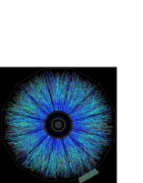
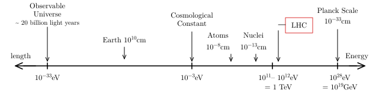

> From <strong>Quantum Field Theory</strong>, lecture notes by <strong>David Tong</strong> (University of Cambridge). Original HTML: <a href="https://davidtong.org/teaching/quantum-field-theory/qfthtml/S0.html">https://davidtong.org/teaching/quantum-field-theory/qfthtml/S0.html</a> · <a href="https://davidtong.org/pdfs/teaching/quantum-field-theory/qft.pdf">PDF version</a> · <a href="https://davidtong.org/teaching/quantum-field-theory">course page</a>. Reformatted for this reader; all content © David Tong.

<a href="README.md">Contents</a> · <a href="1.%20Classical%20Field%20Theory.md">1. Classical Field Theory →</a>

# 0 Introduction

> “There are no real one-particle systems in nature, not even few-particle systems. The existence of virtual pairs and of pair fluctuations shows that the days of fixed particle numbers are over.”

<em>Viki Weisskopf</em>

The concept of wave-particle duality tells us that the properties of electrons and photons are fundamentally very similar. Despite obvious differences in their mass and charge, under the right circumstances both suffer wave-like diffraction and both can pack a particle-like punch.

Yet the appearance of these objects in classical physics is very different. Electrons and other matter particles are postulated to be elementary constituents of Nature. In contrast, light is a derived concept: it arises as a ripple of the electromagnetic field. If photons and particles are truely to be placed on equal footing, how should we reconcile this difference in the quantum world? Should we view the particle as fundamental, with the electromagnetic field arising only in some classical limit from a collection of quantum photons? Or should we instead view the field as fundamental, with the photon appearing only when we correctly treat the field in a manner consistent with quantum theory? And, if this latter view is correct, should we also introduce an “electron field”, whose ripples give rise to particles with mass and charge? But why then didn’t Faraday, Maxwell and other classical physicists find it useful to introduce the concept of matter fields, analogous to the electromagnetic field?

The purpose of this course is to answer these questions. We shall see that the second viewpoint above is the most useful: the field is primary and particles are derived concepts, appearing only after quantization. We will show how photons arise from the quantization of the electromagnetic field and how massive, charged particles such as electrons arise from the quantization of matter fields. We will learn that in order to describe the fundamental laws of Nature, we must not only introduce electron fields, but also quark fields, neutrino fields, gluon fields, W and Z-boson fields, Higgs fields and a whole slew of others. There is a field associated to each type of fundamental particle that appears in Nature.

### Why Quantum Field Theory?

In classical physics, the primary reason for introducing the concept of the field is to construct laws of Nature that are <em>local</em>. The old laws of Coulomb and Newton involve “action at a distance”. This means that the force felt by an electron (or planet) changes immediately if a distant proton (or star) moves. This situation is philosophically unsatisfactory. More importantly, it is also experimentally wrong. The field theories of Maxwell and Einstein remedy the situation, with all interactions mediated in a local fashion by the field.

The requirement of locality remains a strong motivation for studying field theories in the quantum world. However, there are further reasons for treating the quantum field as fundamental<a href="#footnote1">1</a>. Here I’ll give two answers to the question: Why quantum field theory?

### Answer 1: Because the combination of quantum mechanics and special relativity implies that particle number is not conserved.

<figure id="F1" style="margin:1.5em auto;text-align:center"><figcaption style="font-size:0.9em;margin-top:0.4em"><strong>Figure 1.</strong> </figcaption></figure>

Particles are not indestructible objects, made at the beginning of the universe and here for good. They can be created and destroyed. They are, in fact, mostly ephemeral and fleeting. This experimentally verified fact was first predicted by Dirac who understood how relativity implies the necessity of anti-particles. An extreme demonstration of particle creation is shown in the picture, which comes from the Relativistic Heavy Ion Collider (RHIC) at Brookhaven, Long Island. This machine crashes gold nuclei together, each containing $197$ nucleons. The resulting explosion contains up to 10,000 particles, captured here in all their beauty by the STAR detector.

We will review Dirac’s argument for anti-particles later in this course, together with the better understanding that we get from viewing particles in the framework of quantum field theory. For now, we’ll quickly sketch the circumstances in which we expect the number of particles to change. Consider a particle of mass $m$ trapped in a box of size $L$. <a id="heisenberg-inequality" class="note-ref" href="notes/heisenberg-inequality.html">Heisenberg tells us that the uncertainty in the momentum is</a> $\Delta p\geq\hbar/L$. In a relativistic setting, momentum and energy are on an equivalent footing, so we should also have an uncertainty in the energy of order $\Delta E\geq\hbar c/L$. However, when the uncertainty in the energy exceeds $\Delta E=2mc^{2}$, then we cross the barrier to pop particle anti-particle pairs out of the vacuum. We learn that particle-anti-particle pairs are expected to be important when a particle of mass $m$ is localized within a distance of order

$$
\displaystyle\lambda=\frac{\hbar}{mc}
$$

At distances shorter than this, there is a high probability that we will detect particle-anti-particle pairs swarming around the original particle that we put in. The distance $\lambda$ is called the <em>Compton wavelength</em>. It is always smaller than the de Broglie wavelength $\lambda_{dB}=h/|\vec{p}|$. If you like, the de Broglie wavelength is the distance at which the wavelike nature of particles becomes apparent; the Compton wavelength is the distance at which the concept of a single pointlike particle breaks down completely.

The presence of a multitude of particles and antiparticles at short distances tells us that any attempt to write down a relativistic version of the one-particle Schrödinger equation (or, indeed, an equation for any <em>fixed</em> number of particles) is doomed to failure. There is no mechanism in standard non-relativistic quantum mechanics to deal with changes in the particle number. Indeed, any attempt to naively construct a relativistic version of the one-particle Schrödinger equation meets with serious problems. (Negative probabilities, infinite towers of negative energy states, or a breakdown in causality are the common issues that arise). In each case, this failure is telling us that once we enter the relativistic regime we need a new formalism in order to treat states with an unspecified number of particles. This formalism is quantum field theory (QFT).

### Answer 2: Because all particles of the same type are the same

This sound rather dumb. But it’s not! What I mean by this is that two electrons are identical in every way, regardless of where they came from and what they’ve been through. The same is true of every other fundamental particle. Let me illustrate this through a rather prosaic story. Suppose we capture a proton from a cosmic ray which we identify as coming from a supernova lying 8 billion lightyears away. We compare this proton with one freshly minted in a particle accelerator here on Earth. And the two are exactly the same! How is this possible? Why aren’t there errors in proton production? How can two objects, manufactured so far apart in space and time, be identical in all respects? One explanation that might be offered is that there’s a sea of proton “stuff” filling the universe and when we make a proton we somehow dip our hand into this stuff and from it mould a proton. Then it’s not surprising that protons produced in different parts of the universe are identical: they’re made of the same stuff. It turns out that this is roughly what happens. The “stuff” is the proton field or, if you look closely enough, the quark field.

In fact, there’s more to this tale. Being the “same” in the quantum world is not like being the “same” in the classical world: quantum particles that are the same are truely indistinguishable. Swapping two particles around leaves the state completely unchanged — apart from a possible minus sign. This minus sign determines the statistics of the particle. In quantum mechanics you have to put these statistics in by hand and, to agree with experiment, should choose Bose statistics (no minus sign) for integer spin particles, and Fermi statistics (yes minus sign) for half-integer spin particles. In quantum field theory, this relationship between spin and statistics is not something that you have to put in by hand. Rather, it is a consequence of the framework.

### What is Quantum Field Theory?

Having told you why QFT is necessary, I should really tell you what it is. The clue is in the name: it is the quantization of a classical field, the most familiar example of which is the electromagnetic field. In standard quantum mechanics, we’re taught to take the classical degrees of freedom and promote them to operators acting on a Hilbert space. The rules for quantizing a field are no different. Thus the basic degrees of freedom in quantum field theory are <em>operator valued functions of space and time</em>. This means that we are dealing with an infinite number of degrees of freedom — at least one for every point in space. This infinity will come back to bite on several occasions.

It will turn out that the possible interactions in quantum field theory are governed by a few basic principles: locality, symmetry and renormalization group flow (the decoupling of short distance phenomena from physics at larger scales). These ideas make QFT a very robust framework: given a set of fields there is very often an almost unique way to couple them together.

### What is Quantum Field Theory Good For?

The answer is: almost everything. As I have stressed above, for any relativistic system it is a necessity. But it is also a very useful tool in non-relativistic systems with many particles. Quantum field theory has had a major impact in condensed matter, high-energy physics, cosmology, quantum gravity and pure mathematics. It is literally the language in which the laws of Nature are written.

## 0.1 Units and Scales

Nature presents us with three fundamental dimensionful constants; the speed of light $c$, Planck’s constant (divided by $2\pi$) $\hbar$ and Newton’s constant $G$. They have dimensions

$$
\begin{aligned}\displaystyle[c] &\displaystyle= \displaystyle LT^{-1}\end{aligned}
$$

$$
\begin{aligned}\displaystyle\left[\hbar\right] &\displaystyle= \displaystyle L^{2}MT^{-1}\end{aligned}
$$

$$
\begin{aligned}\displaystyle\left[G\right] &\displaystyle= \displaystyle L^{3}M^{-1}T^{-2}\end{aligned}
$$

Throughout this course we will work with “natural” units, defined by

$$
\displaystyle c=\hbar=1 \tag{0.1}
$$

which allows us to express all dimensionful quantities in terms of a single scale which we choose to be mass or, equivalently, energy (since $E=mc^{2}$ has become $E=m$). The usual choice of energy unit is $eV$, the electron volt or, more often $GeV=10^{9}eV$ or $TeV=10^{12}eV$. To convert the unit of energy back to a unit of length or time, we need to insert the relevant powers of $c$ and $\hbar$. For example, the length scale $\lambda$ associated to a mass $m$ is the Compton wavelength

$$
\displaystyle\lambda=\frac{\hbar}{mc}
$$

With this conversion factor, the electron mass $m_{e}=10^{6}eV$ translates to a length scale $\lambda_{e}\sim 10^{-12}m$. (The Compton wavelength is also defined with an extra factor of $2\pi$: $\lambda=2\pi\hbar/mc$.)

Throughout this course we will refer to the <em>dimension</em> of a quantity, meaning the mass dimension. If $X$ has dimensions of $({\rm mass})^{d}$ we will write $[X]=d$. In particular, the surviving natural quantity $G$ has dimensions $[G]=-2$ and defines a mass scale,

$$
\displaystyle G=\frac{\hbar c}{M_{p}^{2} }=\frac{1}{M_{p}^{2} } \tag{0.2}
$$

where $M_{p}\approx 10^{19}GeV$ is the <em>Planck scale</em>. It corresponds to a length $l_{p}\approx 10^{-33}cm$. The Planck scale is thought to be the smallest length scale that makes sense: beyond this quantum gravity effects become important and it’s no longer clear that the concept of spacetime makes sense. The largest length scale we can talk of is the size of the cosmological horizon, roughly $10^{60}l_{p}$.

<figure id="F2" style="margin:1.5em auto;text-align:center">

<figcaption style="font-size:0.9em;margin-top:0.4em"><strong>Figure 2.</strong> Energy and Distance Scales in the Universe</figcaption></figure>

Some useful scales in the universe are shown in the figure. This is a logarithmic plot, with energy increasing to the right and, correspondingly, length increasing to the left. The smallest and largest scales known are shown on the figure, together with other relevant energy scales. The standard model of particle physics is expected to hold up to about the $TeV$. This is precisely the regime that is currently being probed by the Large Hadron Collider (LHC) at CERN. There is a general belief that the framework of quantum field theory will continue to hold to energy scales only slightly below the Planck scale — for example, there are experimental hints that the coupling constants of electromagnetism, and the weak and strong forces unify at around $10^{18}$ GeV.

For comparison, the rough masses of some elementary (and not so elementary) particles are shown in the table,

<table><tr><th>Particle</th><th>Mass</th></tr><tr><td>neutrinos</td><td>$\sim 10^{-2}$ eV</td></tr><tr><td>electron</td><td>0.5 MeV</td></tr><tr><td>Muon</td><td>100 MeV</td></tr><tr><td>Pions</td><td>140 MeV</td></tr><tr><td>Proton, Neutron</td><td>1 GeV</td></tr><tr><td>Tau</td><td>2 GeV</td></tr><tr><td>W,Z Bosons</td><td>80-90 GeV</td></tr><tr><td>Higgs Boson</td><td>125 GeV</td></tr></table>

---

<strong>Footnotes</strong>

1 A concise review of the underlying principles and major successes of quantum field theory can be found in the article by Frank Wilczek, <a href="http://arxiv.org/abs/hep-th/9803075">http://arxiv.org/abs/hep-th/9803075</a> <a href="#footnote1-ref">↩</a>

---

<a href="README.md">Contents</a> · <a href="1.%20Classical%20Field%20Theory.md">1. Classical Field Theory →</a>
