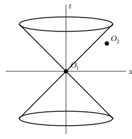
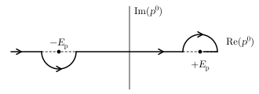
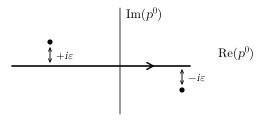
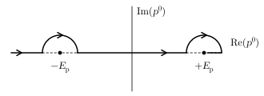

> From <strong>Quantum Field Theory</strong>, lecture notes by <strong>David Tong</strong> (University of Cambridge). Original HTML: <a href="https://davidtong.org/teaching/quantum-field-theory/qfthtml/S2.html">https://davidtong.org/teaching/quantum-field-theory/qfthtml/S2.html</a> · <a href="https://davidtong.org/pdfs/teaching/quantum-field-theory/qft.pdf">PDF version</a> · <a href="https://davidtong.org/teaching/quantum-field-theory">course page</a>. Reformatted for this reader; all content © David Tong.

<a href="1.%20Classical%20Field%20Theory.md">← 1. Classical Field Theory</a> · <a href="README.md">Contents</a> · <a href="3.%20Interacting%20Fields.md">3. Interacting Fields →</a>

# 2 Free Fields

> “The career of a young theoretical physicist consists of treating the harmonic oscillator in ever-increasing levels of abstraction.”

<em>Sidney Coleman</em>

## 2.1 Canonical Quantization

In quantum mechanics, canonical quantization is a recipe that takes us from the Hamiltonian formalism of classical dynamics to the quantum theory. The recipe tells us to take the generalized coordinates $q_{a}$ and their conjugate momenta $p^{a}$ and promote them to operators. The Poisson bracket structure of classical mechanics morphs into the structure of commutation relations between operators, so that, in units with $\hbar=1$,

$$
\displaystyle[q_{a},q_{b}]=[p^{a},p^{b}]=0
$$

$$
\displaystyle[q_{a},p^{b}]=i\,\delta_{a}^{b} \tag{2.76}
$$

In field theory we do the same, now for the field $\phi_{a}(\vec{x})$ and its momentum conjugate $\pi^{b}(\vec{x})$. Thus a <em>quantum field</em> is an operator valued function of space obeying the commutation relations

$$
\displaystyle[\phi_{a}(\vec{x}),\phi_{b}(\vec{y})]=[\pi^{a}(\vec{x}),\pi^{b}(\vec{y})]=0
$$

$$
\displaystyle[\phi_{a}(\vec{x}),\pi^{b}(\vec{y})]=i\delta^{(3)}(\vec{x}-\vec{y})\,\delta_{a}^{b} \tag{2.77}
$$

Note that we’ve lost all track of Lorentz invariance since we have separated space $\vec{x}$ and time $t$. We are working in the Schrödinger picture so that the operators $\phi_{a}(\vec{x})$ and $\pi^{a}(\vec{x})$ do not depend on time at all — only on space. All time dependence sits in the states $|\psi\rangle$ which evolve by the usual Schrödinger equation

$$
\displaystyle i\frac{d|\psi\rangle}{dt}=H\left|\psi\right\rangle \tag{2.78}
$$

We aren’t doing anything different from usual quantum mechanics; we’re merely applying the old formalism to fields. Be warned however that the notation $\left|\psi\right\rangle$ for the state is deceptively simple: if you were to write the wavefunction in quantum field theory, it would be a <em>functional</em>, that is a function of every possible configuration of the field $\phi$.

The typical information we want to know about a quantum theory is the spectrum of the Hamiltonian $H$. In quantum field theories, this is usually <em>very</em> hard. One reason for this is that we have an infinite number of degrees of freedom — at least one for every point $\vec{x}$ in space. However, for certain theories — known as <em>free theories</em> — we can find a way to write the dynamics such that each degree of freedom evolves independently from all the others. Free field theories typically have Lagrangians which are quadratic in the fields, so that the equations of motion are linear. For example, the simplest relativistic free theory is the classical Klein-Gordon (KG) equation for a real scalar field $\phi(\vec{x},t)$,

$$
\displaystyle\partial_{\mu}\partial^{\mu}\phi+m^{2}\phi=0 \tag{2.79}
$$

To exhibit the coordinates in which the degrees of freedom decouple from each other, we need only take the Fourier transform,

$$
\displaystyle\phi(\vec{x},t)=\int\frac{d^{3}p}{(2\pi)^{3} }\,e^{i\vec{p}\cdot\vec{x} }\,\phi(\vec{p},t) \tag{2.80}
$$

Then $\phi(\vec{p},t)$ satisfies

$$
\displaystyle\left(\frac{\partial^{2} }{\partial t^{2} }+(\vec{p}^{\,2}+m^{2})\right)\,\phi(\vec{p},t)=0 \tag{2.81}
$$

Thus, for each value of $\vec{p}$, $\phi(\vec{p},t)$ solves the equation of a harmonic oscillator vibrating at frequency

$$
\displaystyle\omega_{\vec{p} }=+\sqrt{\vec{p}^{\,2}+m^{2} } \tag{2.82}
$$

We learn that the most general solution to the KG equation is a linear superposition of simple harmonic oscillators, each vibrating at a different frequency with a different amplitude. To quantize $\phi(\vec{x},t)$ we must simply quantize this infinite number of harmonic oscillators. Let’s recall how to do this.

### 2.1.1 The Simple Harmonic Oscillator

Consider the quantum mechanical Hamiltonian

$$
\displaystyle H={\textstyle\frac{1}{2} }p^{2}+{\textstyle\frac{1}{2} }\omega^{2}q^{2} \tag{2.83}
$$

with the canonical commutation relations $[q,p]=i$. To find the spectrum we define the creation and annihilation operators (also known as raising/lowering operators, or sometimes ladder operators)

$$
\displaystyle a=\sqrt{\frac{\omega}{2} }\,q+\frac{i}{\sqrt{2\omega} }\,p\ \ \ ,\ \ \ a^{\dagger}=\sqrt{\frac{\omega}{2} }\,q-\frac{i}{\sqrt{2\omega} }\,p \tag{2.84}
$$

which can be easily inverted to give

$$
\displaystyle q=\frac{1}{\sqrt{2\omega} }\,(a+a^{\dagger})\ \ \ ,\ \ \ p=-i\sqrt{\frac{\omega}{2} }\,(a-a^{\dagger}) \tag{2.85}
$$

Substituting into the above expressions we find

$$
\displaystyle[a,a^{\dagger}]=1 \tag{2.86}
$$

while the Hamiltonian is given by

$$
\begin{aligned}\displaystyle H &\displaystyle= \displaystyle{\textstyle\frac{1}{2} }\omega(aa^{\dagger}+a^{\dagger}a) \\ &\displaystyle= \displaystyle\omega(a^{\dagger}a+{\textstyle\frac{1}{2} })\end{aligned} \tag{2.87}
$$

One can easily confirm that the commutators between the Hamiltonian and the creation and annihilation operators are given by

$$
\displaystyle[H,a^{\dagger}]=\omega a^{\dagger}\ \ \ {\rm and}\ \ \ [H,a]=-\omega a \tag{2.88}
$$

These relations ensure that $a$ and $a^{\dagger}$ take us between energy eigenstates. Let $\left|E\right\rangle$ be an eigenstate with energy $E$, so that $H\left|E\right\rangle=E\left|E\right\rangle$. Then we can construct more eigenstates by acting with $a$ and $a^{\dagger}$,

$$
\displaystyle Ha^{\dagger}\left|E\right\rangle=(E+\omega)a^{\dagger}\left|E\right\rangle\ \ \ ,\ \ \ Ha\left|E\right\rangle=(E-\omega)a\left|E\right\rangle \tag{2.89}
$$

So we find that the system has a ladder of states with energies

$$
\displaystyle\ldots,E-\omega,E,E+\omega,E+2\omega,\ldots \tag{2.90}
$$

If the energy is bounded below, there must be a <em>ground state</em> $\left|0\right\rangle$ which satisfies $a\left|0\right\rangle=0$. This has ground state energy (also known as zero point energy),

$$
\displaystyle H\left|0\right\rangle={\textstyle\frac{1}{2} }\omega\,\left|0\right\rangle \tag{2.91}
$$

Excited states then arise from repeated application of $a^{\dagger}$,

$$
\displaystyle\left|n\right\rangle=(a^{\dagger})^{n}\left|0\right\rangle\ \ \ {\rm with}\ \ \ H\left|n\right\rangle=(n+{\textstyle\frac{1}{2} })\omega\left|n\right\rangle \tag{2.92}
$$

where I’ve ignored the normalization of these states so, $\left\langle n\right|{n}\rangle\neq 1$.

## 2.2 The Free Scalar Field

We now apply the quantization of the harmonic oscillator to the free scalar field. We write $\phi$ and $\pi$ as a linear sum of an infinite number of creation and annihilation operators $a_{\vec{p} }^{\dagger}$ and $a_{\vec{p} }$, indexed by the 3-momentum $\vec{p}$,

$$
\begin{aligned}\displaystyle\phi(\vec{x}) &\displaystyle= \displaystyle\int\frac{d^{3}p}{(2\pi)^{3} }\frac{1}{\sqrt{2\omega_{\vec{p} } } }\,\left[a_{\vec{p} }\,e^{i\vec{p}\cdot\vec{x} }+a^{\dagger}_{\vec{p} }\,e^{-i\vec{p}\cdot\vec{x} }\right]\end{aligned} \tag{2.93}
$$

$$
\begin{aligned}\displaystyle\pi(\vec{x}) &\displaystyle= \displaystyle\int\frac{d^{3}p}{(2\pi)^{3} }(-i)\,\sqrt{\frac{\omega_{\vec{p} } }{2} }\,\left[a_{\vec{p} }\,e^{i\vec{p}\cdot\vec{x} }-a_{\vec{p} }^{\dagger}\,e^{-i\vec{p}\cdot\vec{x} }\right]\end{aligned} \tag{2.94}
$$

<strong>Claim:</strong> The commutation relations for $\phi$ and $\pi$ are equivalent to the following commutation relations for $a_{\vec{p} }$ and $a_{\vec{p} }^{\dagger}$

$$
\displaystyle\begin{array}{c}[\phi(\vec{x}),\phi(\vec{y})]=[\pi(\vec{x}),\pi(\vec{y})]=0\\ \left[\phi(\vec{x}),\pi(\vec{y})\right]=i\delta^{(3)}(\vec{x}-\vec{y})\end{array}\ \ \ \Leftrightarrow\ \ \ \begin{array}{c}[a_{\vec{p} },a_{\vec{q} }]=[a^{\dagger}_{\vec{p} },a^{\dagger}_{\vec{q} }]=0\\ {[}a_{\vec{p} },a_{\vec{q} }^{\dagger}{]}=(2\pi)^{3}\delta^{(3)}(\vec{p}-\vec{q})\end{array} \tag{2.95}
$$

<strong>Proof:</strong> We’ll show this just one way. Assume that $[a_{\vec{p} },a_{\vec{q} }^{\dagger}]=(2\pi)^{3}\delta^{(3)}(\vec{p}-\vec{q})$. Then

$$
\begin{aligned}\displaystyle[\phi(\vec{x}),\pi(\vec{y})] &\displaystyle= \displaystyle\int\frac{d^{3}p\ d^{3}q}{(2\pi)^{6} }\ \frac{(-i)}{2}\ \sqrt{\frac{\omega_{\vec{q} } }{\omega_{\vec{p} } } }\ \left(-[a_{\vec{p} },a_{\vec{q} }^{\dagger}]\,e^{i\vec{p}\cdot\vec{x}-i\vec{q}\cdot\vec{y} }+[a_{\vec{p} }^{\dagger},a_{\vec{q} }]\,e^{-i\vec{p}\cdot\vec{x}+i\vec{q}\cdot\vec{y} }\right) \\ &\displaystyle= \displaystyle\int\frac{d^{3}p}{(2\pi)^{3} }\ \frac{(-i)}{2}\ \left(-e^{i\vec{p}\cdot(\vec{x}-\vec{y})}-e^{i\vec{p}\cdot(\vec{y}-\vec{x})}\right) \\ &\displaystyle= \displaystyle i\delta^{(3)}(\vec{x}-\vec{y})\ \ \ \ \ \ \ \ \ \ \ \ \ \ \ \ \ \ \ \ \ \ \ \ \ \ \ \ \ \ \ \ \ \ \ \ \ \ \ \ \ \ \ \ \ \ \ \ \ \ \ \ \ \ \ \ \ \ \ \ \ \ \ \ \ \ \ \ \ \ \ \ \ \Box\end{aligned}
$$

### The Hamiltonian

Let’s now compute the Hamiltonian in terms of $a_{\vec{p} }$ and $a^{\dagger}_{\vec{p} }$. We have

$$
\begin{aligned}\displaystyle H &\displaystyle= \displaystyle\frac{1}{2}\int d^{3}x\ \pi^{2}+(\nabla\phi)^{2}+m^{2}\phi^{2} \\ &\displaystyle= \displaystyle\frac{1}{2}\int\frac{d^{3}x\ d^{3}p\ d^{3}q}{(2\pi)^{6} }\left[-\frac{\sqrt{\omega_{\vec{p} }\omega_{\vec{q} } } }{2}\ (a_{\vec{p} }\,e^{i\vec{p}\cdot\vec{x} }-a^{\dagger}_{\vec{p} }\,e^{-i\vec{p}\cdot\vec{x} })(a_{\vec{q} }\,e^{i\vec{q}\cdot\vec{x} }-a^{\dagger}_{\vec{q} }\,e^{-i\vec{q}\cdot\vec{x} })\right. \\ & \displaystyle\ \ \ \ +\frac{1}{2\sqrt{\omega_{\vec{p} }\omega_{\vec{q} } } }\ (i\vec{p}\,a_{\vec{p} }\,e^{i\vec{p}\cdot\vec{x} }-i\vec{p}\,a^{\dagger}_{\vec{p} }\,e^{-i\vec{p}\cdot\vec{x} })\cdot(i\vec{q}\,a_{\vec{q} }\,e^{i\vec{q}\cdot\vec{x} }-i\vec{q}\,a^{\dagger}_{\vec{q} }\,e^{-i\vec{q}\cdot\vec{x} }) \\ & \displaystyle\ \ \ \ \left.+\frac{m^{2} }{2\sqrt{\omega_{\vec{p} }\omega_{\vec{q} } } }\ (a_{\vec{p} }\,e^{i\vec{p}\cdot\vec{x} }+a^{\dagger}_{\vec{p} }\,e^{-i\vec{p}\cdot\vec{x} })(a_{\vec{q} }\,e^{i\vec{q}\cdot\vec{x} }+a^{\dagger}_{\vec{q} }\,e^{-i\vec{q}\cdot\vec{x} })\right] \\ &\displaystyle= \displaystyle\frac{1}{4}\int\frac{d^{3}p}{(2\pi)^{3} }\,\frac{1}{\omega_{\vec{p} } }\left[(-\omega_{\vec{p} }^{2}+\vec{p}^{\,2}+m^{2})(a_{\vec{p} }\,a_{-\vec{p} }+a_{\vec{p} }^{\dagger}\,a^{\dagger}_{-\vec{p} })+(\omega_{\vec{p} }^{2}+\vec{p}^{\,2}+m^{2})(a_{\vec{p} }\,a_{\vec{p} }^{\dagger}+a^{\dagger}_{\vec{p} }\,a_{\vec{p} })\right]\end{aligned}
$$

where in the second line we’ve used the expressions for $\phi$ and $\pi$ given in (<a href="#E93">2.93</a>) and (<a href="#E94">2.94</a>); to get to the third line we’ve integrated over $d^{3}x$ to get delta-functions $\delta^{(3)}(\vec{p}\pm\vec{q})$ which, in turn, allow us to perform the $d^{3}q$ integral. Now using the expression for the frequency $\omega_{\vec{p} }^{2}=\vec{p}^{\,2}+m^{2}$, the first term vanishes and we’re left with

$$
\begin{aligned}\displaystyle H &\displaystyle= \displaystyle\frac{1}{2}\int\frac{d^{3}p}{(2\pi)^{3} }\,\omega_{\vec{p} }\,\left[a_{\vec{p} }\,a_{\vec{p} }^{\dagger}+a_{\vec{p} }^{\dagger}\,a_{\vec{p} }\right] \\ &\displaystyle= \displaystyle\int\frac{d^{3}p}{(2\pi)^{3} }\,\omega_{\vec{p} }\,\left[a_{\vec{p} }^{\dagger}\,a_{\vec{p} }+{\textstyle\frac{1}{2} }(2\pi)^{3}\,\delta^{(3)}(0)\right]\end{aligned} \tag{2.97}
$$

Hmmmm. We’ve found a delta-function, evaluated at zero where it has its infinite spike. Moreover, the integral over $\omega_{\vec{p} }$ diverges at large $p$. What to do? Let’s start by looking at the ground state where this infinity first becomes apparent.

## 2.3 The Vacuum

Following our procedure for the harmonic oscillator, let’s define the vacuum $\left|0\right\rangle$ by insisting that it is annihilated by <em>all</em> $a_{\vec{p} }$,

$$
\displaystyle a_{\vec{p} }\left|0\right\rangle=0\ \ \ \ \ \forall\ \vec{p} \tag{2.98}
$$

With this definition, the energy $E_{0}$ of the ground state comes from the second term in (<a href="#E97">2.97</a>),

$$
\displaystyle H\left|0\right\rangle\equiv E_{0}\left|0\right\rangle=\left[\int d^{3}p\ \frac{1}{2}\,\omega_{\vec{p} }\,\delta^{(3)}(0)\right]\left|\,0\right\rangle=\infty\left|0\right\rangle \tag{2.99}
$$

The subject of quantum field theory is rife with infinities. Each tells us something important, usually that we’re doing something wrong, or asking the wrong question. Let’s take some time to explore where this infinity comes from and how we should deal with it.

In fact there are two different $\infty$’s lurking in the expression (<a href="#E99">2.99</a>). The first arises because space is infinitely large. (Infinities of this type are often referred to as <em>infra-red divergences</em> although in this case the $\infty$ is so simple that it barely deserves this name). To extract out this infinity, let’s consider putting the theory in a box with sides of length $L$. We impose periodic boundary conditions on the field. Then, taking the limit where $L\rightarrow\infty$, we get

$$
\displaystyle(2\pi)^{3}\,\delta^{(3)}(0)=\lim_{L\rightarrow\infty}\int_{-L/2}^{L/2}d^{3}x\ \left.e^{i\vec{x}\cdot\vec{p} }\right|_{\vec{p}=0}=\lim_{L\rightarrow\infty}\int_{-L/2}^{L/2}d^{3}x=V \tag{2.100}
$$

where $V$ is the volume of the box. So the $\delta(0)$ divergence arises because we’re computing the total energy, rather than the energy density ${\cal E}_{0}$. To find ${\cal E}_{0}$ we can simply divide by the volume,

$$
\displaystyle{\cal E}_{0}=\frac{E_{0} }{V}=\int\frac{d^{3}p}{(2\pi)^{3} }\ \frac{1}{2}\,\omega_{\vec{p} } \tag{2.101}
$$

which is still infinite. We recognize it as the sum of ground state energies for each harmonic oscillator. But ${\cal E}_{0}\rightarrow\infty$ due to the $|\vec{p}|\rightarrow\infty$ limit of the integral. This is a high frequency — or short distance — infinity known as an <em>ultra-violet divergence</em>. This divergence arises because of our hubris. We’ve assumed that our theory is valid to arbitrarily short distance scales, corresponding to arbitrarily high energies. This is clearly absurd. The integral should be cut-off at high momentum in order to reflect the fact that our theory is likely to break down in some way.

We can deal with the infinity in (<a href="#E99">2.99</a>) in a more practical way. In physics we’re only interested in energy differences. There’s no way to measure $E_{0}$ directly, so we can simply redefine the Hamiltonian by subtracting off this infinity,

$$
\displaystyle H=\int\frac{d^{3}p}{(2\pi)^{3} }\,\omega_{\vec{p} }\,a_{\vec{p} }^{\dagger}\,a_{\vec{p} } \tag{2.102}
$$

so that, with this new definition, $H\left|0\right\rangle=0$. In fact, the difference between this Hamiltonian and the previous one is merely an ordering ambiguity in moving from the classical theory to the quantum theory. For example, if we defined the Hamiltonian of the harmonic oscillator to be $H=(1/2)(\omega q-ip)(\omega q+ip)$, which is classically the same as our original choice, then upon quantization it would naturally give $H=\omega a^{\dagger}a$ as in (<a href="#E102">2.102</a>). This type of ordering ambiguity arises a lot in field theories. We’ll come across a number of ways of dealing with it. The method that we’ve used above is called <em>normal ordering</em>.    <strong>Definition:</strong> We write the <em>normal ordered</em> string of operators $\phi_{1}(\vec{x}_{1})\ldots\phi_{n}(\vec{x}_{n})$ as

$$
\displaystyle:\phi_{1}(\vec{x}_{1})\ldots\phi_{n}(\vec{x}_{n}): \tag{2.103}
$$

It is defined to be the usual product with all annihilation operators $a_{\vec{p} }$ placed to the right. So, for the Hamiltonian, we could write (<a href="#E102">2.102</a>) as

$$
\displaystyle:H:=\int\frac{d^{3}p}{(2\pi)^{3} }\,\omega_{\vec{p} }\,a_{\vec{p} }^{\dagger}\,a_{\vec{p} } \tag{2.104}
$$

In the remainder of this section, we will normal order all operators in this manner.

### 2.3.1 The Cosmological Constant

Above I wrote “there’s no way to measure $E_{0}$ directly”. There is a BIG caveat here: gravity is supposed to see everything! The sum of all the zero point energies should contribute to the stress-energy tensor that appears on the right-hand side of Einstein’s equations. We expect them to appear as a <em>cosmological constant</em> $\Lambda=E_{0}/V$,

$$
\displaystyle R_{\mu\nu}-{\textstyle\frac{1}{2} }Rg_{\mu\nu}=-8\pi GT_{\mu\nu}+\Lambda g_{\mu\nu} \tag{2.105}
$$

Current observation suggests that 70% of the energy density in the universe has the properties of a cosmological constant with $\Lambda\sim(10^{-3}eV)^{4}$. This is much smaller than other scales in particle physics. In particular, the Standard Model is valid at least up to $10^{12}\,eV$. Why don’t the zero point energies of these fields contribute to $\Lambda$? Or, if they do, what cancels them to such high accuracy? This is the cosmological constant problem. No one knows the answer!

### 2.3.2 The Casimir Effect

> “I mentioned my results to Niels Bohr, during a walk. That is nice, he said, that is something new… and he mumbled something about zero-point energy.”

<em>Hendrik Casimir</em>

Using the normal ordering prescription we can happily set $E_{0}=0$, while chanting the mantra that only energy differences can be measured. But we should be careful, for there is a situation where differences in the energy of vacuum fluctuations themselves can be measured.

To regulate the infra-red divergences, we’ll make the $x^{1}$ direction periodic, with size $L$, and impose periodic boundary conditions such that

$$
\displaystyle\phi(\vec{x})=\phi(\vec{x}+L{\vec{n} }) \tag{2.106}
$$

<figure id="F3" style="margin:1.5em auto;text-align:center"><figcaption style="font-size:0.9em;margin-top:0.4em"><strong>Figure 3.</strong> </figcaption></figure>

with $\vec{n}=(1,0,0)$. We’ll leave $y$ and $z$ alone, but remember that we should compute all physical quantities per unit area $A$. We insert two reflecting plates, separated by a distance $d\ll L$ in the $x^{1}$ direction. The plates are such that they impose $\phi(x)=0$ at the position of the plates. The presence of these plates affects the Fourier decomposition of the field and, in particular, means that the momentum of the field inside the plates is quantized as

$$
\displaystyle\vec{p}=\left(\frac{n\pi}{d},p_{y},p_{z}\right)\ \ \ \ n\in{\bf Z^{+} } \tag{2.107}
$$

For a <em>massless</em> scalar field, the ground state energy between the plates is

$$
\displaystyle\frac{E(d)}{A}=\sum_{n=1}^{\infty}\int\frac{dp_{y}dp_{z} }{(2\pi)^{2} }\,\frac{1}{2}\sqrt{\left(\frac{n\pi}{d}\right)^{2}+p_{y}^{2}+p_{z}^{2} } \tag{2.108}
$$

while the energy outside the plates is $E(L-d)$. The total energy is therefore

$$
\displaystyle E=E(d)+E(L-d) \tag{2.109}
$$

which – at least naively – depends on $d$. If this naive guess is true, it would mean that there is a force on the plates due to the fluctuations of the vacuum. This is the Casimir force, first predicted in 1948 and observed 10 years later. In the real world, the effect is due to the vacuum fluctuations of the electromagnetic field, with the boundary conditions imposed by conducting plates. Here we model this effect with a scalar.

But there’s a problem. $E$ is infinite! What to do? The problem comes from the arbitrarily high momentum modes. We could regulate this in a number of different ways. Physically one could argue that any real plate cannot reflect waves of arbitrarily high frequency: at some point, things begin to leak. Mathematically, we want to find a way to neglect modes of momentum $p\gg a^{-1}$ for some distance scale $a\ll d$, known as the ultra-violet (UV) cut-off. One way to do this is to change the integral (<a href="#E108">2.108</a>) to,

$$
\displaystyle\frac{E(d)}{A}=\sum_{n=1}^{\infty}\int\frac{dp_{y}dp_{z} }{(2\pi)^{2} }\,\frac{1}{2}\left(\sqrt{\left(\frac{n\pi}{d}\right)^{2}+p_{y}^{2}+p_{z}^{2} }\right)\ e^{-a\sqrt{\left(\frac{n\pi}{d}\right)^{2}+p_{y}^{2}+p_{z}^{2} } } \tag{2.110}
$$

which has the property that as $a\rightarrow 0$, we regain the full, infinite, expression (<a href="#E108">2.108</a>). However (<a href="#E110">2.110</a>) is finite, and gives us something we can easily work with. Of course, we made it finite in a rather ad-hoc manner and we better make sure that any physical quantity we calculate doesn’t depend on the UV cut-off $a$, otherwise it’s not something we can really trust.

The integral (<a href="#E110">2.110</a>) is do-able, but a little complicated. It’s a lot simpler if we look at the problem in $d=1+1$ dimensions, rather than $d=3+1$ dimensions. We’ll find that all the same physics is at play. Now the energy is given by

$$
\displaystyle E_{1+1}(d)=\frac{\pi}{2d}\sum_{n=1}^{\infty}\ n \tag{2.111}
$$

We now regulate this sum by introducing the UV cutoff $a$ introduced above. This renders the expression finite, allowing us to start manipulating it thus,

$$
\begin{aligned}\displaystyle E_{1+1}(d) &\displaystyle\rightarrow \displaystyle\frac{\pi}{2d}\sum_{n=1}^{\infty}\ n\,e^{-an\pi/d} \\ &\displaystyle= \displaystyle-\frac{1}{2}\frac{\partial}{\partial a}\,\sum_{n=1}^{\infty}\,e^{-an\pi/d} \\ &\displaystyle= \displaystyle-\frac{1}{2}\frac{\partial}{\partial a}\,\frac{1}{1-e^{-a\pi/d} } \\ &\displaystyle= \displaystyle\frac{\pi}{2d}\,\frac{e^{a\pi/d} }{(e^{a\pi/d}-1)^{2} } \\ &\displaystyle= \displaystyle\frac{d}{2\pi a^{2} }-\frac{\pi}{24d}+{\cal O}(a^{2})\end{aligned} \tag{2.112}
$$

where, in the last line, we’ve used the fact that $a\ll d$. We can now compute the full energy,

$$
\displaystyle E_{1+1}=E_{1+1}(d)+E_{1+1}(L-d)=\frac{L}{2\pi a^{2} }-\frac{\pi}{24}\left(\frac{1}{d}+\frac{1}{L-d}\right)+{\cal O}(a^{2}) \tag{2.113}
$$

This is still infinite in the limit $a\rightarrow 0$, which is to be expected. However, the force is given by

$$
\displaystyle\frac{\partial{E_{1+1} } }{\partial{d} }=\frac{\pi}{24d^{2} }+\ldots \tag{2.114}
$$

where the $\ldots$ include terms of size $d/L$ and $a/d$. The key point is that as we remove both the regulators, and take $a\rightarrow 0$ and $L\rightarrow\infty$, the force between the plates remains finite. This is the Casimir force<a href="#footnote2">1</a>.

If we ploughed through the analogous calculation in $d=3+1$ dimensions, and performed the integral (<a href="#E110">2.110</a>), we would find the result

$$
\displaystyle\frac{1}{A}\frac{\partial{E} }{\partial{d} }=\frac{\pi^{2} }{480d^{4} } \tag{2.115}
$$

The true Casimir force is twice as large as this, due to the two polarization states of the photon.

## 2.4 Particles

Having dealt with the vacuum, we can now turn to the excitations of the field. It’s easy to verify that

$$
\displaystyle[H,a_{\vec{p} }^{\dagger}]=\omega_{\vec{p} }\,a_{\vec{p} }^{\dagger}\ \ \ \ {\rm and}\ \ \ \ [H,a_{\vec{p} }]=-\omega_{\vec{p} }\,a_{\vec{p} } \tag{2.116}
$$

which means that, just as for the harmonic oscillator, we can construct energy eigenstates by acting on the vacuum $\left|0\right\rangle$ with $a_{\vec{p} }^{\dagger}$. Let

$$
\displaystyle\left|\vec{p}\right\rangle=a_{\vec{p} }^{\dagger}\left|0\right\rangle \tag{2.117}
$$

This state has energy

$$
\displaystyle H\left|\vec{p}\right\rangle=\omega_{\vec{p} }\left|\vec{p}\right\rangle\ \ \ \ \ {\rm with}\ \ \ \ \ \omega^{2}_{\vec{p} }=\vec{p}^{\,2}+m^{2} \tag{2.118}
$$

But we recognize this as the relativistic dispersion relation for a particle of mass $m$ and 3-momentum $\vec{p}$,

$$
\displaystyle E_{\vec{p} }^{2}=\vec{p}^{\,2}+m^{2} \tag{2.119}
$$

We interpret the state $\left|\vec{p}\right\rangle$ as the momentum eigenstate of a single particle of mass $m$. To stress this, from now on we’ll write $E_{\vec{p} }$ everywhere instead of $\omega_{\vec{p} }$. Let’s check this particle interpretation by studying the other quantum numbers of $\left|\vec{p}\right\rangle$. We may take the classical total momentum $\vec{P}$ given in (<a href="1.%20Classical%20Field%20Theory.md#E48">1.48</a>) and turn it into an operator. After normal ordering, it becomes

$$
\displaystyle\vec{P}=-\int d^{3}x\ \pi\,\vec{\nabla}\phi=\int\frac{d^{3}p}{(2\pi)^{3} }\ \vec{p}\,a^{\dagger}_{\vec{p} }\,a_{\vec{p} } \tag{2.120}
$$

Acting on our state $\left|\vec{p}\right\rangle$ with $\vec{P}$, we learn that it is indeed an eigenstate,

$$
\displaystyle\vec{P}\left|\vec{p}\right\rangle=\vec{p}\,\left|\vec{p}\right\rangle \tag{2.121}
$$

telling us that the state $\left|\vec{p}\right\rangle$ has momentum $\vec{p}$. Another property of $\left|\vec{p}\right\rangle$ that we can study is its angular momentum. Once again, we may take the classical expression for the total angular momentum of the field (<a href="1.%20Classical%20Field%20Theory.md#E57">1.57</a>) and turn it into an operator,

$$
\displaystyle J^{i}=\epsilon^{ijk}\,\int d^{3}x\ ({\cal J}^{0})^{jk} \tag{2.122}
$$

It’s not hard to show that acting on the one-particle state with zero momentum, $J^{i}\left|\vec{p}=0\right\rangle=0$, which we interpret as telling us that the particle carries no internal angular momentum. In other words, quantizing a scalar field gives rise to a spin 0 particle.

### Multi-Particle States, Bosonic Statistics and Fock Space

We can create multi-particle states by acting multiple times with $a^{\dagger}$’s. We interpret the state in which $n$ $a^{\dagger}$’s act on the vacuum as an $n$-particle state,

$$
\displaystyle\left|\vec{p}_{1},\ldots,\vec{p}_{n}\right\rangle=a^{\dagger}_{\vec{p}_{1} }\ldots a^{\dagger}_{\vec{p}_{n} }\,\left|0\right\rangle \tag{2.123}
$$

Because all the $a^{\dagger}$’s commute among themselves, the state is symmetric under exchange of any two particles. For example,

$$
\displaystyle\left|\vec{p},\vec{q}\right\rangle=\left|\vec{q},\vec{p}\right\rangle \tag{2.124}
$$

This means that the particles are <em>bosons</em>.

The full Hilbert space of our theory is spanned by acting on the vacuum with all possible combinations of $a^{\dagger}$’s,

$$
\displaystyle\left|0\right\rangle\ ,\ a^{\dagger}_{\vec{p} }\left|0\right\rangle\ ,\ a^{\dagger}_{\vec{p} }\,a^{\dagger}_{\vec{q} }\left|0\right\rangle\ ,\ a^{\dagger}_{\vec{p} }\,a^{\dagger}_{\vec{q} }\,a^{\dagger}_{\vec{r} }\left|0\right\rangle\ldots \tag{2.125}
$$

This space is known as a <em>Fock space</em>. The Fock space is simply the sum of the $n$-particle Hilbert spaces, for all $n\geq 0$. There is a useful operator which counts the number of particles in a given state in the Fock space. It is called the <em>number operator</em> $N$

$$
\displaystyle N=\int\frac{d^{3}p}{(2\pi)^{3} }\ a^{\dagger}_{\vec{p} }\,a_{\vec{p} } \tag{2.126}
$$

and satisfies $N\left|\vec{p}_{1},\ldots,\vec{p}_{n}\right\rangle=n\left|\vec{p}_{1},\ldots,\vec{p}_{n}\right\rangle$. The number operator commutes with the Hamiltonian, $[N,H]=0$, ensuring that particle number is conserved. This means that we can place ourselves in the $n$-particle sector, and stay there. This is a property of free theories, but will no longer be true when we consider interactions: interactions create and destroy particles, taking us between the different sectors in the Fock space.

### Operator Valued Distributions

Although we’re referring to the states $\left|\vec{p}\right\rangle$ as “particles”, they’re not localized in space in any way — they are momentum eigenstates. Recall that in quantum mechanics the position and momentum eigenstates are not good elements of the Hilbert space since they are not normalizable (they normalize to delta-functions). Similarly, in quantum field theory neither the operators $\phi(\vec{x})$, nor $a_{\vec{p} }$ are good operators acting on the Fock space. This is because they don’t produce normalizable states. For example,

$$
\displaystyle\left\langle 0\right|a_{\vec{p} }\,a^{\dagger}_{\vec{p} }\left|0\right\rangle=\left\langle\vec{p}\right|\vec{p}\rangle=(2\pi)^{3}\delta(0)\ \ \ {\rm and}\ \ \ \left\langle 0\right|\!\phi(\vec{x})\,\phi(\vec{x})\left|0\right\rangle=\left\langle\vec{x}\right|\vec{x}\rangle=\delta(0) \tag{2.127}
$$

They are operator valued distributions, rather than functions. This means that although $\phi(\vec{x})$ has a well defined vacuum expectation value, $\left\langle 0\right|\phi(\vec{x})\left|0\right\rangle=0$, the fluctuations of the operator at a fixed point are infinite, $\left\langle 0\right|\phi(\vec{x})\phi(\vec{x})\left|0\right\rangle=\infty$. We can construct well defined operators by smearing these distributions over space. For example, we can create a wavepacket

$$
\displaystyle\left|\varphi\right\rangle=\int\frac{d^{3}p}{(2\pi)^{3} }\,e^{-i\vec{p}\cdot\vec{x} }\,\varphi(\vec{p})\,\left|\vec{p}\right\rangle \tag{2.128}
$$

which is partially localized in both position and momentum space. (A typical state might be described by the Gaussian $\varphi(\vec{p})=\exp(-\vec{p}^{\,\,2}/2m^{2})$).

### 2.4.1 Relativistic Normalization

We have defined the vacuum $\left|0\right\rangle$ which we normalize as $\left\langle 0\right|0\rangle=1$. The one-particle states $\left|\vec{p}\right\rangle=a^{\dagger}_{\vec{p} }\left|0\right\rangle$ then satisfy

$$
\displaystyle\left\langle\vec{p}\right|\vec{q}\rangle=(2\pi)^{3}\,\delta^{(3)}(\vec{p}-\vec{q}) \tag{2.129}
$$

But is this Lorentz invariant? It’s not obvious because we only have 3-vectors. What could go wrong? Suppose we have a Lorentz transformation

$$
\displaystyle p^{\,\mu}\rightarrow(p^{\prime})^{\mu}=\Lambda^{\mu}_{\ \nu}p^{\,\nu} \tag{2.130}
$$

such that the 3-vector transforms as $\vec{p}\rightarrow\vec{p}^{\,\prime}$. In the quantum theory, it would be preferable if the two states are related by a unitary transformation,

$$
\displaystyle\left|\vec{p}\right\rangle\rightarrow\left|\vec{p}^{\,\prime}\right\rangle=U(\Lambda)\left|\vec{p}\right\rangle \tag{2.131}
$$

This would mean that the normalizations of $\left|\vec{p}\right\rangle$ and $\left|\vec{p}^{\,\prime}\right\rangle$ are the same whenever $\vec{p}$ and $\vec{p}^{\,\prime}$ are related by a Lorentz transformation. But we haven’t been at all careful with normalizations. In general, we could get

$$
\displaystyle\left|\vec{p}\right\rangle\rightarrow\lambda(\vec{p},\vec{p}^{\,\prime})\,\left|\vec{p}^{\,\prime}\right\rangle \tag{2.132}
$$

for some unknown function $\lambda(\vec{p},\vec{p}^{\,\prime})$. How do we figure this out? The trick is to look at an object which we know is Lorentz invariant. One such object is the identity operator on one-particle states (which is really the projection operator onto one-particle states). With the normalization (<a href="#E129">2.129</a>) we know this is given by

$$
\displaystyle 1=\int\frac{d^{3}p}{(2\pi)^{3} }\,\left|\vec{p}\right\rangle\left\langle\vec{p}\right| \tag{2.133}
$$

This operator is Lorentz invariant, but it consists of two terms: the measure $\int d^{3}p$ and the projector $\left|\vec{p}\right\rangle\!\left\langle\vec{p}\right|$. Are these individually Lorentz invariant? In fact the answer is no.    <strong>Claim</strong> The Lorentz invariant measure is,

$$
\displaystyle\int\frac{d^{3}p}{2E_{\vec{p} } } \tag{2.134}
$$

<strong>Proof:</strong> $\int d^{4}p$ is obviously Lorentz invariant. And the relativistic dispersion relation for a massive particle,

$$
\displaystyle p_{\mu}p^{\mu}=m^{2}\ \ \Rightarrow\ \ p_{0}^{\,2}=E_{\vec{p} }^{2}=\vec{p}^{\,2}+m^{2} \tag{2.135}
$$

is also Lorentz invariant. Solving for $p_{0}$, there are two branches of solutions: $p_{0}=\pm E_{\vec{p} }$. But the choice of branch is another Lorentz invariant concept. So piecing everything together, the following combination must be Lorentz invariant,

$$
\displaystyle\left.\int d^{4}p\ \delta(p_{0}^{2}-\vec{p}^{\,2}-m^{2})\right|_{p_{0}>0}=\left.\int\frac{d^{3}p}{2p_{0} }\right|_{p_{0}=E_{\vec{p} } } \tag{2.136}
$$

which completes the proof. $\Box$

From this result we can figure out everything else. For example, the Lorentz invariant $\delta$-function for 3-vectors is

$$
\displaystyle 2E_{\vec{p} }\,\delta^{(3)}(\vec{p}-\vec{q}) \tag{2.137}
$$

which follows because

$$
\displaystyle\int\frac{d^{3}p}{2E_{\vec{p} } }\ 2E_{\vec{p} }\,\delta^{(3)}(\vec{p}-\vec{q})=1 \tag{2.138}
$$

So finally we learn that the relativistically normalized momentum states are given by

$$
\displaystyle\left|p\right\rangle=\sqrt{2E_{\vec{p} } }\,\left|\vec{p}\right\rangle=\sqrt{2E_{\vec{p} } }\,a^{\dagger}_{\vec{p} }\left|0\right\rangle \tag{2.139}
$$

Notice that our notation is rather subtle: the relativistically normalized momentum state $\left|p\right\rangle$ differs from $\left|\vec{p}\right\rangle$ by the factor $\sqrt{2E_{\vec{p} } }$. These states now satisfy

$$
\displaystyle\left\langle p\right|q\rangle=(2\pi)^{3}\,2E_{\vec{p} }\,\delta^{(3)}(\vec{p}-\vec{q}) \tag{2.140}
$$

Finally, we can rewrite the identity on one-particle states as

$$
\displaystyle 1=\int\frac{d^{3}p}{(2\pi)^{3} }\frac{1}{2E_{\vec{p} } }\,\left|p\right\rangle\left\langle p\right| \tag{2.141}
$$

Some texts also define relativistically normalized creation operators by $a^{\dagger}(p)=\sqrt{2E_{\vec{p} } }\,a^{\dagger}_{\vec{p} }$. We won’t make use of this notation here.

## 2.5 Complex Scalar Fields

Consider a complex scalar field $\psi(x)$ with Lagrangian

$$
\displaystyle{\cal L}=\partial_{\mu}\psi^{\star}\,\partial^{\mu}\psi-M^{2}\psi^{\star}\psi \tag{2.142}
$$

Notice that, in contrast to the Lagrangian (<a href="1.%20Classical%20Field%20Theory.md#Ex7">1.1.1</a>) for a real scalar field, there is no factor of $1/2$ in front of the Lagrangian for a complex scalar field. If we write $\psi$ in terms of real scalar fields by $\psi=(\phi_{1}+i\phi_{2})/\sqrt{2}$, we get the factor of $1/2$ coming from the $1/\sqrt{2}$’s. The equations of motion are

$$
\begin{aligned}\displaystyle\partial_{\mu}\partial^{\mu}\,\psi+M^{2}\psi &\displaystyle= \displaystyle 0\end{aligned}
$$

$$
\begin{aligned}\displaystyle\partial_{\mu}\partial^{\mu}\psi^{\star}+M^{2}\psi^{\star} &\displaystyle= \displaystyle 0\end{aligned} \tag{2.143}
$$

where the second equation is the complex conjugate of the first. We expand the complex field operator as a sum of plane waves as

$$
\begin{aligned}\displaystyle\psi &\displaystyle= \displaystyle\int\frac{d^{3}p}{(2\pi)^{3} }\,\frac{1}{\sqrt{2E_{\vec{p} } } }\,\left(b_{\vec{p} }\,e^{+i\vec{p}\cdot\vec{x} }+c^{\dagger}_{\vec{p} }\,e^{-i\vec{p}\cdot\vec{x} }\right)\end{aligned}
$$

$$
\begin{aligned}\displaystyle\psi^{\dagger} &\displaystyle= \displaystyle\int\frac{d^{3}p}{(2\pi)^{3} }\,\frac{1}{\sqrt{2E_{\vec{p} } } }\,\left(b^{\dagger}_{\vec{p} }\,e^{-i\vec{p}\cdot\vec{x} }+c_{\vec{p} }\,e^{+i\vec{p}\cdot\vec{x} }\right)\end{aligned} \tag{2.144}
$$

Since the classical field $\psi$ is not real, the corresponding quantum field $\psi$ is not hermitian. This is the reason that we have different operators $b$ and $c^{\dagger}$ appearing in the positive and negative frequency parts. The classical field momentum is $\pi=\partial{\cal L}/\partial\dot{\psi}=\dot{\psi}^{\star}$. We also turn this into a quantum operator field which we write as,

$$
\begin{aligned}\displaystyle\pi &\displaystyle= \displaystyle\int\frac{d^{3}p}{(2\pi)^{3} }\,i\,\sqrt{\frac{E_{\vec{p} } }{2} }\left(b^{\dagger}_{\vec{p} }\,e^{-i\vec{p}\cdot\vec{x} }-c_{\vec{p} }\,e^{+i\vec{p}\cdot\vec{x} }\right)\end{aligned}
$$

$$
\begin{aligned}\displaystyle\pi^{\dagger} &\displaystyle= \displaystyle\int\frac{d^{3}p}{(2\pi)^{3} }\,(-i)\,\sqrt{\frac{E_{\vec{p} } }{2} }\left(b_{\vec{p} }\,e^{+i\vec{p}\cdot\vec{x} }-c^{\dagger}_{\vec{p} }\,e^{-i\vec{p}\cdot\vec{x} }\right)\end{aligned} \tag{2.145}
$$

The commutation relations between fields and momenta are given by

$$
\displaystyle[\psi(\vec{x}),\pi(\vec{y})]=i\delta^{(3)}(\vec{x}-\vec{y})\ \ \ {\rm and}\ \ \ [\psi(\vec{x}),\pi^{\dagger}(\vec{y})]=0 \tag{2.146}
$$

together with others related by complex conjugation, as well as the usual $[\psi(\vec{x}),\psi(\vec{y})]=[\psi(\vec{x}),\psi^{\dagger}(\vec{y})]=0$, etc. One can easily check that these field commutation relations are equivalent to the commutation relations for the operators $b_{\vec{p} }$ and $c_{\vec{p} }$,

$$
\begin{aligned}\displaystyle[b_{\vec{p} },b^{\dagger}_{\vec{q} }{]} &\displaystyle= \displaystyle(2\pi)^{3}\,\delta^{(3)}(\vec{p}-\vec{q})\end{aligned}
$$

$$
\begin{aligned}\displaystyle{[}c_{\vec{p} },c_{\vec{q} }^{\dagger}{]} &\displaystyle= \displaystyle(2\pi)^{3}\,\delta^{(3)}(\vec{p}-\vec{q})\end{aligned} \tag{2.147}
$$

and

$$
\displaystyle{[}b_{\vec{p} },b_{\vec{q} }{]}={[}c_{\vec{p} },c_{\vec{q} }{]}={[}b_{\vec{p} },c_{\vec{q} }{]}={[}b_{\vec{p} },c_{\vec{q} }^{\dagger}{]}=0 \tag{2.148}
$$

In summary, quantizing a complex scalar field gives rise to two creation operators, $b_{\vec{p} }^{\dagger}$ and $c_{\vec{p} }^{\dagger}$. These have the interpretation of creating two types of particle, both of mass $M$ and both spin zero. They are interpreted as particles and anti-particles. In contrast, for a real scalar field there is only a single type of particle: for a real scalar field, the particle is its own antiparticle.

Recall that the theory (<a href="#E142">2.142</a>) has a classical conserved charge

$$
\displaystyle Q=i\int d^{3}x\ (\dot{\psi}^{\star}\psi-\psi^{\star}\dot{\psi})=i\int d^{3}x\ (\pi\psi-\psi^{\star}\pi^{\star}) \tag{2.149}
$$

After normal ordering, this becomes the quantum operator

$$
\displaystyle Q=\int\frac{d^{3}p}{(2\pi)^{3} }\ (c_{\vec{p} }^{\dagger}\,c_{\vec{p} }-b_{\vec{p} }^{\dagger}\,b_{\vec{p} })=N_{c}-N_{b} \tag{2.150}
$$

so $Q$ counts the number of anti-particles (created by $c^{\dagger}$) minus the number of particles (created by $b^{\dagger}$). We have $[H,Q]=0$, ensuring that $Q$ is conserved quantity in the quantum theory. Of course, in our free field theory this isn’t such a big deal because both $N_{c}$ and $N_{b}$ are separately conserved. However, we’ll soon see that in interacting theories $Q$ survives as a conserved quantity, while $N_{c}$ and $N_{b}$ individually do not.

## 2.6 The Heisenberg Picture

Although we started with a Lorentz invariant Lagrangian, we slowly butchered it as we quantized, introducing a preferred time coordinate $t$. It’s not at all obvious that the theory is still Lorentz invariant after quantization. For example, the operators $\phi(\vec{x})$ depend on space, but not on time. Meanwhile, the one-particle states evolve in time by Schrödinger’s equation,

$$
\displaystyle i\frac{d\left|\vec{p}(t)\right\rangle}{dt}=H\left|\vec{p}(t)\right\rangle\ \ \ \Rightarrow\ \ \ \ \left|\vec{p}(t)\right\rangle=e^{-iE_{\vec{p} }\,t}\left|\vec{p}\right\rangle \tag{2.151}
$$

Things start to look better in the Heisenberg picture where time dependence is assigned to the operators ${\cal O}$,

$$
\displaystyle{\cal O}_{H}=e^{iHt}\,{\cal O}_{S}\,e^{-iHt} \tag{2.152}
$$

so that

$$
\displaystyle\frac{d{\cal O}_{H} }{dt}=i[H,{\cal O}_{H}] \tag{2.153}
$$

where the subscripts $S$ and $H$ tell us whether the operator is in the Schrödinger or Heisenberg picture. In field theory, we drop these subscripts and we will denote the picture by specifying whether the fields depend on space $\phi(\vec{x})$ (the Schrödinger picture) or spacetime $\phi(\vec{x},t)=\phi(x)$ (the Heisenberg picture).

The operators in the two pictures agree at a fixed time, say, $t=0$. The commutation relations (<a href="#E77">2.77</a>) become equal time commutation relations in the Heisenberg picture,

$$
\displaystyle[\phi(\vec{x},t),\phi(\vec{y},t)]=[\pi(\vec{x},t),\pi(\vec{y},t)]=0
$$

$$
\displaystyle[\phi(\vec{x},t),\pi(\vec{y},t)]=i\delta^{(3)}(\vec{x}-\vec{y}) \tag{2.154}
$$

Now that the operator $\phi(x)=\phi(\vec{x},t)$ depends on time, we can start to study how it evolves. For example, we have

$$
\begin{aligned}\displaystyle\dot{\phi}=i[H,\phi] &\displaystyle= \displaystyle\frac{i}{2}[\,\int d^{3}y\ \pi(y)^{2}+\nabla\phi(y)^{2}+m^{2}\phi(y)^{2}\ ,\ \phi(x)] \\ &\displaystyle= \displaystyle i\int d^{3}y\ \pi(y)\,(-i)\,\delta^{(3)}(\vec{y}-\vec{x})=\pi(x)\end{aligned} \tag{2.155}
$$

Meanwhile, the equation of motion for $\pi$ reads,

$$
\begin{aligned}\displaystyle\dot{\pi}=i[H,\pi] &\displaystyle= \displaystyle\frac{i}{2}\,[\,\int d^{3}y\ \pi(y)^{2}+\nabla\phi(y)^{2}+m^{2}\phi(y)^{2}\ ,\ \pi(x)] \\ &\displaystyle= \displaystyle\frac{i}{2}\int d^{3}y\ \left(\nabla_{y}[\phi(y),\pi(x)]\right)\nabla\phi(y)+\nabla\phi(y)\,\nabla_{y}[\phi(y),\pi(x)] \\ & \displaystyle\ \ \ \ \ \ \ \ \ \ \ \ \ \ \ +2im^{2}\phi(y)\,\delta^{(3)}(\vec{x}-\vec{y}) \\ &\displaystyle= \displaystyle-\left(\int d^{3}y\ \left(\nabla_{y}\,\delta^{(3)}(\vec{x}-\vec{y})\right)\nabla_{y}\phi(y)\right)-m^{2}\phi(x) \\ &\displaystyle= \displaystyle\nabla^{2}\phi-m^{2}\phi\end{aligned} \tag{2.156}
$$

where we’ve included the subscript $y$ on $\nabla_{y}$ when there may be some confusion about which argument the derivative is acting on. To reach the last line, we’ve simply integrated by parts. Putting (<a href="#E155">2.155</a>) and (<a href="#E156">2.156</a>) together we find that the field operator $\phi$ satisfies the Klein-Gordon equation

$$
\displaystyle\partial_{\mu}\partial^{\mu}\phi+m^{2}\phi=0 \tag{2.157}
$$

Things are beginning to look more relativistic. We can write the Fourier expansion of $\phi(x)$ by using the definition (<a href="#E152">2.152</a>) and noting,

$$
\displaystyle e^{iHt}\,a_{\vec{p} }\,e^{-iHt}=e^{-iE_{\vec{p} }\,t}\,a_{\vec{p} }\ \ \ {\rm and}\ \ \ e^{iHt}\,a^{\dagger}_{\vec{p} }\,e^{-iHt}=e^{+iE_{\vec{p} }\,t}\,a_{\vec{p} }^{\dagger} \tag{2.158}
$$

which follows from the commutation relations $[H,a_{\vec{p} }\,]=-E_{\vec{p} }\,a_{\vec{p} }$ and $[H,a^{\dagger}_{\vec{p} }\,]=+E_{\vec{p} }\,a^{\dagger}_{\vec{p} }$. This then gives,

$$
\displaystyle\phi(\vec{x},t)=\int\frac{d^{3}p}{(2\pi)^{3} }\,\frac{1}{\sqrt{2E_{\vec{p} } } }\,\left(a_{\vec{p} }\,e^{-ip\cdot x}+a_{\vec{p} }^{\dagger}\,e^{+ip\cdot x}\right) \tag{2.159}
$$

<figure id="F4" style="margin:1.5em auto;text-align:center"><figcaption style="font-size:0.9em;margin-top:0.4em"><strong>Figure 4.</strong> </figcaption></figure>

which looks very similar to the previous expansion (<a href="#E93">2.93</a>) except that the exponent is now written in terms of 4-vectors, $p\cdot x=E_{\vec{p} }\,t-\vec{p}\cdot\vec{x}$. (Note also that a sign has flipped in the exponent due to our Minkowski metric contraction). It’s simple to check that (<a href="#E159">2.159</a>) indeed satisfies the Klein-Gordon equation (<a href="#E157">2.157</a>).

### 2.6.1 Causality

We’re approaching something Lorentz invariant in the Heisenberg picture, where $\phi(x)$ now satisfies the Klein-Gordon equation. But there’s still a hint of non-Lorentz invariance because $\phi$ and $\pi$ satisfy <em>equal time</em> commutation relations,

$$
\displaystyle[\phi(\vec{x},t),\pi(\vec{y},t)]=i\delta^{(3)}(\vec{x}-\vec{y}) \tag{2.160}
$$

But what about arbitrary spacetime separations? In particular, for our theory to be <em>causal</em>, we must require that all spacelike separated operators commute,

$$
\displaystyle[{\cal O}_{1}(x),{\cal O}_{2}(y)]=0\ \ \ \forall\ \ (x-y)^{2}<0 \tag{2.161}
$$

This ensures that a measurement at $x$ cannot affect a measurement at $y$ when $x$ and $y$ are not causally connected. Does our theory satisfy this crucial property? Let’s define

$$
\displaystyle\Delta(x-y)=[\phi(x),\phi(y)] \tag{2.162}
$$

The objects on the right-hand side of this expression are operators. However, it’s easy to check by direct substitution that the left-hand side is simply a c-number function with the integral expression

$$
\displaystyle\Delta(x-y)=\int\frac{d^{3}p}{(2\pi)^{3} }\,\frac{1}{2E_{\vec{p} } }\,\left(e^{-ip\cdot(x-y)}-e^{ip\cdot(x-y)}\right) \tag{2.163}
$$

What do we know about this function?

&#8226;&nbsp; It’s Lorentz invariant, thanks to the appearance of the Lorentz invariant measure $\int d^{3}p/2E_{\vec{p} }$ that we introduced in (<a href="#E134">2.134</a>).

&#8226;&nbsp; It doesn’t vanish for timelike separation. For example, taking $x-y=(t,0,0,0)$ gives $[\phi(\vec{x},0),\phi(\vec{x},t)]\sim e^{-imt}-e^{+imt}$.

&#8226;&nbsp; It vanishes for space-like separations. This follows by noting that $\Delta(x-y)=0$ at equal times for all $(x-y)^{2}=-(\vec{x}-\vec{y})^{2}<0$, which we can see explicitly by writing

$$
\displaystyle[\phi(\vec{x},t),\phi(\vec{y},t)]={\textstyle\frac{1}{2} }\int\frac{d^{3}p}{(2\pi)^{3} }\,\frac{1}{\sqrt{\vec{p}^{\,2}+m^{2} } }\,\left(e^{i\vec{p}\cdot(\vec{x}-\vec{y})}-e^{-i\vec{p}\cdot(\vec{x}-\vec{y})}\right) \tag{2.164}
$$

and noticing that we can flip the sign of $\vec{p}$ in the last exponent as it is an integration variable. But since $\Delta(x-y)$ Lorentz invariant, it can only depend on $(x-y)^{2}$ and must therefore vanish for all $(x-y)^{2}<0$.

We therefore learn that our theory is indeed causal with commutators vanishing outside the lightcone. This property will continue to hold in interacting theories; indeed, it is usually given as one of the axioms of local quantum field theories. I should mention however that the fact that $[\phi(x),\phi(y)]$ is a c-number function, rather than an operator, is a property of free fields only.

## 2.7 Propagators

We could ask a different question to probe the causal structure of the theory. Prepare a particle at spacetime point $y$. What is the amplitude to find it at point $x$? We can calculate this:

$$
\begin{aligned}\displaystyle\left\langle 0\right|\phi(x)\phi(y)\left|0\right\rangle &\displaystyle= \displaystyle\int\frac{d^{3}p\,d^{3}p^{\,\prime} }{(2\pi)^{6} }\,\frac{1}{\sqrt{4E_{\vec{p} }E_{\vec{p}^{\,\prime} } } }\,\left\langle 0\right|a_{\vec{p} }\,a_{\vec{p}^{\,\prime} }^{\dagger}\left|\,0\right\rangle\,e^{-ip\cdot x+ip^{\prime}\cdot y} \\ &\displaystyle= \displaystyle\int\frac{d^{3}p}{(2\pi)^{3} }\,\frac{1}{2E_{\vec{p} } }\,e^{-ip\cdot(x-y)}\equiv D(x-y)\end{aligned} \tag{2.165}
$$

The function $D(x-y)$ is called the <em>propagator</em>. For spacelike separations, $(x-y)^{2}<0$, one can show that $D(x-y)$ decays like

$$
\displaystyle D(x-y)\sim e^{-m|\vec{x}-\vec{y}|} \tag{2.166}
$$

So it decays exponentially quickly outside the lightcone but, nonetheless, is non-vanishing! The quantum field appears to leak out of the lightcone. Yet we’ve just seen that spacelike measurements commute and the theory is causal. How do we reconcile these two facts? We can rewrite the calculation (<a href="#E164">2.164</a>) as

$$
\displaystyle[\phi(x),\phi(y)]=D(x-y)-D(y-x)=0\ \ {\rm if}\ \ (x-y)^{2}<0 \tag{2.167}
$$

There are words you can drape around this calculation. When $(x-y)^{2}<0$, there is no Lorentz invariant way to order events. If a particle can travel in a spacelike direction from $x\rightarrow y$, it can just as easily travel from $y\rightarrow x$. In any measurement, the amplitudes for these two events cancel.

With a complex scalar field, it is more interesting. We can look at the equation $[\psi(x),\psi^{\dagger}(y)]=0$ outside the lightcone. The interpretation now is that the amplitude for the particle to propagate from $x\rightarrow y$ cancels the amplitude for the <em>antiparticle</em> to travel from $y\rightarrow x$. In fact, this interpretation is also there for a real scalar field because the particle is its own antiparticle.

### 2.7.1 The Feynman Propagator

As we will see shortly, one of the most important quantities in interacting field theory is the <em>Feynman propagator</em>,

$$
\begin{aligned}\displaystyle\Delta_{F}(x-y)=\left\langle 0\right|T\phi(x)\phi(y)\left|0\right\rangle &\displaystyle= \displaystyle\left\{\ \ \begin{array}{cr}D(x-y)&\ \ \ \ \ x^{0}>y^{0}\\ D(y-x)&y^{0}>x^{0}\end{array}\right.\end{aligned} \tag{2.168}
$$

where $T$ stands for time ordering, placing all operators evaluated at later times to the left so,

$$
\displaystyle T\phi(x)\phi(y)=\left\{\ \begin{array}{cr}\phi(x)\phi(y)&\ \ \ \ \ \ \ x^{0}>y^{0}\\ \phi(y)\phi(x)&y^{0}>x^{0}\end{array}\right. \tag{2.169}
$$

<strong>Claim:</strong> There is a useful way of writing the Feynman propagator in terms of a 4-momentum integral.

$$
\displaystyle\Delta_{F}(x-y)=\int\frac{d^{4}p}{(2\pi)^{4} }\,\frac{i}{p^{2}-m^{2} }\,e^{-ip\cdot(x-y)} \tag{2.170}
$$

Notice that this is the first time in this course that we’ve integrated over 4-momentum. Until now, we integrated only over 3-momentum, with $p^{0}$ fixed by the mass-shell condition to be $p^{0}=E_{\vec{p} }$. In the expression (<a href="#E170">2.170</a>) for $\Delta_{F}$, we have no such condition on $p^{0}$. However, as it stands this integral is ill-defined because, for each value of $\vec{p}$, the denominator $p^{2}-m^{2}=(p^{0})^{2}-\vec{p}^{\,2}-m^{2}$ produces a pole when $p^{0}=\pm E_{\vec{p} }=\pm\sqrt{\vec{p}^{\,2}+m^{2} }$. We need a prescription for avoiding these singularities in the $p_{0}$ integral. To get the Feynman propagator, we must choose the contour to be

<figure id="F5" style="margin:1.5em auto;text-align:center"><figcaption style="font-size:0.9em;margin-top:0.4em"><strong>Figure 5.</strong> The contour for the Feynman propagator.</figcaption></figure>

<strong>Proof:</strong>

$$
\displaystyle\frac{1}{p^{2}-m^{2} }=\frac{1}{(p^{0})^{2}-E_{\vec{p} }^{2} }=\frac{1}{(p^{0}-E_{\vec{p} })(p^{0}+E_{\vec{p} })} \tag{2.171}
$$

so the residue of the pole at $p^{0}=\pm E_{\vec{p} }$ is $\pm 1/2E_{\vec{p} }$. When $x^{0}>y^{0}$, we close the contour in the lower half plane, where $p^{0}\rightarrow-i\infty$, ensuring that the integrand vanishes since $e^{-ip^{0}(x^{0}-y^{0})}\rightarrow 0$. The integral over $p^{0}$ then picks up the residue at $p^{0}=+E_{\vec{p} }$ which is $-2\pi i/2E_{\vec{p} }$ where the minus sign arises because we took a clockwise contour. Hence when $x^{0}>y^{0}$ we have

$$
\begin{aligned}\displaystyle\Delta_{F}(x-y) &\displaystyle= \displaystyle\int\frac{d^{3}p}{(2\pi)^{4} }\,\frac{-2\pi i}{2E_{\vec{p} } }\,i\,e^{-iE_{\vec{p} }(x^{0}-y^{0})+i\vec{p}\cdot(\vec{x}-\vec{y})} \\ &\displaystyle= \displaystyle\int\frac{d^{3}p}{(2\pi)^{3} }\,\frac{1}{2E_{\vec{p} } }\,e^{-ip\cdot(x-y)}=D(x-y)\end{aligned} \tag{2.172}
$$

which is indeed the Feynman propagator for $x^{0}>y^{0}$. In contrast, when $y^{0}>x^{0}$, we close the contour in an anti-clockwise direction in the upper half plane to get,

$$
\begin{aligned}\displaystyle\Delta_{F}(x-y) &\displaystyle= \displaystyle\int\frac{d^{3}p}{(2\pi)^{4} }\,\frac{2\pi i}{(-2E_{\vec{p} })}\,i\,e^{+iE_{\vec{p} }(x^{0}-y^{0})+i\vec{p}\cdot(\vec{x}-\vec{y})} \\ &\displaystyle= \displaystyle\int\frac{d^{3}p}{(2\pi)^{3} }\,\frac{1}{2E_{\vec{p} } }\,e^{-iE_{\vec{p} }(y^{0}-x^{0})-i\vec{p}\cdot(\vec{y}-\vec{x})} \\ &\displaystyle= \displaystyle\int\frac{d^{3}p}{(2\pi)^{3} }\,\frac{1}{2E_{\vec{p} } }\,e^{-ip\cdot(y-x)}=D(y-x)\end{aligned} \tag{2.173}
$$

where to go to from the second line to the third, we have flipped the sign of $\vec{p}$ which is valid since we integrate over $d^{3}p$ and all other quantities depend only on $\vec{p}^{\,2}$. Once again we reproduce the Feynman propagator. $\Box$

<figure id="F6" style="margin:1.5em auto;text-align:center"><figcaption style="font-size:0.9em;margin-top:0.4em"><strong>Figure 6.</strong> </figcaption></figure>

Instead of specifying the contour, it is standard to write the Feynman propagator as

$$
\displaystyle\Delta_{F}(x-y)=\int\frac{d^{4}p}{(2\pi)^{4} }\,\frac{ie^{-ip\cdot(x-y)} }{p^{2}-m^{2}+i\epsilon} \tag{2.174}
$$

with $\epsilon>0$, and infinitesimal. This has the effect of shifting the poles slightly off the real axis, so the integral along the real $p^{0}$ axis is equivalent to the contour shown in Figure <a href="#F5">5</a>. This way of writing the propagator is, for obvious reasons, called the “$i\epsilon$ prescription”.

### 2.7.2 Green’s Functions

There is another avatar of the propagator: it is a Green’s function for the Klein-Gordon operator. If we stay away from the singularities, we have

$$
\begin{aligned}\displaystyle(\partial_{t}^{2}-\nabla^{2}+m^{2})\Delta_{F}(x-y) &\displaystyle= \displaystyle\int\frac{d^{4}p}{(2\pi)^{4} }\,\frac{i}{p^{2}-m^{2} }\,(-p^{2}+m^{2})\,e^{-ip\cdot(x-y)} \\ &\displaystyle= \displaystyle-i\int\frac{d^{4}p}{(2\pi)^{4} }\,e^{-ip\cdot(x-y)} \\ &\displaystyle= \displaystyle-i\,\delta^{(4)}(x-y)\end{aligned} \tag{2.175}
$$

Note that we didn’t make use of the contour anywhere in this derivation. For some purposes it is also useful to pick other contours which also give rise to Green’s functions. For example, the <em>retarded</em> Green’s function $\Delta_{R}(x-y)$ is defined by the contour shown in Figure 7 which has the property

<figure id="F7" style="margin:0;text-align:center"><figcaption style="font-size:0.9em;margin-top:0.4em"><strong>Figure 7.</strong> The retarded contour</figcaption></figure><figure id="F8" style="margin:0;text-align:center"><figcaption style="font-size:0.9em;margin-top:0.4em"><strong>Figure 8.</strong> The advanced contour</figcaption></figure>

$$
\displaystyle\Delta_{R}(x-y)=\left\{\ \ \begin{array}{cr}D(x-y)-D(y-x)&\ \ \ \ \ x^{0}>y^{0}\\ 0&y^{0}>x^{0}\end{array}\right. \tag{2.176}
$$

The retarded Green’s function is useful in classical field theory if we know the initial value of some field configuration and want to figure out what it evolves into in the presence of a source, meaning that we want to know the solution to the inhomogeneous Klein-Gordon equation,

$$
\displaystyle\partial_{\mu}\partial^{\mu}\phi+m^{2}\phi=J(x) \tag{2.177}
$$

for some fixed background function $J(x)$. Similarly, one can define the <em>advanced</em> Green’s function $\Delta_{A}(x-y)$ which vanishes when $y^{0}<x^{0}$, which is useful if we know the end point of a field configuration and want to figure out where it came from. Given that next term’s course is called “Advanced Quantum Field Theory”, there is an obvious name for the current course. But it got shot down in the staff meeting. In the quantum theory, we will see that the Feynman Green’s function is most relevant.

## 2.8 Non-Relativistic Fields

Let’s return to our classical complex scalar field obeying the Klein-Gordon equation. We’ll decompose the field as

$$
\displaystyle\psi(\vec{x},t)=e^{-imt}\tilde{\psi}(\vec{x},t) \tag{2.178}
$$

Then the KG-equation reads

$$
\displaystyle\partial_{t}^{2}\psi-\nabla^{2}\psi+m^{2}\psi=e^{-imt}\left[\ddot{\tilde{\psi} }-2im\dot{\tilde{\psi} }-\nabla^{2}\tilde{\psi}\right]=0 \tag{2.179}
$$

with the $m^{2}$ term cancelled by the time derivatives. The non-relativistic limit of a particle is $|\vec{p}|\ll m$. Let’s look at what this does to our field. After a Fourier transform, this is equivalent to saying that $|\ddot{\tilde{\psi} }|\ll m|\dot{\tilde{\psi} }|$. In this limit, we drop the term with two time derivatives and the KG equation becomes,

$$
\displaystyle i\frac{\partial\tilde{\psi} }{\partial t}=-\frac{1}{2m}\nabla^{2}\tilde{\psi} \tag{2.180}
$$

This looks very similar to the Schrödinger equation for a non-relativistic free particle of mass $m$. Except it doesn’t have any probability interpretation — it’s simply a classical field evolving through an equation that’s first order in time derivatives.

We wrote down a Lagrangian in section <a href="1.%20Classical%20Field%20Theory.md#SS1.SSS2">1.1.2</a> which gives rise to field equations which are first order in time derivatives. In fact, we can derive this from the relativistic Lagrangian for a scalar field by again taking the limit $\partial_{t}\psi\ll m\psi$. After losing the $\tilde{\rm tilde}$, so $\tilde{\psi}\rightarrow\psi$, the non-relativistic Lagrangian becomes

$$
\displaystyle{\cal L}=+i\psi^{\star}\dot{\psi}-\frac{1}{2m}\,\nabla\psi^{\star}\,\nabla\psi \tag{2.181}
$$

where we’ve divided by $1/2m$. This Lagrangian has a conserved current arising from the internal symmetry $\psi\rightarrow e^{i\alpha}\psi$. The current has time and space components

$$
\displaystyle j^{\mu}=\left(-\psi^{\star}\psi,\frac{i}{2m}(\psi^{\star}\nabla\psi-\psi\nabla\psi^{\star})\right) \tag{2.182}
$$

To move to the Hamiltonian formalism we compute the momentum

$$
\displaystyle\pi=\frac{\partial{\cal L} }{\partial{\dot{\psi} } }=i\psi^{\star} \tag{2.183}
$$

This means that the momentum conjugate to $\psi$ is $i\psi^{\star}$. The momentum does not depend on time derivatives at all! This looks a little disconcerting but it’s fully consistent for a theory which is first order in time derivatives. In order to determine the full trajectory of the field, we need only specify $\psi$ and $\psi^{\star}$ at time $t=0$: no time derivatives on the initial slice are required.

Since the Lagrangian already contains a “$p\dot{q}$” term (instead of the more familiar ${\textstyle\frac{1}{2} }p\dot{q}$ term), the time derivatives drop out when we compute the Hamiltonian. We get,

$$
\displaystyle{\cal H}=\frac{1}{2m}\nabla\psi^{\star}\,\nabla\psi \tag{2.184}
$$

To quantize we impose (in the Schrödinger picture) the canonical commutation relations

$$
\displaystyle[\psi(\vec{x}),\psi(\vec{y})]=[\psi^{\dagger}(\vec{x}),\psi^{\dagger}(\vec{y})]=0
$$

$$
\displaystyle[\psi(\vec{x}),\psi^{\dagger}(\vec{y})]=\delta^{(3)}(\vec{x}-\vec{y}) \tag{2.185}
$$

We may expand $\psi(\vec{x})$ as a Fourier transform

$$
\displaystyle\psi(\vec{x})=\int\frac{d^{3}p}{(2\pi)^{3} }\,a_{\vec{p} }\,e^{i\vec{p}\cdot\vec{x} } \tag{2.186}
$$

where the commutation relations (<a href="#E185">2.185</a>) require

$$
\displaystyle{[}a_{\vec{p} },a^{\dagger}_{\vec{q} }\,{]}=(2\pi)^{3}\delta^{(3)}(\vec{p}-\vec{q}) \tag{2.187}
$$

The vacuum satisfies $a_{\vec{p} }\left|0\right\rangle=0$, and the excitations are $a^{\dagger}_{\vec{p}_{1} }\ldots a^{\dagger}_{\vec{p}_{n} }\left|0\right\rangle$. The one-particle states have energy

$$
\displaystyle H\left|\vec{p}\right\rangle=\frac{\vec{p}^{\,2} }{2m}\,\left|\vec{p}\right\rangle \tag{2.188}
$$

which is the non-relativistic dispersion relation. We conclude that quantizing the first order Lagrangian (<a href="#E181">2.181</a>) gives rise to non-relativistic particles of mass $m$. Some comments:

&#8226;&nbsp; We have a complex field but only a single type of particle. The anti-particle is not in the spectrum. The existence of anti-particles is a consequence of relativity.

&#8226;&nbsp; A related fact is that the conserved charge $Q=\int d^{3}x:\!\psi^{\dagger}\psi\!:$ is the particle number. This remains conserved even if we include interactions in the Lagrangian of the form

$$
\displaystyle\Delta{\cal L}=V(\psi^{\star}\psi) \tag{2.189}
$$

So in non-relativistic theories, particle number is conserved. It is only with relativity, and the appearance of anti-particles, that particle number can change.

&#8226;&nbsp; There is no non-relativistic limit of a real scalar field. In the relativistic theory, the particles are their own anti-particles, and there can be no way to construct a multi-particle theory that conserves particle number.

### 2.8.1 Recovering Quantum Mechanics

In quantum mechanics, we talk about the position and momentum operators $\vec{X}$ and $\vec{P}$. In quantum field theory, position is relegated to a label. How do we get back to quantum mechanics? We already have the operator for the total momentum of the field

$$
\displaystyle\vec{P}=\int\frac{d^{3}p}{(2\pi)^{3} }\,\vec{p}\,a_{\vec{p} }^{\dagger}\,a_{\vec{p} } \tag{2.190}
$$

which, on one-particle states, gives $\vec{P}\left|\vec{p}\right\rangle=\vec{p}\left|\vec{p}\right\rangle$. It’s also easy to construct the position operator. Let’s work in the non-relativistic limit. Then the operator

$$
\displaystyle\psi^{\dagger}(\vec{x})=\int\frac{d^{3}p}{(2\pi)^{3} }\,a_{\vec{p} }^{\dagger}\,e^{-i\vec{p}\cdot\vec{x} } \tag{2.191}
$$

creates a particle with $\delta$-function localization at $\vec{x}$. We write $\left|\vec{x}\right\rangle=\psi^{\dagger}(\vec{x})\left|0\right\rangle$. A natural position operator is then

$$
\displaystyle\vec{X}=\int d^{3}x\ \vec{x}\,\psi^{\dagger}(\vec{x})\,\psi(\vec{x}) \tag{2.192}
$$

so that $\vec{X}\left|\vec{x}\right\rangle=\vec{x}\left|\vec{x}\right\rangle$.

Let’s now construct a state $\left|\varphi\right\rangle$ by taking superpositions of one-particle states $\left|\vec{x}\right\rangle$,

$$
\displaystyle\left|\varphi\right\rangle=\int d^{3}x\ \varphi(\vec{x})\left|\vec{x}\right\rangle \tag{2.193}
$$

The function $\varphi(\vec{x})$ is what we would usually call the Schrödinger wavefunction (in the position representation). Let’s make sure that it indeed satisfies all the right properties. Firstly, it’s clear that acting with the position operator $\vec{X}$ has the right action of $\varphi(\vec{x})$,

$$
\displaystyle X^{i}\left|\varphi\right\rangle=\int d^{3}x\ x^{i}\,\varphi(\vec{x})\left|\vec{x}\right\rangle \tag{2.194}
$$

but what about the momentum operator $\vec{P}$? We will now show that

$$
\displaystyle P^{i}\left|\varphi\right\rangle=\int d^{3}x\ \left(-i\frac{\partial{\varphi} }{\partial x^{i} }\right)\,\left|\vec{x}\right\rangle \tag{2.195}
$$

which tells us that $P^{i}$ acts as the familiar derivative on wavefunctions $\left|\varphi\right\rangle$. To see that this is the case, we write

$$
\begin{aligned}\displaystyle P^{i}\left|\varphi\right\rangle &\displaystyle= \displaystyle\int\frac{d^{3}xd^{3}p}{(2\pi)^{3} }\,p^{i}a_{\vec{p} }^{\dagger}a_{\vec{p} }\ \varphi(\vec{x})\,\psi^{\dagger}(\vec{x})\ \left|0\right\rangle \\ &\displaystyle= \displaystyle\int\frac{d^{3}xd^{3}p}{(2\pi)^{3} }\,p^{i}a^{\dagger}_{\vec{p} }\,e^{-i\vec{p}\cdot\vec{x} }\,\varphi(\vec{x})\,\left|0\right\rangle\end{aligned} \tag{2.196}
$$

where we’ve used the relationship $[a_{\vec{p} },\psi^{\dagger}(\vec{x})]=e^{-i\vec{p}\cdot\vec{x} }$ which can be easily checked. Proceeding with our calculation, we have

$$
\begin{aligned}\displaystyle P^{i}\left|\varphi\right\rangle &\displaystyle= \displaystyle\int\frac{d^{3}xd^{3}p}{(2\pi)^{3} }\,a_{\vec{p} }^{\dagger}\ \left(i\frac{\partial}{\partial{x^{i} } }\,e^{-i\vec{p}\cdot\vec{x} }\right)\varphi(\vec{x})\,\left|0\right\rangle \\ &\displaystyle= \displaystyle\int\frac{d^{3}xd^{3}p}{(2\pi)^{3} }e^{-i\vec{p}\cdot\vec{x} }\,\left(-i\frac{\partial\varphi}{\partial x^{i} }\right)\,a_{\vec{p} }^{\dagger}\,\left|0\right\rangle \\ &\displaystyle= \displaystyle\int d^{3}x\ \left(-i\frac{\partial\varphi}{\partial x^{i} }\right)\,\left|\vec{x}\right\rangle\end{aligned} \tag{2.197}
$$

which confirms (<a href="#E195">2.195</a>). So we learn that when acting on one-particle states, the operators $\vec{X}$ and $\vec{P}$ act as position and momentum operators in quantum mechanics, with $[X^{i},P^{j}]\left|\varphi\right\rangle=i\delta^{ij}\left|\varphi\right\rangle$. But what about dynamics? How does the wavefunction $\varphi(\vec{x},t)$ change in time? The Hamiltonian (<a href="#E184">2.184</a>) can be rewritten as

$$
\displaystyle H=\int d^{3}x\,\frac{1}{2m}\,\nabla\psi^{\star}\,\nabla\psi=\int\frac{d^{3}p}{(2\pi)^{3} }\,\frac{\vec{p}^{\,2} }{2m}\,a_{\vec{p} }^{\dagger}\,a_{\vec{p} } \tag{2.198}
$$

so we find that

$$
\displaystyle i\frac{\partial{\varphi} }{\partial{t} }=-\frac{1}{2m}\,\nabla^{2}\varphi \tag{2.199}
$$

But this is the same equation obeyed by the original field (<a href="#E180">2.180</a>)! Except this time, it really is the Schrödinger equation, complete with the usual probabilistic interpretation for the wavefunction $\varphi$. Note in particular that the conserved charge arising from the Noether current (<a href="#E182">2.182</a>) is $Q=\int d^{3}x\,|\varphi(\vec{x})|^{2}$ which is the total probability.

Historically, the fact that the equation for the classical field (<a href="#E180">2.180</a>) and the one-particle wavefunction (<a href="#E199">2.199</a>) coincide caused some confusion. It was thought that perhaps we are quantizing the wavefunction itself and the resulting name “second quantization” is still sometimes used today to mean quantum field theory. It’s important to stress that, despite the name, we’re not quantizing anything twice! We simply quantize a classical field once. Nonetheless, in practice it’s useful to know that if we treat the one-particle Schrödinger equation as the equation for a quantum field then it will give the correct generalization to multi-particle states.

### Interactions

Often in quantum mechanics, we’re interested in particles moving in some fixed background potential $V(\vec{x})$. This can be easily incorporated into field theory by working with a Lagrangian with explicit $\vec{x}$ dependence,

$$
\displaystyle{\cal L}=i\psi^{\star}\dot{\psi}-\frac{1}{2m}\,\nabla\psi^{\star}\,\nabla\psi-V(\vec{x})\,\psi^{\star}\psi \tag{2.200}
$$

Note that this Lagrangian doesn’t respect translational symmetry and we won’t have the associated energy-momentum tensor. While such Lagrangians are useful in condensed matter physics, we rarely (or never) come across them in high-energy physics, where all equations obey translational (and Lorentz) invariance.

One can also consider interactions <em>between</em> particles. Obviously these are only important for $n$ particle states with $n\geq 2$. We therefore expect them to arise from additions to the Lagrangian of the form

$$
\displaystyle\Delta{\cal L}=\psi^{\star}(\vec{x})\,\psi^{\star}(\vec{x})\,\psi(\vec{x})\,\psi(\vec{x}) \tag{2.201}
$$

which, in the quantum theory, is an operator which destroys two particles before creating two new ones. Such terms in the Lagrangian will indeed lead to inter-particle forces, both in the non-relativistic and relativistic setting. In the next section we explore these types of interaction in detail for relativistic theories.

---

<strong>Footnotes</strong>

1 The number 24 that appears in the denominator of the one-dimensional Casimir force plays a more famous role in string theory: the same calculation in that context is the reason the bosonic string lives in $26=24+2$ spacetime dimensions. (The +2 comes from the fact the string itself is extended in one space and one time dimension). You will need to attend next term’s “String Theory” course to see what on earth this has to do with the Casimir force. <a href="#footnote2-ref">↩</a>

---

<a href="1.%20Classical%20Field%20Theory.md">← 1. Classical Field Theory</a> · <a href="README.md">Contents</a> · <a href="3.%20Interacting%20Fields.md">3. Interacting Fields →</a>
