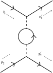
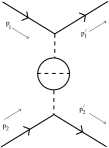
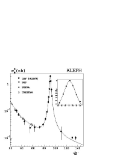
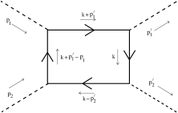
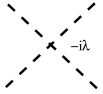
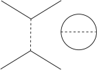
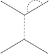
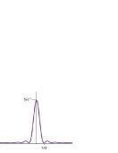
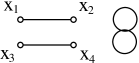

> From <strong>Quantum Field Theory</strong>, lecture notes by <strong>David Tong</strong> (University of Cambridge). Original HTML: <a href="https://davidtong.org/teaching/quantum-field-theory/qfthtml/S3.html">https://davidtong.org/teaching/quantum-field-theory/qfthtml/S3.html</a> · <a href="https://davidtong.org/pdfs/teaching/quantum-field-theory/qft.pdf">PDF version</a> · <a href="https://davidtong.org/teaching/quantum-field-theory">course page</a>. Reformatted for this reader; all content © David Tong.

<a href="2.%20Free%20Fields.md">← 2. Free Fields</a> · <a href="README.md">Contents</a> · <a href="4.%20The%20Dirac%20Equation.md">4. The Dirac Equation →</a>

# 3 Interacting Fields

The free field theories that we’ve discussed so far are very special: we can determine their spectrum, but nothing interesting then happens. They have particle excitations, but these particles don’t interact with each other.

Here we’ll start to examine more complicated theories that include interaction terms. These will take the form of higher order terms in the Lagrangian. We’ll start by asking what kind of <em>small</em> perturbations we can add to the theory. For example, consider the Lagrangian for a real scalar field,

$$
\displaystyle{\cal L}=\frac{1}{2}\partial_{\mu}\phi\,\partial^{\mu}\phi-\frac{1}{2}m^{2}\phi^{2}-\sum_{n\geq 3}\,\frac{\lambda_{n} }{n!}\,\phi^{n} \tag{3.202}
$$

The coefficients $\lambda_{n}$ are called <em>coupling constants</em>. What restrictions do we have on $\lambda_{n}$ to ensure that the additional terms are small perturbations? You might think that we need simply make “$\lambda_{n}\ll 1$”. But this isn’t quite right. To see why this is the case, let’s do some dimensional analysis. Firstly, note that the action has dimensions of angular momentum or, equivalently, the same dimensions as $\hbar$. Since we’ve set $\hbar=1$, using the convention described in the introduction, we have $[S]=0$. With $S=\int d^{4}x\,{\cal L}$, and $[d^{4}x]=-4$, the Lagrangian density must therefore have

$$
\displaystyle[{\cal L}]=4 \tag{3.203}
$$

What does this mean for the Lagrangian (<a href="#E202">3.202</a>)? Since $[\partial_{\mu}]=1$, we can read off the mass dimensions of all the factors to find,

$$
\displaystyle[\phi]=1\ \ \ ,\ \ \ [m]=1\ \ \ \ ,\ \ \ \ [\lambda_{n}]=4-n \tag{3.204}
$$

So now we see why we can’t simply say we need $\lambda_{n}\ll 1$, because this statement only makes sense for dimensionless quantities. The various terms, parameterized by $\lambda_{n}$, fall into three different categories

- $[\lambda_{3}]=1$: For this term, the dimensionless parameter is $\lambda_{3}/E$, where $E$ has dimensions of mass. Typically in quantum field theory, $E$ is the energy scale of the process of interest. This means that $\lambda_{3}\,\phi^{3}/3!$ is a small perturbation at high energies $E\gg\lambda_{3}$, but a large perturbation at low energies $E\ll\lambda_{3}$. Terms that we add to the Lagrangian with this behavior are called <em>relevant</em> because they’re most relevant at low energies (which, after all, is where most of the physics we see lies). In a relativistic theory, $E>m$, so we can always make this perturbation small by taking $\lambda_{3}\ll m$.

- $[\lambda_{4}]=0$: this term is small if $\lambda_{4}\ll 1$. Such perturbations are called <em>marginal</em>.

- $[\lambda_{n}]<0$ for $n\geq 5$: The dimensionless parameter is $(\lambda_{n}E^{n-4})$, which is small at low-energies and large at high energies. Such perturbations are called <em>irrelevant</em>.

As you’ll see later, it is typically impossible to avoid high energy processes in quantum field theory. (We’ve already seen a glimpse of this in computing the vacuum energy). This means that we might expect problems with irrelevant operators. Indeed, these lead to “non-renormalizable” field theories in which one cannot make sense of the infinities at arbitrarily high energies. This doesn’t necessarily mean that the theory is useless; just that it is incomplete at some energy scale.

Let me note however that the naive assignment of relevant, marginal and irrelevant is not always fixed in stone: quantum corrections can sometimes change the character of an operator.

### An Important Aside: Why QFT is Simple

Typically in a quantum field theory, only the relevant and marginal couplings are important. This is basically because, as we’ve seen above, the irrelevant couplings become small at low-energies. This is a huge help: of the infinite number of interaction terms that we could write down, only a handful are actually needed (just two in the case of the real scalar field described above).

Let’s look at this a little more. Suppose that we some day discover the true superduper “theory of everything unimportant” that describes the world at very high energy scales, say the GUT scale, or the Planck scale. Whatever this scale is, let’s call it $\Lambda$. It is an energy scale, so $[\Lambda]=1$. Now we want to understand the laws of physics down at our puny energy scale $E\ll\Lambda$. Let’s further suppose that down at the energy scale $E$, the laws of physics are described by a real scalar field. (They’re not of course: they’re described by non-Abelian gauge fields and fermions, but the same argument applies in that case so bear with me). This scalar field will have some complicated interaction terms (<a href="#E202">3.202</a>), where the precise form is dictated by all the stuff that’s going on in the high energy superduper theory. What are these interactions? Well, we could write our dimensionful coupling constants $\lambda_{n}$ in terms of dimensionless couplings $g_{n}$, multiplied by a suitable power of the relevant scale $\Lambda$,

$$
\displaystyle\lambda_{n}=\frac{g_{n} }{\Lambda^{n-4} } \tag{3.205}
$$

The exact values of dimensionless couplings $g_{n}$ depend on the details of the high-energy superduper theory, but typically one expects them to be of order 1: $g_{n}\sim{\cal O}(1)$. This means that for experiments at small energies $E\ll\Lambda$, the interaction terms of the form $\phi^{n}$ with $n>4$ will be suppressed by powers of $(E/\Lambda)^{n-4}$. This is usually a suppression by many orders of magnitude. (e.g for the energies $E$ explored at the LHC, $E/M_{\rm pl}\sim 10^{-16}$). It is this simple argument, based on dimensional analysis, that ensures that we need only focus on the first few terms in the interaction: those which are relevant and marginal. It also means that if we only have access to low-energy experiments (which we do!), it’s going to be very difficult to figure out the high energy theory (which it is!), because its effects are highly diluted except for the relevant and marginal interactions. The discussion given above is a poor man’s version of the ideas of <em>effective field theory</em> and <em>Wilson’s renormalization group</em>, about which you can learn more in the “Statistical Field Theory” course.

### Examples of Weakly Coupled Theories

In this course we’ll study only weakly coupled field theories i.e. ones that can truly be considered as small perturbations of the free field theory at all energies. In this section, we’ll look at two types of interactions    <strong>1) $\phi^{4}$ theory:</strong>

$$
\displaystyle{\cal L}=\frac{1}{2}\partial_{\mu}\phi\partial^{\mu}\phi-\frac{1}{2}m^{2}\phi^{2}-\frac{\lambda}{4!}\phi^{4} \tag{3.206}
$$

with $\lambda\ll 1$. We can get a hint for what the effects of this extra term will be. Expanding out $\phi^{4}$ in terms of $a_{\vec{p} }$ and $a^{\dagger}_{\vec{p} }$, we see a sum of interactions that look like

$$
\displaystyle a^{\dagger}_{\vec{p} }\,a^{\dagger}_{\vec{p} }\,a^{\dagger}_{\vec{p} }\,a^{\dagger}_{\vec{p} }\ \ \ {\rm and}\ \ \ a^{\dagger}_{\vec{p} }\,a^{\dagger}_{\vec{p} }\,a^{\dagger}_{\vec{p} }\,a_{\vec{p} }\ \ \ {\rm etc.} \tag{3.207}
$$

These will create and destroy particles. This suggests that the $\phi^{4}$ Lagrangian describes a theory in which particle number is not conserved. Indeed, we could check that the number operator $N$ now satisfies $[H,N]\neq 0$.    <strong>2) Scalar Yukawa Theory</strong>

$$
\displaystyle{\cal L}=\partial_{\mu}\psi^{\star}\partial^{\mu}\psi+\frac{1}{2}\partial_{\mu}\phi\partial^{\mu}\phi-M^{2}\psi^{\star}\psi-\frac{1}{2}m^{2}\phi^{2}-g\psi^{\star}\psi\phi \tag{3.208}
$$

with $g\ll M,m$. This theory couples a complex scalar $\psi$ to a real scalar $\phi$. While the individual particle numbers of $\psi$ and $\phi$ are no longer conserved, we do still have a symmetry rotating the phase of $\psi$, ensuring the existence of the charge $Q$ defined in (<a href="2.%20Free%20Fields.md#E150">2.150</a>) such that $[Q,H]=0$. This means that the number of $\psi$ particles minus the number of $\psi$ anti-particles is conserved. It is common practice to denote the anti-particle as $\bar{\psi}$.

The scalar Yukawa theory has a slightly worrying aspect: the potential has a stable local minimum at $\phi=\psi=0$, but is unbounded below for large enough $-g\phi$. This means we shouldn’t try to push this theory too far.

### A Comment on Strongly Coupled Field Theories

In this course we restrict attention to weakly coupled field theories where we can use perturbative techniques. The study of strongly coupled field theories is much more difficult, and one of the major research areas in theoretical physics. For example, some of the amazing things that can happen include

- <strong>Charge Fractionalization:</strong> Although electrons have electric charge 1, under the right conditions the elementary excitations in a solid have fractional charge $1/N$ (where $N\in 2{\bf Z}+1$). For example, this occurs in the fractional quantum Hall effect.

- <strong>Confinement:</strong> The elementary excitations of quantum chromodynamics (QCD) are quarks. But they <em>never</em> appear on their own, only in groups of three (in a baryon) or with an anti-quark (in a meson). They are confined.

- <strong>Emergent Space:</strong> There are field theories in four dimensions which at strong coupling become quantum gravity theories in ten dimensions! The strong coupling effects cause the excitations to act as if they’re gravitons moving in higher dimensions. This is quite extraordinary and still poorly understood. It’s called the AdS/CFT correspondence.

## 3.1 The Interaction Picture

There’s a useful viewpoint in quantum mechanics to describe situations where we have small perturbations to a well-understood Hamiltonian. Let’s return to the familiar ground of quantum mechanics with a finite number of degrees of freedom for a moment. In the Schrödinger picture, the states evolve as

$$
\displaystyle i\frac{d{\left|\psi\right\rangle_{S} } }{dt}=H\left|\psi\right\rangle_{S} \tag{3.209}
$$

while the operators ${\cal O}_{S}$ are independent of time.

In contrast, in the Heisenberg picture the states are fixed and the operators change in time

$$
\begin{aligned}\displaystyle{\cal O}_{H}(t) &\displaystyle= \displaystyle e^{iHt}{\cal O}_{S}\,e^{-iHt}\end{aligned}
$$

$$
\begin{aligned}\displaystyle\left|\psi\right\rangle_{H} &\displaystyle= \displaystyle e^{iHt}\,\left|\psi\right\rangle_{S}\end{aligned} \tag{3.210}
$$

The <em>interaction picture</em> is a hybrid of the two. We split the Hamiltonian up as

$$
\displaystyle H=H_{0}+H_{\rm int} \tag{3.211}
$$

The time dependence of operators is governed by $H_{0}$, while the time dependence of states is governed by $H_{\rm int}$. Although the split into $H_{0}$ and $H_{\rm int}$ is arbitrary, it’s useful when $H_{0}$ is soluble (for example, when $H_{0}$ is the Hamiltonian for a free field theory). The states and operators in the interaction picture will be denoted by a subscript $I$ and are given by,

$$
\begin{aligned}\displaystyle\left|\psi(t)\right\rangle_{I} &\displaystyle= \displaystyle e^{iH_{0}t}\left|\psi(t)\right\rangle_{S}\end{aligned}
$$

$$
\begin{aligned}\displaystyle{\cal O}_{I}(t) &\displaystyle= \displaystyle e^{iH_{0}t}{\cal O}_{S}e^{-iH_{0}t}\end{aligned} \tag{3.212}
$$

This last equation also applies to $H_{\rm int}$, which is time dependent. The interaction Hamiltonian in the interaction picture is,

$$
\displaystyle H_{I}\equiv(H_{\rm int})_{I}=e^{iH_{0}t}(H_{\rm int})_{S}\,e^{-iH_{0}t} \tag{3.213}
$$

The Schrödinger equation for states in the interaction picture can be derived starting from the Schrödinger picture

$$
\begin{aligned}\displaystyle i\frac{d\!\left|\psi\right\rangle_{S} }{dt}=H_{S}\left|\psi\right\rangle_{S} &\displaystyle\Rightarrow \displaystyle i\frac{d}{dt}\,\left(e^{-iH_{0}t}\left|\psi\right\rangle_{I}\right)=(H_{0}+H_{\rm int})_{S}\,e^{-iH_{0}t}\left|\psi\right\rangle_{I} \\ &\displaystyle\Rightarrow \displaystyle i\frac{d\!\left|\psi\right\rangle_{I} }{dt}=e^{iH_{0}t}(H_{\rm int})_{S}\,e^{-iH_{0}t}\,\left|\psi\right\rangle_{I}\end{aligned} \tag{3.214}
$$

So we learn that

$$
\displaystyle i\frac{d\!\left|\psi\right\rangle_{I} }{dt}=H_{I}(t)\left|\psi\right\rangle_{I} \tag{3.215}
$$

### 3.1.1 Dyson’s Formula

> “Well, Birmingham has much the best theoretical physicist to work with, Peierls; Bristol has much the best experimental physicist, Powell; Cambridge has some excellent architecture. You can make your choice.”

<em>Oppenheimer’s advice to Dyson on which university position to accept.</em>

We want to solve (<a href="#E215">3.215</a>). Let’s write the solution as

$$
\displaystyle\left|\psi(t)\right\rangle_{I}=U(t,t_{0})\left|\psi(t_{0})\right\rangle_{I} \tag{3.216}
$$

where $U(t,t_{0})$ is a unitary time evolution operator such that $U(t_{1},t_{2})U(t_{2},t_{3})=U(t_{1},t_{3})$ and $U(t,t)=1$. Then the interaction picture Schrödinger equation (<a href="#E215">3.215</a>) requires that

$$
\displaystyle i\frac{dU}{dt}=H_{I}(t)\,U \tag{3.217}
$$

If $H_{I}$ were a function, then we could simply solve this by

$$
\displaystyle U(t,t_{0})\stackrel{ {\scriptstyle?} }{ {=} }\exp\left(-i\int_{t_{0} }^{t}\,H_{I}(t^{\prime})\,dt^{\prime}\right) \tag{3.218}
$$

But there’s a problem. Our Hamiltonian $H_{I}$ is an operator, and we have ordering issues. Let’s see why this causes trouble. The exponential of an operator is defined in terms of the expansion,

$$
\displaystyle\exp\left(-i\int_{t_{0} }^{t}\,H_{I}(t^{\prime})\,dt^{\prime}\right)=1-i\int_{t_{0} }^{t}\,H_{I}(t^{\prime})\,dt^{\prime}+\frac{(-i)^{2} }{2}\left(\int_{t_{0} }^{t}\,H_{I}(t^{\prime})\,dt^{\prime}\right)^{2}+\ldots \tag{3.219}
$$

But when we try to differentiate this with respect to $t$, we find that the quadratic term gives us

$$
\displaystyle-\frac{1}{2}\left(\int_{t_{0} }^{t}\,H_{I}(t^{\prime})\,dt^{\prime}\right)H_{I}(t)-\frac{1}{2}H_{I}(t)\left(\int_{t_{0} }^{t}\,H_{I}(t^{\prime})\,dt^{\prime}\right) \tag{3.220}
$$

Now the second term here looks good, since it will give part of the $H_{I}(t)U$ that we need on the right-hand side of (<a href="#E217">3.217</a>). But the first term is no good since the $H_{I}(t)$ sits the wrong side of the integral term, and we can’t commute it through because $[H_{I}(t^{\prime}),H_{I}(t)]\neq 0$ when $t^{\prime}\neq t$. So what’s the way around this?    <strong>Claim:</strong> The solution to (<a href="#E217">3.217</a>) is given by <em>Dyson’s Formula</em>. (Essentially first figured out by Dirac, although the compact notation is due to Dyson).

$$
\displaystyle U(t,t_{0})=T\,\exp\left(-i\int_{t_{0} }^{t}\,H_{I}(t^{\prime})\,dt^{\prime}\right) \tag{3.221}
$$

where $T$ stands for <em>time ordering</em> where operators evaluated at later times are placed to the left

$$
\displaystyle T\,\left({\cal O}_{1}(t_{1})\,{\cal O}_{2}(t_{2})\right)=\left\{\begin{array}{cr}{\cal O}_{1}(t_{1})\,{\cal O}_{2}(t_{2})&\ \ \ t_{1}>t_{2}\\ {\cal O}_{2}(t_{2})\,{\cal O}_{1}(t_{1})&t_{2}>t_{1}\end{array}\right. \tag{3.222}
$$

Expanding out the expression (<a href="#E221">3.221</a>), we now have

$$
\begin{aligned}\displaystyle U(t,t_{0})=1-i\int_{t_{0} }^{t}dt^{\prime}\,H_{I}(t^{\prime}) &\displaystyle+ \displaystyle\frac{(-i)^{2} }{2}\left[\int_{t_{0} }^{t}dt^{\prime}\int_{t^{\prime} }^{t}dt^{\prime\prime}\,H_{I}(t^{\prime\prime})H_{I}(t^{\prime})\right. \\ & \displaystyle\ \ \ \ \ \ \ \ \ \ \ \ \ \ \ \left.+\int_{t_{0} }^{t}dt^{\prime}\int_{t_{0} }^{t^{\prime} }dt^{\prime\prime}\,H_{I}(t^{\prime})H_{I}(t^{\prime\prime})\right]+\ldots\end{aligned}
$$

Actually these last two terms double up since

$$
\begin{aligned}\displaystyle\int_{t_{0} }^{t}dt^{\prime}\int_{t^{\prime} }^{t}dt^{\prime\prime}\,H_{I}(t^{\prime\prime})H_{I}(t^{\prime}) &\displaystyle= \displaystyle\int_{t_{0} }^{t}dt^{\prime\prime}\int_{t_{0} }^{t^{\prime\prime} }dt^{\prime}\,H_{I}(t^{\prime\prime})H_{I}(t^{\prime}) \\ &\displaystyle= \displaystyle\int_{t_{0} }^{t}dt^{\prime}\int_{t_{0} }^{t^{\prime} }dt^{\prime\prime}\,H_{I}(t^{\prime})H_{I}(t^{\prime\prime})\end{aligned} \tag{3.223}
$$

where the range of integration in the first expression is over $t^{\prime\prime}\geq t^{\prime}$, while in the second expression it is $t^{\prime}\leq t^{\prime\prime}$ which is, of course, the same thing. The final expression is the same as the second expression by a simple relabelling. This means that we can write

$$
\begin{aligned}\displaystyle U(t,t_{0})=1-i\int_{t_{0} }^{t}dt^{\prime}\,H_{I}(t^{\prime}) &\displaystyle+ \displaystyle(-i)^{2}\int_{t_{0} }^{t}dt^{\prime}\int_{t_{0} }^{t^{\prime} }dt^{\prime\prime}\,H_{I}(t^{\prime})H_{I}(t^{\prime\prime})+\ldots\end{aligned} \tag{3.224}
$$

<strong>Proof:</strong> The proof of Dyson’s formula is simpler than explaining what all the notation means! Firstly observe that under the $T$ sign, all operators commute (since their order is already fixed by the $T$ sign). Thus

$$
\begin{aligned}\displaystyle i\frac{\partial}{\partial t}\ T\,\exp\left(-i\int_{t_{0} }^{t}\,dt^{\prime}\,H_{I}(t^{\prime})\right) &\displaystyle= \displaystyle T\left[H_{I}(t)\,\exp\left(\,-i\int_{t_{0} }^{t}dt^{\prime}\,H_{I}(t^{\prime})\right)\right] \\ &\displaystyle= \displaystyle H_{I}(t)\,T\,\exp\left(\,-i\int_{t_{0} }^{t}dt^{\prime}\,H_{I}(t^{\prime})\right)\end{aligned} \tag{3.225}
$$

since $t$, being the upper limit of the integral, is the latest time so $H_{I}(t)$ can be pulled out to the left. $\Box$

Before moving on, I should confess that Dyson’s formula is rather formal. It is typically very hard to compute time ordered exponentials in practice. The power of the formula comes from the expansion which is valid when $H_{I}$ is small and is very easily computed.

## 3.2 A First Look at Scattering

Let us now apply the interaction picture to field theory, starting with the interaction Hamiltonian for our scalar Yukawa theory,

$$
\displaystyle H_{\rm int}=g\int d^{3}x\ \psi^{\dagger}\psi\phi \tag{3.226}
$$

Unlike the free theories discussed in Section 2, this interaction doesn’t conserve particle number, allowing particles of one type to morph into others. To see why this is, we use the interaction picture and follow the evolution of the state: $\left|\psi(t)\right\rangle=U(t,t_{0})\left|\psi(t_{0})\right\rangle$, where $U(t,t_{0})$ is given by Dyson’s formula (<a href="#E221">3.221</a>) which is an expansion in powers of $H_{\rm int}$. But $H_{\rm int}$ contains creation and annihilation operators for each type of particle. In particular,

- $\phi\sim a+a^{\dagger}$: This operator can create or destroy $\phi$ particles. Let’s call them <em>mesons</em>.

- $\psi\sim b+c^{\dagger}$: This operator can destroy $\psi$ particles through $b$, and create anti-particles through $c^{\dagger}$. Let’s call these particles <em>nucleons</em>. Of course, in reality nucleons are spin $1/2$ particles, and don’t arise from the quantization of a scalar field. But we’ll treat our scalar Yukawa theory as a toy model for nucleons interacting with mesons.

- $\psi^{\dagger}\sim b^{\dagger}+c$: This operator can create nucleons through $b^{\dagger}$, and destroy anti-nucleons through $c$.

Importantly, $Q=N_{c}-N_{b}$ remains conserved in the presence of $H_{\rm int}$. At first order in perturbation theory, we find terms in $H_{\rm int}$ like $c^{\dagger}b^{\dagger}a$. This kills a meson, producing a nucleon-anti-nucleon pair. It will contribute to meson decay $\phi\rightarrow\psi\bar{\psi}$.

At second order in perturbation theory, we’ll have more complicated terms in $(H_{\rm int})^{2}$, for example $(c^{\dagger}b^{\dagger}a)(cba^{\dagger})$. This term will give contributions to scattering processes $\psi\bar{\psi}\rightarrow\phi\rightarrow\psi\bar{\psi}$. The rest of this section is devoted to computing the quantum amplitudes for these processes to occur.

To calculate amplitudes we make an important, and slightly dodgy, assumption:

$$
\text{Initial and final states are eigenstates of the free theory}
$$

This means that we take the initial state $\left|i\right\rangle$ at $t\rightarrow-\infty$, and the final state $\left|f\right\rangle$ at $t\rightarrow+\infty$, to be eigenstates of the free Hamiltonian $H_{0}$. At some level, this sounds plausible: at $t\rightarrow-\infty$, the particles in a scattering process are far separated and don’t feel the effects of each other. Furthermore, we intuitively expect these states to be eigenstates of the individual number operators $N$, which commute with $H_{0}$, but not $H_{\rm int}$. As the particles approach each other, they interact briefly, before departing again, each going on its own merry way. The amplitude to go from $\left|i\right\rangle$ to $\left|f\right\rangle$ is

$$
\displaystyle\lim_{t_{\pm}\rightarrow\pm\infty}\,\left\langle f\right|U(t_{+},t_{-})\left|i\right\rangle\equiv\left\langle f\right|S\left|i\right\rangle \tag{3.227}
$$

where the unitary operator $S$ is known as the S-matrix. (S is for scattering). There are a number of reasons why the assumption of non-interacting initial and final states is shaky:

- Obviously we can’t cope with bound states. For example, this formalism can’t describe the scattering of an electron and proton which collide, bind, and leave as a Hydrogen atom. It’s possible to circumvent this objection since it turns out that bound states show up as poles in the S-matrix.

- More importantly, a single particle, a long way from its neighbors, is never alone in field theory. This is true even in classical electrodynamics, where the electron sources the electromagnetic field from which it can never escape. In quantum electrodynamics (QED), a related fact is that there is a cloud of <em>virtual</em> photons surrounding the electron. This line of thought gets us into the issues of renormalization — more on this next term in the “AQFT” course. Nevertheless, motivated by this problem, after developing scattering theory using the assumption of non-interacting asymptotic states, we’ll mention a better way.

### 3.2.1 An Example: Meson Decay

Consider the relativistically normalized initial and final states,

$$
\begin{aligned}\displaystyle\left|i\right\rangle &\displaystyle= \displaystyle\sqrt{2E_{\vec{p} } }\,a_{\vec{p} }^{\dagger}\,\left|0\right\rangle\end{aligned}
$$

$$
\begin{aligned}\displaystyle\left|f\right\rangle &\displaystyle= \displaystyle\sqrt{4E_{\vec{q}_{1} }E_{\vec{q}_{2} } }\,b_{\vec{q}_{1} }^{\dagger}\,c_{\vec{q}_{2} }^{\dagger}\,\left|0\right\rangle\end{aligned} \tag{3.228}
$$

The initial state contains a single meson of momentum $p$; the final state contains a nucleon-anti-nucleon pair of momentum $q_{1}$ and $q_{2}$. We may compute the amplitude for the decay of a meson to a nucleon-anti-nucleon pair. To leading order in $g$, it is

$$
\begin{aligned}\displaystyle\left\langle f\right|S\left|i\right\rangle &\displaystyle= \displaystyle-ig\left\langle f\right|\,\int d^{4}x\,\psi^{\dagger}(x)\psi(x)\phi(x)\left|i\right\rangle\end{aligned} \tag{3.229}
$$

Let’s go slowly. We first expand out $\phi\sim a+a^{\dagger}$ using (<a href="2.%20Free%20Fields.md#E159">2.159</a>). (Remember that the $\phi$ in this formula is in the interaction picture, which is the same as the Heisenberg picture of the free theory). The $a$ piece will turn $\left|i\right\rangle$ into something proportional to $\left|0\right\rangle$, while the $a^{\dagger}$ piece will turn $\left|i\right\rangle$ into a two meson state. But the two meson state will have zero overlap with $\left\langle f\right|$, and there’s nothing in the $\psi$ and $\psi^{\dagger}$ operators that lie between them to change this fact. So we have

$$
\begin{aligned}\displaystyle\left\langle f\right|S\left|i\right\rangle &\displaystyle= \displaystyle-ig\left\langle f\right|\,\int d^{4}x\,\psi^{\dagger}(x)\psi(x)\int\frac{d^{3}k}{(2\pi)^{3} }\,\frac{\sqrt{2E_{\vec{p} } } }{\sqrt{2E_{\vec{k} } } }\,a_{\vec{k} }\,a^{\dagger}_{\vec{p} }\,e^{-ik\cdot x}\left|0\right\rangle \\ &\displaystyle= \displaystyle-ig\left\langle f\right|\int d^{4}x\,\psi^{\dagger}(x)\psi(x)e^{-ip\cdot x}\left|0\right\rangle\end{aligned} \tag{3.230}
$$

where, in the second line, we’ve commuted $a_{\vec{k} }$ past $a^{\dagger}_{\vec{p} }$, picking up a $\delta^{(3)}(\vec{p}-\vec{k})$ delta-function which kills the $d^{3}k$ integral. We now similarly expand out $\psi\sim b+c^{\dagger}$ and $\psi^{\dagger}\sim b^{\dagger}+c$. To get non-zero overlap with $\left\langle f\right|$, only the $b^{\dagger}$ and $c^{\dagger}$ contribute, for they create the nucleon and anti-nucleon from $\left|0\right\rangle$. We then have

$$
\begin{aligned}\displaystyle\left\langle f\right|S\left|i\right\rangle &\displaystyle= \displaystyle-ig\left\langle 0\right|\,\int\int\frac{d^{4}xd^{3}k_{1}d^{3}k_{2} }{(2\pi)^{6} }\,\frac{\sqrt{E_{\vec{q}_{1} }E_{\vec{q}_{2} } } }{\sqrt{E_{\vec{k}_{1} }E_{\vec{k}_{2} } } }\,c_{\vec{q}_{2} }b_{\vec{q}_{1} }c^{\dagger}_{\vec{k}_{1} }b^{\dagger}_{\vec{k}_{2} }\,\left|0\right\rangle e^{i(k_{1}+k_{2}-p)\cdot x} \\ &\displaystyle= \displaystyle-ig\,(2\pi)^{4}\,\delta^{(4)}(q_{1}+q_{2}-p)\end{aligned} \tag{3.231}
$$

and so we get our first quantum field theory amplitude.

Notice that the $\delta$-function puts constraints on the possible decays. In particular, the decay only happens at all if $m\geq 2M$. To see this, we may always boost ourselves to a reference frame where the meson is stationary, so $p=(m,0,0,0)$. Then the delta function imposes momentum conservation, telling us that $\vec{q}_{1}=-\vec{q}_{2}$ and $m=2\sqrt{M^{2}+|\vec{q}|^{2} }$.

Later you will learn how to turn this quantum amplitude into something more physical, namely the lifetime of the meson. The reason this is a little tricky is that we must square the amplitude to get the probability for decay, which means we get the square of a $\delta$-function. We’ll explain how to deal with this in Section 3.6 below, and again in next term’s “Standard Model” course.

## 3.3 Wick’s Theorem

From Dyson’s formula, we want to compute quantities like $\left\langle f\right|T\,\left\{H_{I}(x_{1})\ldots H_{I}(x_{n})\right\}\left|i\right\rangle$, where $\left|i\right\rangle$ and $\left|f\right\rangle$ are eigenstates of the free theory. The ordering of the operators is fixed by $T$, time ordering. However, since the $H_{I}$’s contain certain creation and annihilation operators, our life will be much simpler if we can start to move all annihilation operators to the right where they can start killing things in $\left|i\right\rangle$. Recall that this is the definition of normal ordering. Wick’s theorem tells us how to go from time ordered products to normal ordered products.

### 3.3.1 An Example: Recovering the Propagator

Let’s start simple. Consider a real scalar field which we decompose in the Heisenberg picture as

$$
\displaystyle\phi(x)=\phi^{+}(x)+\phi^{-}(x) \tag{3.232}
$$

where

$$
\begin{aligned}\displaystyle\phi^{+}(x) &\displaystyle= \displaystyle\int\frac{d^{3}p}{(2\pi)^{3} }\,\frac{1}{\sqrt{2E_{\vec{p} } } }\,a_{\vec{p} }\,e^{-ip\cdot x}\end{aligned}
$$

$$
\begin{aligned}\displaystyle\phi^{-}(x) &\displaystyle= \displaystyle\int\frac{d^{3}p}{(2\pi)^{3} }\,\frac{1}{\sqrt{2E_{\vec{p} } } }\,a^{\dagger}_{\vec{p} }\,e^{+ip\cdot x}\end{aligned} \tag{3.233}
$$

where the $\pm$ signs on $\phi^{\pm}$ make little sense, but apparently you have Pauli and Heisenberg to blame. (They come about because $\phi^{+}\sim e^{-iEt}$, which is sometimes called the positive frequency piece, while $\phi^{-}\sim e^{+iEt}$ is the negative frequency piece). Then choosing $x^{0}>y^{0}$, we have

$$
\begin{aligned}\displaystyle T\,\phi(x)\phi(y) &\displaystyle= \displaystyle\phi(x)\phi(y) \\ &\displaystyle= \displaystyle(\phi^{+}(x)+\phi^{-}(x))(\phi^{+}(y)+\phi^{-}(y)) \\ &\displaystyle= \displaystyle\phi^{+}(x)\phi^{+}(y)+\phi^{-}(x)\phi^{+}(y)+\phi^{-}(y)\phi^{+}(x)+[\phi^{+}(x),\phi^{-}(y)]+\phi^{-}(x)\phi^{-}(y)\end{aligned}
$$

where the last line is normal ordered, and for our troubles we have picked up the extra term $D(x-y)=[\phi^{+}(x),\phi^{-}(y)]$ which is the propagator we met in (<a href="2.%20Free%20Fields.md#E165">2.165</a>). So for $x^{0}>y^{0}$ we have

$$
\displaystyle T\,\phi(x)\phi(y)=:\phi(x)\phi(y):+\,D(x-y) \tag{3.235}
$$

Meanwhile, for $y^{0}>x^{0}$, we may repeat the calculation to find

$$
\displaystyle T\,\phi(x)\phi(y)=:\phi(x)\phi(y):+\,D(y-x) \tag{3.236}
$$

So putting this together, we have the final expression

$$
\displaystyle T\,\phi(x)\phi(y)=:\phi(x)\phi(y):+\,\Delta_{F}(x-y) \tag{3.237}
$$

where $\Delta_{F}(x-y)$ is the Feynman propagator defined in (<a href="2.%20Free%20Fields.md#E168">2.168</a>), for which we have the integral representation

$$
\displaystyle\Delta_{F}(x-y)=\int\frac{d^{4}k}{(2\pi)^{4} }\,\frac{ie^{ik\cdot(x-y)} }{k^{2}-m^{2}+i\epsilon} \tag{3.238}
$$

Let me reiterate a comment from Section 2: although $T\,\phi(x)\phi(y)$ and $:\phi(x)\phi(y):$ are both operators, the difference between them is a c-number function, $\Delta_{F}(x-y)$.    <strong>Definition:</strong> We define the <em>contraction</em> of a pair of fields in a string of operators $\ldots\phi(x_{1})\ldots\phi(x_{2})\ldots$ to mean replacing those operators with the Feynman propagator, leaving all other operators untouched. We use the notation,

$$
\displaystyle\ldots\overbrace{\phi(x_{1})\ldots\phi(x_{2})}\ldots \tag{3.239}
$$

to denote contraction. So, for example,

$$
\displaystyle\overbrace{\phi(x)\phi(y)}=\Delta_{F}(x-y) \tag{3.240}
$$

A similar discussion holds for complex scalar fields. We have

$$
\displaystyle T\psi(x)\psi^{\dagger}(y)=:\psi(x)\psi^{\dagger}(y):+\Delta_{F}(x-y) \tag{3.241}
$$

prompting us to define the contraction

$$
\displaystyle\overbrace{\psi(x)\psi^{\dagger}(y)}=\Delta_{F}(x-y)\ \ \ {\rm and}\ \ \ \overbrace{\psi(x)\psi(y)}=\overbrace{\psi^{\dagger}(x)\psi^{\dagger}(y)}=0 \tag{3.242}
$$

### 3.3.2 Wick’s Theorem

For any collection of fields $\phi_{1}=\phi(x_{1})$, $\phi_{2}=\phi(x_{2})$, etc, we have

$$
\displaystyle T(\phi_{1}\ldots\phi_{n})=:\phi_{1}\ldots\phi_{n}:+:\text{all possible contractions}: \tag{3.243}
$$

To see what the last part of this equation means, let’s look at an example. For $n=4$, the equation reads

$$
\begin{aligned}\displaystyle T(\phi_{1}\phi_{2}\phi_{3}\phi_{4}) &\displaystyle= \displaystyle:\phi_{1}\phi_{2}\phi_{3}\phi_{4}:+\overbrace{\phi_{1}\phi_{2} }:\phi_{3}\phi_{4}:+\overbrace{\phi_{1}\phi_{3} }:\phi_{2}\phi_{4}:+\ {\rm four\ similar\ terms} \\ & \displaystyle\ \ \ \ \ \ \ \ \ \ \ \ \ \ \ \ +\overbrace{\phi_{1}\phi_{2} }\overbrace{\phi_{3}\phi_{4} }+\overbrace{\phi_{1}\phi_{3} }\overbrace{\phi_{2}\phi_{4} }+\overbrace{\phi_{1}\phi_{4} }\overbrace{\phi_{2}\phi_{3} }\end{aligned} \tag{3.244}
$$

<strong>Proof:</strong> The proof of Wick’s theorem proceeds by induction and a little thought. It’s true for $n=2$. Suppose it’s true for $\phi_{2}\ldots\phi_{n}$ and now add $\phi_{1}$. We’ll take $x_{1}^{0}>x_{k}^{0}$ for all $k=2,\ldots,n$. Then we can pull $\phi_{1}$ out to the left of the time ordered product, writing

$$
\displaystyle T\,(\phi_{1}\phi_{2}\ldots\phi_{n})=(\phi_{1}^{+}+\phi_{1}^{-})\,\left(:\phi_{2}\ldots\phi_{n}:+:{\rm contractions}:\right) \tag{3.245}
$$

The $\phi_{1}^{-}$ term stays where it is since it is already normal ordered. But in order to write the right-hand side as a normal ordered product, the $\phi_{1}^{+}$ term has to make its way past the crowd of $\phi_{k}^{-}$ operators. Each time it moves past $\phi_{k}^{-}$, we pick up a factor of $\overbrace{\phi_{1}\phi_{k} }=\Delta_{F}(x_{1}-x_{k})$ from the commutator. (Try it!) $\Box$

### 3.3.3 An Example: Nucleon Scattering

Let’s look at $\psi\psi\rightarrow\psi\psi$ scattering. We have the initial and final states

$$
\begin{aligned}\displaystyle\left|i\right\rangle &\displaystyle= \displaystyle\sqrt{2E_{\vec{p}_{1} } }\sqrt{2E_{\vec{p}_{2} } }\,b_{\vec{p}_{1} }^{\dagger}\,b_{\vec{p}_{2} }^{\dagger}\,\left|0\right\rangle\equiv\left|p_{1},p_{2}\right\rangle\end{aligned}
$$

$$
\begin{aligned}\displaystyle\left|f\right\rangle &\displaystyle= \displaystyle\sqrt{2E_{\vec{p}_{1}^{\prime} } }\sqrt{2E_{\vec{p}_{2}^{\,\prime} } }\,b_{\vec{p}_{1}^{\,\prime} }^{\dagger}b_{\vec{p}_{2}^{\,\prime} }^{\dagger}\left|0\right\rangle\equiv\left|p_{1}^{\,\prime},p_{2}^{\,\prime}\right\rangle\end{aligned} \tag{3.246}
$$

We can then look at the expansion of $\left\langle f\right|S\left|i\right\rangle$. In fact, we really want to calculate $\left\langle f\right|S-1\left|i\right\rangle$ since we’re not interested in situations where no scattering occurs. At order $g^{2}$ we have the term

$$
\displaystyle\frac{(-ig)^{2} }{2}\int d^{4}x_{1}d^{4}x_{2}\ T\left(\psi^{\dagger}(x_{1})\psi(x_{1})\phi(x_{1})\psi^{\dagger}(x_{2})\psi(x_{2})\phi(x_{2})\right) \tag{3.247}
$$

Now, using Wick’s theorem we see there is a piece in the string of operators which looks like

$$
\displaystyle:\psi^{\dagger}(x_{1})\psi(x_{1})\psi^{\dagger}(x_{2})\psi(x_{2}):\ \overbrace{\phi(x_{1})\phi(x_{2})} \tag{3.248}
$$

which will contribute to the scattering because the two $\psi$ fields annihilate the $\psi$ particles, while the two $\psi^{\dagger}$ fields create $\psi$ particles. Any other way of ordering the $\psi$ and $\psi^{\dagger}$ fields will give zero contribution. This means that we have

$$
\begin{aligned}& \displaystyle\left\langle p_{1}^{\prime},p_{2}^{\prime}\right|:\psi^{\dagger}(x_{1})\psi(x_{1})\psi^{\dagger}(x_{2})\psi(x_{2}):\left|p_{1},p_{2}\right\rangle \\ &\displaystyle= \displaystyle\left\langle p_{1}^{\prime},p_{2}^{\prime}\right|\psi^{\dagger}(x_{1})\psi^{\dagger}(x_{2})\left|0\right\rangle\left\langle 0\right|\psi(x_{1})\psi(x_{2})\left|p_{1},p_{2}\right\rangle \\ &\displaystyle= \displaystyle\left(e^{ip_{1}^{\prime}\cdot x_{1}+ip_{2}^{\prime}\cdot x_{2} }+e^{ip_{1}^{\prime}\cdot x_{2}+ip_{2}^{\prime}\cdot x_{1} }\right)\left(e^{-ip_{1}\cdot x_{1}-ip_{2}\cdot x_{2} }+e^{-ip_{1}\cdot x_{2}-ip_{2}\cdot x_{1} }\right) \\ &\displaystyle= \displaystyle e^{ix_{1}\cdot(p_{1}^{\prime}-p_{1})+ix_{2}\cdot(p_{2}^{\prime}-p_{2})}+e^{ix_{1}\cdot(p_{2}^{\prime}-p_{1})+ix_{2}\cdot(p_{1}^{\prime}-p_{2})}+(x_{1}\leftrightarrow x_{2})\end{aligned} \tag{3.249}
$$

where, in going to the third line, we’ve used the fact that for relativistically normalized states,

$$
\displaystyle\left\langle 0\right|\psi(x)\left|p\right\rangle=e^{-ip\cdot x} \tag{3.250}
$$

Now let’s insert this into (<a href="#E247">3.247</a>), to get the expression for $\left\langle f\right|S\left|i\right\rangle$ at order $g^{2}$,

$$
\displaystyle\frac{(-ig)^{2} }{2}\int d^{4}x_{1}d^{4}x_{2}\ \left[e^{i\ldots}+e^{i\ldots}+(x_{1}\leftrightarrow x_{2})\right]\,\int\frac{d^{4}k}{(2\pi)^{4} }\ \frac{ie^{ik\cdot(x_{1}-x_{2})} }{k^{2}-m^{2}+i\epsilon} \tag{3.251}
$$

where the expression in square brackets is (<a href="#E249">3.249</a>), while the final integral is the $\phi$ propagator which comes from the contraction in (<a href="#E248">3.248</a>). Now the $(x_{1}\leftrightarrow x_{2})$ terms double up with the others to cancel the factor of $1/2$ out front. Meanwhile, the $x_{1}$ and $x_{2}$ integrals give delta-functions. We’re left with the expression

$$
\begin{aligned}\displaystyle(-ig)^{2}\int\frac{d^{4}k}{(2\pi)^{4} }\,\frac{i(2\pi)^{8} }{k^{2}-m^{2}+i\epsilon} & \displaystyle\left[\delta^{(4)}(p_{1}^{\prime}-p_{1}+k)\,\delta^{(4)}(p_{2}^{\prime}-p_{2}-k)\right. \\ & \displaystyle\ \ \ \ \ \left.+\,\delta^{(4)}(p_{2}^{\prime}-p_{1}+k)\,\delta^{(4)}(p_{1}^{\prime}-p_{2}-k)\right]\end{aligned} \tag{3.252}
$$

Finally, we can trivially do the $d^{4}k$ integral using the delta-functions to get

$$
\displaystyle i(-ig)^{2}\,\left[\frac{1}{(p_{1}-p^{\,\prime}_{1})^{2}-m^{2}+i\epsilon}+\frac{1}{(p_{1}-p^{\,\prime}_{2})^{2}-m^{2}+i\epsilon}\right]\,(2\pi)^{4}\,\delta^{(4)}(p_{1}+p_{2}-p_{1}^{\prime}-p_{2}^{\prime})
$$

In fact, for this process we may drop the $+i\epsilon$ terms since the denominator is never zero. To see this, we can go to the center of mass frame, where $\vec{p}_{1}=-\vec{p}_{2}$ and, by momentum conservation, $|\vec{p}_{1}|=|\vec{p}_{1}^{\ \prime}|$. This ensures that the 4-momentum of the meson is $k=(0,\vec{p}-\vec{p}^{\ \prime})$, so $k^{2}<0$. We therefore have the end result,

$$
\displaystyle i(-ig)^{2}\,\left[\frac{1}{(p_{1}-p^{\,\prime}_{1})^{2}-m^{2} }+\frac{1}{(p_{1}-p^{\,\prime}_{2})^{2}-m^{2} }\right]\,(2\pi)^{4}\,\delta^{(4)}(p_{1}+p_{2}-p_{1}^{\prime}-p_{2}^{\prime}) \tag{3.253}
$$

We will see another, much simpler way to reproduce this result shortly using Feynman diagrams. This will also shed light on the physical interpretation.

This calculation is also relevant for other scattering processes, such as $\bar{\psi}\bar{\psi}\rightarrow\bar{\psi}\bar{\psi}$, $\psi\bar{\psi}\rightarrow\psi\bar{\psi}$. Each of these comes from the term (<a href="#E249">3.249</a>) in Wick’s theorem. However, we will never find a term that contributes to scattering $\psi\psi\rightarrow\bar{\psi}\bar{\psi}$, for this would violate the conservation of $Q$ charge.

### Another Example: Meson-Nucleon Scattering

If we want to compute $\psi\phi\rightarrow\psi\phi$ scattering at order $g^{2}$, we would need to pick out the term

$$
\displaystyle:\psi^{\dagger}(x_{1})\phi(x_{1})\psi(x_{2})\phi(x_{2}):\,\overbrace{\psi(x_{1})\psi^{\dagger}(x_{2})} \tag{3.254}
$$

and a similar term with $\psi$ and $\psi^{\dagger}$ exchanged. Once more, this term also contributes to similar scattering processes, including $\bar{\psi}\phi\rightarrow\bar{\psi}\phi$ and $\phi\phi\rightarrow\psi\bar{\psi}$.

## 3.4 Feynman Diagrams

> “Like the silicon chips of more recent years, the Feynman diagram was bringing computation to the masses.”

<em>Julian Schwinger</em>

As the above example demonstrates, to actually compute scattering amplitudes using Wick’s theorem is rather tedious. There’s a much better way. It requires drawing pretty pictures. These pictures represent the expansion of $\left\langle f\right|S\left|i\right\rangle$ and we will learn how to associate numbers (or at least integrals) to them. These pictures are called <em>Feynman diagrams</em>.

The object that we really want to compute is $\left\langle f\right|S-1\left|i\right\rangle$, since we’re not interested in processes where no scattering occurs. The various terms in the perturbative expansion can be represented pictorially as follows

- Draw an external line for each particle in the initial state $\left|i\right\rangle$ and each particle in the final state $\left|f\right\rangle$. We’ll choose dotted lines for mesons, and solid lines for nucleons. Assign a directed momentum $p$ to each line. Further, add an arrow to solid lines to denote its charge; we’ll choose an incoming (outgoing) arrow in the initial state for $\psi$ $(\bar{\psi})$. We choose the reverse convention for the final state, where an outgoing arrow denotes $\psi$.

- Join the external lines together with trivalent vertices

Each such diagram you can draw is in 1-1 correspondence with the terms in the expansion of $\left\langle f\right|S-1\left|i\right\rangle$.

### 3.4.1 Feynman Rules

To each diagram we associate a number, using the <em>Feynman rules</em>

&#8226;&nbsp; Add a momentum $k$ to each internal line

&#8226;&nbsp; To each vertex, write down a factor of

$$
\displaystyle(-ig)\,(2\pi)^{4}\,\delta^{(4)}(\sum_{i}k_{i}) \tag{3.255}
$$

where $\sum k_{i}$ is the sum of all momenta flowing <em>into</em> the vertex.

&#8226;&nbsp; For each internal dotted line, corresponding to a $\phi$ particle with momentum $k$, we write down a factor of

$$
\displaystyle\int\frac{d^{4}k}{(2\pi)^{4} }\,\frac{i}{k^{2}-m^{2}+i\epsilon} \tag{3.256}
$$

We include the same factor for solid internal $\psi$ lines, with $m$ replaced by the nucleon mass $M$.

## 3.5 Examples of Scattering Amplitudes

Let’s apply the Feynman rules to compute the amplitudes for various processes. We start with something familiar:

### Nucleon Scattering Revisited

Let’s look at how this works for the $\psi\psi\rightarrow\psi\psi$ scattering at order $g^{2}$. We can write down the two simplest diagrams contributing to this process. They are shown in Figure <a href="#F9">9</a>.

<figure id="F9" style="margin:1.5em auto;text-align:center">
This figure is not included in the HTML edition of the notes. See the <a href="https://davidtong.org/pdfs/teaching/quantum-field-theory/qft.pdf">PDF version</a>.
<figcaption style="font-size:0.9em;margin-top:0.4em"><strong>Figure 9.</strong> The two lowest order Feynman diagrams for nucleon scattering.</figcaption></figure>

Applying the Feynman rules to these diagrams, we get

$$
\displaystyle i(-ig)^{2}\,\left[\frac{1}{(p_{1}-p^{\,\prime}_{1})^{2}-m^{2} }+\frac{1}{(p_{1}-p^{\,\prime}_{2})^{2}-m^{2} }\right]\,(2\pi)^{4}\,\delta^{(4)}(p_{1}+p_{2}-p_{1}^{\prime}-p_{2}^{\prime}) \tag{3.257}
$$

which agrees with the calculation (<a href="#E252">3.252</a>) that we performed earlier. There is a nice physical interpretation of these diagrams. We talk, rather loosely, of the nucleons exchanging a meson which, in the first diagram, has momentum $k=(p_{1}-p_{1}^{\prime})=(p^{\prime}_{2}-p_{2})$. This meson doesn’t satisfy the usual energy dispersion relation, because $k^{2}\neq m^{2}$: the meson is called a <em>virtual particle</em> and is said to be <em>off-shell</em> (or, sometimes, off mass-shell). Heuristically, it can’t live long enough for its energy to be measured to great accuracy. In contrast, the momentum on the external, nucleon legs all satisfy $p^{2}=M^{2}$, the mass of the nucleon. They are <em>on-shell</em>. One final note: the addition of the two diagrams above ensures that the particles satisfy Bose statistics.

There are also more complicated diagrams which will contribute to the scattering process at higher orders. For example, we have the two diagrams shown in Figures 10 and 11,

<figure id="F10" style="margin:0;text-align:center"><figcaption style="font-size:0.9em;margin-top:0.4em"><strong>Figure 10.</strong> A contribution at ${\cal O}(g^{4})$.</figcaption></figure><figure id="F11" style="margin:0;text-align:center"><figcaption style="font-size:0.9em;margin-top:0.4em"><strong>Figure 11.</strong> A contribution at ${\cal O}(g^{6})$</figcaption></figure>

and similar diagrams with $p_{1}^{\prime}$ and $p_{2}^{\prime}$ exchanged. Using the Feynman rules, each of these diagrams translates into an integral that we will not attempt to calculate here. And so we go on, with increasingly complicated diagrams, all appearing at higher order in the coupling constant $g$.

### Amplitudes

Our final result for the nucleon scattering amplitude $\left\langle f\right|S-1\left|i\right\rangle$ at order $g^{2}$ was

$$
\displaystyle i(-ig)^{2}\,\left[\frac{1}{(p_{1}-p^{\,\prime}_{1})^{2}-m^{2} }+\frac{1}{(p_{1}-p^{\,\prime}_{2})^{2}-m^{2} }\right]\,(2\pi)^{4}\,\delta^{(4)}(p_{1}+p_{2}-p_{1}^{\,\prime}-p_{2}^{\,\prime})
$$

The $\delta$-function follows from the conservation of 4-momentum which, in turn, follows from spacetime translational invariance. It is common to all S-matrix elements. We will define the amplitude ${\cal A}_{fi}$ by stripping off this momentum-conserving delta-function,

$$
\displaystyle\left\langle f\right|S-1\left|i\right\rangle=i\,{\cal A}_{fi}\,(2\pi)^{4}\delta^{(4)}(p_{F}-p_{I}) \tag{3.258}
$$

where $p_{I}$ ($p_{F}$) is the sum of the initial (final) 4-momenta, and the factor of $i$ out front is a convention which is there to match non-relativistic quantum mechanics. We can now refine our Feynman rules to compute the amplitude $i{\cal A}_{fi}$ itself:

- Draw all possible diagrams with appropriate external legs and impose 4-momentum conservation at each vertex.

- Write down a factor of $(-ig)$ at each vertex.

- For each internal line, write down the propagator

- Integrate over momentum $k$ flowing through each loop $\int d^{4}k/(2\pi)^{4}$.

This last step deserves a short explanation. The diagrams we’ve computed so far have no loops. They are <em>tree level</em> diagrams. It’s not hard to convince yourself that in tree diagrams, momentum conservation at each vertex is sufficient to determine the momentum flowing through each internal line. For diagrams with loops, such as those shown in Figures 10 and 11, this is no longer the case.

### Nucleon to Meson Scattering

Let’s now look at the amplitude for a nucleon-anti-nucleon pair to annihilate into a pair of mesons: $\psi\bar{\psi}\rightarrow\phi\phi$. The simplest Feynman diagrams for this process are shown in Figure <a href="#F12">12</a>

<figure id="F12" style="margin:1.5em auto;text-align:center">
This figure is not included in the HTML edition of the notes. See the <a href="https://davidtong.org/pdfs/teaching/quantum-field-theory/qft.pdf">PDF version</a>.
<figcaption style="font-size:0.9em;margin-top:0.4em"><strong>Figure 12.</strong> The two lowest order Feynman diagrams for nucleon to meson scattering.</figcaption></figure>

where the virtual particle in these diagrams is now the nucleon $\psi$ rather than the meson $\phi$. This fact is reflected in the denominator of the amplitudes which are given by

$$
\displaystyle i{\cal A}=(-ig)^{2}\left[\frac{i}{(p_{1}-p_{1}^{\,\prime})^{2}-M^{2} }+\frac{i}{(p_{1}-p_{2}^{\,\prime})^{2}-M^{2} }\right] \tag{3.259}
$$

As in (<a href="#E253">3.253</a>), we’ve dropped the $i\epsilon$ from the propagators as the denominator never vanishes.

### Nucleon-Anti-Nucleon Scattering

<figure id="F13" style="margin:1.5em auto;text-align:center">
This figure is not included in the HTML edition of the notes. See the <a href="https://davidtong.org/pdfs/teaching/quantum-field-theory/qft.pdf">PDF version</a>.
<figcaption style="font-size:0.9em;margin-top:0.4em"><strong>Figure 13.</strong> The two lowest order Feynman diagrams for nucleon-anti-nucleon scattering.</figcaption></figure>

For the scattering of a nucleon and an anti-nucleon, $\psi\bar{\psi}\rightarrow\psi\bar{\psi}$, the Feynman diagrams are a little different. At lowest order, they are given by the diagrams of Figure <a href="#F13">13</a>. It is a simple matter to write down the amplitude using the Feynman rules,

$$
\displaystyle i{\cal A}=(-ig)^{2}\left[\frac{i}{(p_{1}-p_{1}^{\,\prime})^{2}-m^{2} }+\frac{i}{(p_{1}+p_{2})^{2}-m^{2}+i\epsilon}\right] \tag{3.260}
$$

<figure id="F14" style="margin:1.5em auto;text-align:center"><figcaption style="font-size:0.9em;margin-top:0.4em"><strong>Figure 14.</strong> </figcaption></figure>

Notice that the momentum dependence in the second term is different from that of nucleon-nucleon scattering (<a href="#E257">3.257</a>), reflecting the different Feynman diagram that contributes to the process. In the center of mass frame, $\vec{p}_{1}=-\vec{p}_{2}$, the denominator of the second term is $4(M^{2}+\vec{p}_{1}^{\,2})-m^{2}$. If $m<2M$, then this term never vanishes and we may drop the $i\epsilon$. In contrast, if $m>2M$, then the amplitude corresponding to the second diagram diverges at some value of $\vec{p}$. In this case it turns out that we may also neglect the $i\epsilon$ term, although for a different reason: the meson is unstable when $m>2M$, a result we derived in (<a href="#E231">3.231</a>). When correctly treated, this instability adds a finite imaginary piece to the denominator which overwhelms the $i\epsilon$. Nonetheless, the increase in the scattering amplitude which we see in the second diagram when $4(M^{2}+\vec{p}^{\,2})=m^{2}$ is what allows us to discover new particles: they appear as a resonance in the cross section. For example, the Figure 14 shows the cross-section (roughly the amplitude squared) plotted vertically for $e^{+}e^{-}\rightarrow\mu^{+}\mu^{-}$ scattering from the ALEPH experiment in CERN. The horizontal axis shows the center of mass energy. The curve rises sharply around 91 GeV, the mass of the Z-boson.

### Meson Scattering

<figure id="F15" style="margin:1.5em auto;text-align:center"><figcaption style="font-size:0.9em;margin-top:0.4em"><strong>Figure 15.</strong> </figcaption></figure>

For $\phi\phi\rightarrow\phi\phi$, the simplest diagram we can write down has a single loop, and momentum conservation at each vertex is no longer sufficient to determine every momentum passing through the diagram. We choose to assign the single undetermined momentum $k$ to the right-hand propagator. All other momenta are then determined. The amplitude corresponding to the diagram shown in the figure is

$$
\begin{aligned}\displaystyle(-ig)^{4}\int\frac{d^{4}k}{(2\pi)^{4} } & \displaystyle\frac{1}{(k^{2}-M^{2}+i\epsilon)((k+p_{1}^{\prime})^{2}-M^{2}+i\epsilon)} \\ & \displaystyle\ \ \ \ \ \ \ \times\frac{1}{((k+p_{1}^{\,\prime}-p_{1})^{2}-M^{2}+i\epsilon)((k-p_{2}^{\,\prime})^{2}-M^{2}+i\epsilon)}\end{aligned}
$$

These integrals can be tricky. For large $k$, this integral goes as $\int d^{4}k/k^{8}$, which is at least convergent as $k\rightarrow\infty$. But this won’t always be the case!

### 3.5.1 Mandelstam Variables

We see that in many of the amplitudes above — in particular those that include the exchange of just a single particle — the same combinations of momenta are appearing frequently in the denominators. There are standard names for various sums and differences of momenta: they are known as <em>Mandelstam variables</em>. They are

$$
\begin{aligned}\displaystyle s &\displaystyle= \displaystyle(p_{1}+p_{2})^{2}=(p_{1}^{\prime}+p_{2}^{\prime})^{2}\end{aligned}
$$

$$
\begin{aligned}\displaystyle t &\displaystyle= \displaystyle(p_{1}-p_{1}^{\prime})^{2}=(p_{2}-p_{2}^{\prime})^{2}\end{aligned} \tag{3.261}
$$

$$
\begin{aligned}\displaystyle u &\displaystyle= \displaystyle(p_{1}-p_{2}^{\prime})^{2}=(p_{2}-p_{1}^{\prime})^{2}\end{aligned}
$$

where, as in the examples above, $p_{1}$ and $p_{2}$ are the momenta of the two initial particles, and $p_{1}^{\prime}$ and $p_{2}^{\prime}$ are the momenta of the final two particles. We can define these variables whether the particles involved in the scattering are the same or different. To get a feel for what these variables mean, let’s assume all four particles are the same. We sit in the center of mass frame, so that the initial two particles have four-momenta

$$
\displaystyle p_{1}=(E,0,0,p)\ \ {\rm and}\ \ p_{2}=(E,0,0,-p) \tag{3.262}
$$

The particles then scatter at some angle $\theta$ and leave with momenta

$$
\displaystyle p_{1}^{\prime}=(E,0,p\sin\theta,p\cos\theta)\ \ {\rm and}\ \ p_{2}^{\prime}=(E,0,-p\sin\theta,-p\cos\theta) \tag{3.263}
$$

Then from the above definitions, we have that

$$
\displaystyle s=4E^{2}\ \ \ {\rm and}\ \ \ t=-2p^{2}(1-\cos\theta)\ \ {\rm and}\ \ u=-2p^{2}(1+\cos\theta) \tag{3.264}
$$

The variable $s$ measures the total center of mass energy of the collision, while the variables $t$ and $u$ are measures of the momentum exchanged between particles. (They are basically equivalent, just with the outgoing particles swapped around). Now the amplitudes that involve exchange of a single particle can be written simply in terms of the Mandelstam variables. For example, for nucleon-nucleon scattering, the amplitude (<a href="#E257">3.257</a>) is schematically ${\cal A}\sim(t-m^{2})^{-1}+(u-m^{2})^{-1}$. For the nucleon-anti-nucleon scattering, the amplitude (<a href="#E260">3.260</a>) is ${\cal A}\sim(t-m^{2})^{-1}+(s-m^{2})^{-1}$. We say that the first case involves “t-channel” and “u-channel” diagrams. Meanwhile the nucleon-anti-nucleon scattering is said to involve “t-channel” and “s-channel” diagrams. (The first diagram indeed includes a vertex that looks like the letter “T”).

Note that there is a relationship between the Mandelstam variables. When all the masses are the same we have $s+t+u=4M^{2}$. When the masses of all 4 particles differ, this becomes $s+t+u=\sum_{i}M_{i}^{2}$.

### 3.5.2 The Yukawa Potential

So far we’ve computed the quantum amplitudes for various scattering processes. But these quantities are a little abstract. In Section 3.6 below (and again in next term’s “Standard Model” course) we’ll see how to turn amplitudes into measurable quantities such as cross-sections, or the lifetimes of unstable particles. Here we’ll instead show how to translate the amplitude (<a href="#E253">3.253</a>) for nucleon scattering into something familiar from Newtonian mechanics: a potential, or force, between the particles.

Let’s start by asking a simple question in classical field theory that will turn out to be relevant. Suppose that we have a fixed $\delta$-function source for a real scalar field $\phi$, that persists for all time. What is the profile of $\phi(\vec{x})$? To answer this, we must solve the static Klein-Gordon equation,

$$
\displaystyle-\nabla^{2}\phi+m^{2}\phi=\delta^{(3)}(\vec{x}) \tag{3.265}
$$

We can solve this using the Fourier transform,

$$
\displaystyle\phi(\vec{x})=\int\frac{d^{3}k}{(2\pi)^{3} }\,e^{i\vec{k}\cdot\vec{x} }\,\tilde{\phi}(\vec{k}) \tag{3.266}
$$

Plugging this into (<a href="#E265">3.265</a>) tells us that $(\vec{k}^{\,2}+m^{2})\tilde{\phi}(\vec{k})=1$, giving us the solution

$$
\displaystyle\phi(\vec{x})=\int\frac{d^{3}k}{(2\pi)^{3} }\,\frac{e^{i\vec{k}\cdot\vec{x} } }{\vec{k}^{\,2}+m^{2} } \tag{3.267}
$$

Let’s now do this integral. Changing to polar coordinates, and writing $\vec{k}\cdot\vec{x}=kr\cos\theta$, we have

$$
\begin{aligned}\displaystyle\phi(\vec{x}) &\displaystyle= \displaystyle\frac{1}{(2\pi)^{2} }\int_{0}^{\infty}dk\,\frac{k^{2} }{k^{2}+m^{2} }\,\frac{2\sin\,kr}{kr} \\ &\displaystyle= \displaystyle\frac{1}{(2\pi)^{2}r}\int_{-\infty}^{+\infty}dk\ \frac{k\sin\,kr}{k^{2}+m^{2} } \\ &\displaystyle= \displaystyle\frac{1}{2\pi r}{\rm Re}\left[\int_{-\infty}^{+\infty}\frac{dk}{2\pi i}\,\frac{ke^{ikr} }{k^{2}+m^{2} }\right]\end{aligned} \tag{3.268}
$$

We compute this last integral by closing the contour in the upper half plane $k\rightarrow+i\infty$, picking up the pole at $k=+im$. This gives

$$
\displaystyle\phi(\vec{x})=\frac{1}{4\pi r}\,e^{-mr} \tag{3.269}
$$

The field dies off exponentially quickly at distances $1/m$, the Compton wavelength of the meson.

Now we understand the profile of the $\phi$ field, what does this have to do with the force between $\psi$ particles? We do very similar calculations to that above in electrostatics where a charged particle acts as a $\delta$-function source for the gauge potential: $-\nabla^{2}A_{0}=\delta^{(3)}(\vec{x})$, which is solved by $A_{0}=1/4\pi r$. The profile for $A_{0}$ then acts as the potential energy for another charged (test) particle moving in this background. Can we give the same interpretation to our scalar field? In other words, is there a classical limit of the scalar Yukawa theory where the $\psi$ particles act as $\delta$-function sources for $\phi$, creating the profile (<a href="#E269">3.269</a>)? And, if so, is this profile then felt as a static potential? The answer is essentially yes, at least in the limit $M\gg m$. But the correct way to describe the potential felt by the $\psi$ particles is not to talk about classical fields at all, but instead work directly with the quantum amplitudes.

Our strategy is to compare the nucleon scattering amplitude (<a href="#E253">3.253</a>) to the corresponding amplitude in non-relativistic quantum mechanics for two particles interacting through a potential. To make this comparison, we should first take the non-relativistic limit of (<a href="#E253">3.253</a>). Let’s work in the center of mass frame, with $\vec{p}\equiv\vec{p}_{1}=-\vec{p}_{2}$ and $\vec{p}^{\ \prime}\equiv\vec{p}_{1}^{\ \prime}=-\vec{p}_{2}^{\ \prime}$. The non-relativistic limit means $|\vec{p}|\ll M$ which, by momentum conservation, ensures that $|\vec{p}^{\,\,\prime}|\ll M$. In fact one can check that, for this particular example, this limit doesn’t change the scattering amplitude (<a href="#E253">3.253</a>): it’s given by

$$
\displaystyle i{\cal A}=+ig^{2}\left[\frac{1}{(\vec{p}-\vec{p}^{\,\prime})^{2}+m^{2} }+\frac{1}{(\vec{p}+\vec{p}^{\,\prime})^{2}+m^{2} }\right] \tag{3.270}
$$

How do we compare this to scattering in quantum mechanics? Consider two particles, separated by a distance $\vec{r}$, interacting through a potential $U(\vec{r})$. In non-relativistic quantum mechanics, the amplitude for the particles to scatter from momentum states $\pm\vec{p}$ into momentum states $\pm\vec{p}^{\,\prime}$ can be computed in perturbation theory, using the techniques described in Section 3.1. To leading order, known in this context as the Born approximation, the amplitude is given by

$$
\displaystyle\left\langle\vec{p}^{\,\prime}\right|U(\vec{r})\left|\vec{p}\,\right\rangle=-i\int d^{3}r\,U(\vec{r})e^{-i(\vec{p}-\vec{p}^{\prime})\cdot\vec{r} } \tag{3.271}
$$

There’s a relative factor of $(2M)^{2}$ that arises in comparing the quantum field theory amplitude ${\cal A}$ to $\left\langle\vec{p}^{\,\prime}\right|U(\vec{r})\left|\vec{p}\right\rangle$, that can be traced to the relativistic normalization of the states $\left|p_{1},p_{2}\right\rangle$. (It is also necessary to get the dimensions of the potential to work out correctly). Including this factor, and equating the expressions for the two amplitudes, we get

$$
\displaystyle\int d^{3}r\,U(\vec{r})\,e^{-i(\vec{p}-\vec{p}^{\prime})\cdot\vec{r} }=\frac{-\lambda^{2} }{(\vec{p}-\vec{p}^{\,\prime})^{2}+m^{2} } \tag{3.272}
$$

where we’ve introduced the dimensionless parameter $\lambda=g/2M$. We can trivially invert this to find,

$$
\displaystyle U(\vec{r})=-\lambda^{2}\int\frac{d^{3}p}{(2\pi)^{3} }\,\frac{e^{i\vec{p}\cdot\vec{r} } }{\vec{p}^{\,2}+m^{2} } \tag{3.273}
$$

But this is exactly the integral (<a href="#E267">3.267</a>) we just did in the classical theory. We have

$$
\displaystyle U(\vec{r})=\frac{-\lambda^{2} }{4\pi r}\,e^{-mr} \tag{3.274}
$$

This is the <em>Yukawa potential</em>. The force has a range $1/m$, the Compton wavelength of the exchanged particle. The minus sign tells us that the potential is attractive.

Notice that quantum field theory has given us an entirely new perspective on the nature of forces between particles. Rather than being a fundamental concept, the force arises from the virtual exchange of other particles, in this case the meson. In Section 6 of these lectures, we will see how the Coulomb force arises from quantum field theory due to the exchange of virtual photons.

We could repeat the calculation for nucleon-anti-nucleon scattering. The amplitude from field theory is given in (<a href="#E260">3.260</a>). The first term in this expression gives the same result as for nucleon-nucleon scattering <em>with the same sign</em>. The second term vanishes in the non-relativisitic limit (it is an example of an interaction that doesn’t have a simple Newtonian interpretation). There is no longer a factor of $1/2$ in (<a href="#E271">3.271</a>), because the incoming/outgoing particles are not identical, so we learn that the potential between a nucleon and anti-nucleon is again given by (<a href="#E274">3.274</a>). This reveals a key feature of forces arising due to the exchange of scalars: they are universally attractive. Notice that this is different from forces due to the exchange of a spin 1 particle — such as electromagnetism — where the sign flips when we change the charge. However, for forces due to the exchange of a spin 2 particle — i.e. gravity — the force is again universally attractive.

### 3.5.3 $\phi^{4}$ Theory

<figure id="F16" style="margin:1.5em auto;text-align:center"><figcaption style="font-size:0.9em;margin-top:0.4em"><strong>Figure 16.</strong> </figcaption></figure>

Let’s briefly look at the Feynman rules and scattering amplitudes for the interaction Hamiltonian

$$
\displaystyle H_{\rm int}=\frac{\lambda}{4!}\,\phi^{4} \tag{3.275}
$$

The theory now has a single interaction vertex, which comes with a factor of $(-i\lambda)$, while the other Feynman rules remain the same. Note that we assign $(-i\lambda)$ to the vertex rather than $(-i\lambda/4!)$. To see why this is, we can look at $\phi\phi\rightarrow\phi\phi$ scattering, which has its lowest contribution at order $\lambda$, with the term

$$
\displaystyle\frac{-i\lambda}{4!}\left\langle p_{1}^{\,\prime},p_{2}^{\,\prime}\right|:\phi(x)\phi(x)\phi(x)\phi(x):\left|p_{1},p_{2}\right\rangle \tag{3.276}
$$

Any one of the fields can do the job of annihilation or creation. This gives $4!$ different contractions, which cancels the $1/4!$ sitting out front.

Feynman diagrams in the $\phi^{4}$ theory sometimes come with extra combinatoric factors (typically 2 or 4) which are known as symmetry factors that one must take into account. For more details, see the book by Peskin and Schroeder.

Using the Feynman rules, the scattering amplitude for $\phi\phi\rightarrow\phi\phi$ is simply $i{\cal A}=-i\lambda$. Note that it doesn’t depend on the angle at which the outgoing particles emerge: in $\phi^{4}$ theory the leading order two-particle scattering occurs with equal probability in all directions. Translating this into a potential between two mesons, we have

$$
\displaystyle U(\vec{r})=\frac{\lambda}{(2m)^{2} }\int\frac{d^{3}p}{(2\pi)^{3} }\,e^{+i\vec{p}\cdot{\vec{r} } }=\frac{\lambda}{(2m)^{2} }\delta^{(3)}(\vec{r}) \tag{3.277}
$$

So scattering in $\phi^{4}$ theory is due to a $\delta$-function potential. The particles don’t know what hit them until it’s over.

### 3.5.4 Connected Diagrams and Amputated Diagrams

We’ve seen how one can compute scattering amplitudes by writing down all Feynman diagrams and assigning integrals to them using the Feynman rules. In fact, there are a couple of caveats about what Feynman diagrams you should write down. Both of these caveats are related to the assumption we made earlier that “initial and final states are eigenstates of the free theory” which, as we mentioned at the time, is not strictly accurate. The two caveats which go some way towards ameliorating the problem are the following

- We consider only connected Feynman diagrams, where every part of the diagram is connected to at least one external line. As we shall see shortly, this will be related to the fact that the vacuum $\left|0\right\rangle$ of the free theory is not the true vacuum $\left|\Omega\right\rangle$ of the interacting theory. An example of a diagram that is not connected is shown in Figure 17.

- We do not consider diagrams with loops on external lines, for example the diagram shown in the Figure 18. We will not explain how to take these into account in this course, but you will discuss them next term. They are related to the fact that the one-particle states of the free theory are not the same as the one-particle states of the interacting theory. In particular, correctly dealing with these diagrams will account for the fact that particles in interacting quantum field theories are never alone, but surrounded by a cloud of virtual particles. We will refer to diagrams in which all loops on external legs have been cut-off as “amputated”.

<figure id="F17" style="margin:0;text-align:center"><figcaption style="font-size:0.9em;margin-top:0.4em"><strong>Figure 17.</strong> A disconnected diagram.</figcaption></figure><figure id="F18" style="margin:0;text-align:center"><figcaption style="font-size:0.9em;margin-top:0.4em"><strong>Figure 18.</strong> An un-amputated diagram</figcaption></figure>

## 3.6 What We Measure: Cross Sections and Decay Rates

So far we’ve learnt to compute the quantum amplitudes for particles decaying or scattering. As usual in quantum theory, the probabilities for things to happen are the (modulus) square of the quantum amplitudes. In this section we will compute these probabilities, known as decay rates and cross sections. One small subtlety here is that the S-matrix elements $\left\langle f\right|S-1\left|i\right\rangle$ all come with a factor of $(2\pi)^{4}\delta^{(4)}(p_{F}-p_{I})$, so we end up with the square of a delta-function. As we will now see, this comes from the fact that we’re working in an infinite space.

### 3.6.1 Fermi’s Golden Rule

Let’s start with something familiar and recall how to derive Fermi’s golden rule from Dyson’s formula. For two energy eigenstates $\left|m\right\rangle$ and $\left|n\right\rangle$, with $E_{m}\neq E_{n}$, we have to leading order in the interaction,

$$
\begin{aligned}\displaystyle\left\langle m\right|U(t)\left|n\right\rangle &\displaystyle= \displaystyle-i\left\langle m\right|\int_{0}^{t}dt\,H_{I}(t)\left|n\right\rangle \\ &\displaystyle= \displaystyle-i\left\langle m\right|H_{\rm int}\left|n\right\rangle\ \int_{0}^{t}dt^{\prime}\,e^{i\omega t^{\prime} } \\ &\displaystyle= \displaystyle-\left\langle m\right|H_{\rm int}\left|n\right\rangle\,\frac{e^{i\omega t}-1}{\omega}\end{aligned} \tag{3.278}
$$

where $\omega=E_{m}-E_{n}$. This gives us the probability for the transition from $\left|n\right\rangle$ to $\left|m\right\rangle$ in time $t$, as

$$
\displaystyle P_{n\rightarrow m}(t)=|\left\langle m\right|U(t)\left|n\right\rangle|^{\,2}=2|\left\langle m\right|H_{\rm int}\left|n\right\rangle|^{\,2}\,\left(\frac{1-\cos\omega t}{\omega^{2} }\right) \tag{3.279}
$$

<figure id="F19" style="margin:1.5em auto;text-align:center"><figcaption style="font-size:0.9em;margin-top:0.4em"><strong>Figure 19.</strong> </figcaption></figure>

The function in brackets is plotted in Figure 19 for fixed $t$. We see that in time $t$, most transitions happen in a region between energy eigenstates separated by $\Delta E=2\pi/t$. As $t\rightarrow\infty$, the function in the figure starts to approach a delta-function. To find the normalization, we can calculate

$$
\begin{aligned}& \displaystyle\ \ \ \ \ \int_{-\infty}^{+\infty}d\omega\,\left(\frac{1-\cos\omega t}{\omega^{2} }\right)=\pi t \\ &\displaystyle\Rightarrow \displaystyle\ \ \ \left(\frac{1-\cos\omega t}{\omega^{2} }\right)\ \rightarrow\ \pi t\delta(\omega)\ \ \ {\rm as}\ \ \ t\rightarrow\infty\end{aligned}
$$

Consider now a transition to a cluster of states with density $\rho(E)$. In the limit $t\rightarrow\infty$, we get the transition probability

$$
\begin{aligned}\displaystyle P_{n\rightarrow m} &\displaystyle= \displaystyle\int dE_{m}\,\rho(E_{m})\,2|\left\langle m\right|H_{\rm int}\left|n\right\rangle|^{\,2}\,\left(\frac{1-\cos\omega t}{\omega^{2} }\right) \\ &\displaystyle\rightarrow \displaystyle 2\pi\,|\left\langle m\right|H_{\rm int}\left|n\right\rangle|^{\,2}\,\rho(E_{n})t\end{aligned} \tag{3.280}
$$

which gives a constant probability for the transition per unit time for states around the same energy $E_{n}\sim E_{m}=E$.

$$
\displaystyle\dot{P}_{n\rightarrow m}=2\pi|\left\langle m\right|H_{\rm int}\left|n\right\rangle|^{2}\,\rho(E) \tag{3.281}
$$

This is Fermi’s Golden Rule.

In the above derivation, we were fairly careful with taking the limit as $t\rightarrow\infty$. Suppose we were a little sloppier, and first chose to compute the amplitude for the state $\left|n\right\rangle$ at $t\rightarrow-\infty$ to transition to the state $\left|m\right\rangle$ at $t\rightarrow+\infty$. Then we get

$$
\displaystyle-i\left\langle m\right|\int_{t=-\infty}^{t=+\infty}H_{I}(t)\left|n\right\rangle=-i\left\langle m\right|H_{int}\left|n\right\rangle\,2\pi\delta(\omega) \tag{3.282}
$$

Now when squaring the amplitude to get the probability, we run into the problem of the square of the delta-function: $P_{n\rightarrow m}=|\left\langle m\right|H_{\rm int}\left|n\right\rangle|^{2}(2\pi)^{2}\delta(\omega)^{2}$. Tracking through the previous computations, we realize that the extra infinity is coming because $P_{m\rightarrow n}$ is the probability for the transition to happen in infinite time $t\rightarrow\infty$. We can write the delta-functions as

$$
\displaystyle(2\pi)^{2}\delta(\omega)^{2}=(2\pi)\delta(\omega)\ T \tag{3.283}
$$

where $T$ is shorthand for $t\rightarrow\infty$ (we used a very similar trick when looking at the vacuum energy in (<a href="2.%20Free%20Fields.md#E100">2.100</a>)). We now divide out by this power of $T$ to get the transition probability per unit time,

$$
\displaystyle\dot{P}_{n\rightarrow m}=2\pi|\left\langle m\right|H_{\rm int}\left|n\right\rangle|^{2}\,\delta(\omega) \tag{3.284}
$$

which, after integrating over the density of final states, gives us back Fermi’s Golden rule. The reason that we’ve stressed this point is because, in our field theory calculations, we’ve computed the amplitudes in the same way as (<a href="#E282">3.282</a>), and the square of the $\delta^{(4)}$-functions will just be re-interpreted as spacetime volume factors.

### 3.6.2 Decay Rates

Let’s now look at the probability for a single particle $\left|i\right\rangle$ of momentum $p_{I}$ (I=initial) to decay into some number of particles $\left|f\right\rangle$ with momentum $p_{i}$ and total momentum $p_{F}=\sum_{i}p_{i}$. This is given by

$$
\displaystyle P=\frac{|\left\langle f\right|S\left|i\right\rangle|^{2} }{\left\langle f\right|f\rangle\left\langle i\right|i\rangle} \tag{3.285}
$$

Our states obey the relativistic normalization formula (<a href="2.%20Free%20Fields.md#E140">2.140</a>),

$$
\displaystyle\left\langle i\right|i\rangle=(2\pi)^{3}\,2E_{\vec{p}_{I} }\,\delta^{(3)}(0)=2E_{\vec{p_{I} } }V \tag{3.286}
$$

where we have replaced $\delta^{(3)}(0)$ by the volume of 3-space. Similarly,

$$
\displaystyle\left\langle f\right|{f}\rangle=\prod_{\rm final\ states}2E_{\vec{p}_{i} }V \tag{3.287}
$$

If we place our initial particle at rest, so $\vec{p}_{I}=0$ and $E_{\vec{p}_{I} }=m$, we get the probability for decay

$$
\displaystyle P=\frac{|{\cal A}_{fi}|^{2} }{2mV}\,(2\pi)^{4}\delta^{(4)}(p_{I}-p_{F})\,VT\,\prod_{\rm final\ states}\frac{1}{2E_{\vec{p}_{i} }V} \tag{3.288}
$$

where, as in the second derivation of Fermi’s Golden Rule, we’ve exchanged one of the delta-functions for the volume of spacetime: $(2\pi)^{4}\delta^{(4)}(0)=VT$. The amplitudes ${\cal A}_{fi}$ are, of course, exactly what we’ve been computing. (For example, in (<a href="#E231">3.231</a>), we saw that ${\cal A}=-g$ for a single meson decaying into two nucleons). We can now divide out by $T$ to get the transition function per unit time. But we still have to worry about summing over all final states. There are two steps: the first is to integrate over all possible momenta of the final particles: $V\int d^{3}p_{i}/(2\pi)^{3}$. The factors of spatial volume $V$ in this measure cancel those in (<a href="#E288">3.288</a>), while the factors of $1/2E_{\vec{p}_{i} }$ in (<a href="#E288">3.288</a>) conspire to produce the Lorentz invariant measure for 3-momentum integrals. The result is an expression for the density of final states given by the Lorentz invariant measure

$$
\displaystyle d\Pi=(2\pi)^{4}\delta^{(4)}(p_{F}-p_{I})\prod_{\rm final\ states}\frac{d^{3}p_{i} }{(2\pi)^{3} }\frac{1}{2E_{\vec{p}_{i} } } \tag{3.289}
$$

The second step is to sum over all final states with different numbers (and possibly types) of particles. This gives us our final expression for the decay probability per unit time, $\Gamma=\dot{P}$.

$$
\displaystyle\Gamma=\frac{1}{2m}\sum_{\rm final\ states}\ \int\ |{\cal A}_{fi}|^{2}\,d\Pi \tag{3.290}
$$

$\Gamma$ is called the width of the particle. It is equal to the reciprocal of the half-life $\tau=1/\Gamma$.

### 3.6.3 Cross Sections

Collide two beams of particles. Sometimes the particles will hit and bounce off each other; sometimes they will pass right through. The fraction of the time that they collide is called the <em>cross section</em> and is denoted by $\sigma$. If the incoming flux $F$ is defined to be the number of incoming particles per area per unit time, then the total number of scattering events $N$ per unit time is given by,

$$
\displaystyle N=F\sigma \tag{3.291}
$$

We would like to calculate $\sigma$ from quantum field theory. In fact, we can calculate a more sensitive quantity $d\sigma$ known as the <em>differential cross section</em> which is the probability for a given scattering process to occur in the solid angle $(\theta,\phi)$. More precisely

$$
\displaystyle d\sigma=\frac{\rm Differential\ Probability}{\text{Unit Time}\ \times\ \text{\rm Unit Flux} }=\frac{1}{4E_{1}E_{2}V}\frac{1}{F}|{\cal A}_{fi}|^{2}\,d\Pi \tag{3.292}
$$

where we’ve used the expression for probability per unit time that we computed in the previous subsection. $E_{1}$ and $E_{2}$ are the energies of the incoming particles. We now need an expression for the unit flux. For simplicity, let’s sit in the center of mass frame of the collision. We’ve been considering just a single particle per spatial volume $V$, meaning that the flux is given in terms of the 3-velocities $\vec{v}_{i}$ as $F=|\vec{v}_{1}-\vec{v}_{2}|/V$. This then gives,

$$
\displaystyle d\sigma=\frac{1}{4E_{1}E_{2} }\frac{1}{|\vec{v}_{1}-\vec{v}_{2}|}|{\cal A}_{fi}|^{2}\,d\Pi \tag{3.293}
$$

If you want to write this in terms of momentum, then recall from your course on special relativity that the 3-velocities ${\vec{v} }_{i}$ are related to the momenta by $\vec{v}={\vec{p} }/{m\sqrt{1-v^{2} } }={\vec{p} }/{p^{\,0} }$.

Equation (<a href="#E293">3.293</a>) is our final expression relating the S-matrix to the differential cross section. You may now take your favorite scattering amplitude, and compute the probability for particles to fly out at your favorite angles. This will involve doing the integral over the phase space of final states, with measure $d\Pi$. Notice that different scattering amplitudes have different momentum dependence and will result in different angular dependence in scattering amplitudes. For example, in $\phi^{4}$ theory the amplitude for tree level scattering was simply ${\cal A}=-\lambda$. This results in isotropic scattering. In contrast, for nucleon-nucleon scattering we have schematically ${\cal A}\sim(t-m^{2})^{-1}+(u-m^{2})^{-1}$. This gives rise to angular dependence in the differential cross-section, which follows from the fact that, for example, $t=-2|\vec{p}|^{2}(1-\cos\theta)$, where $\theta$ is the angle between the incoming and outgoing particles.

## 3.7 Green’s Functions

So far we’ve learnt to compute scattering amplitudes. These are nice and physical (well – they’re directly related to cross-sections and decay rates which are physical) but there are many questions we want to ask in quantum field theory that aren’t directly related to scattering experiments. For example, we might want to compute the viscosity of the quark gluon plasma, or the optical conductivity in a tentative model of strange metals, or figure out the non-Gaussianity of density perturbations arising in the CMB from novel models of inflation. All of these questions are answered in the framework of quantum field theory by computing elementary objects known as <em>correlation functions</em>. In this section we will briefly define correlation functions, explain how to compute them using Feynman diagrams, and then relate them back to scattering amplitudes. We’ll leave the relationship to other physical phenomena to other courses.

We’ll denote the true vacuum of the interacting theory as $\left|\Omega\right\rangle$. We’ll normalize $H$ such that

$$
\displaystyle H\left|\Omega\right\rangle=0 \tag{3.294}
$$

and $\left\langle\Omega\right|\Omega\rangle=1$. Note that this is different from the state we’ve called $\left|0\right\rangle$ which is the vacuum of the free theory and satisfies $H_{0}\left|0\right\rangle=0$. Define

$$
\displaystyle G^{(n)}(x_{1},\ldots,x_{n})=\left\langle\Omega\right|T\,\phi_{H}(x_{1})\ldots\phi_{H}(x_{n})\left|\Omega\right\rangle \tag{3.295}
$$

where $\phi_{H}$ is $\phi$ in the Heisenberg picture of the full theory, rather than the interaction picture that we’ve been dealing with so far. The $G^{(n)}$ are called correlation functions, or <em>Green’s functions</em>. There are a number of different ways of looking at these objects which tie together nicely. Let’s start by asking how to compute $G^{(n)}$ using Feynman diagrams. We prove the following result    <strong>Claim:</strong> We use the notation $\phi_{1}=\phi(x_{1})$, and write $\phi_{1H}$ to denote the field in the Heisenberg picture, and $\phi_{1I}$ to denote the field in the interaction picture. Then

$$
\displaystyle G^{(n)}(x_{1},\ldots,x_{n})=\left\langle\Omega\right|T\,\phi_{1H}\ldots\phi_{nH}\left|\Omega\right\rangle=\frac{\left\langle 0\right|T\phi_{1I}\ldots\phi_{nI}\,S\,\left|0\right\rangle}{\left\langle 0\right|S\left|0\right\rangle} \tag{3.296}
$$

where the operators on the right-hand side are evaluated on $\left|0\right\rangle$, the vacuum of the free theory.    <strong>Proof:</strong> Take $t_{1}>t_{2}>\ldots>t_{n}$. Then we can drop the $T$ and write the numerator of the right-hand side as

$$
\displaystyle\left\langle 0\right|U_{I}(+\infty,t_{1})\phi_{1I}\,U(t_{1},t_{2})\,\phi_{2I}\ldots\phi_{nI}\,U_{I}(t_{n},-\infty)\left|0\right\rangle
$$

We’ll use the factors of $U_{I}(t_{k},t_{k+1})=T\exp(-i\int_{t_{k} }^{t_{k+1} }H_{I})$ to convert each of the $\phi_{I}$ into $\phi_{H}$ and we choose operators in the two pictures to be equal at some arbitrary time $t_{0}$. Then we can write

$$
\begin{aligned}\displaystyle\left\langle 0\right|U_{I}(+\infty,t_{1})\phi_{1I}\,U(t_{1},t_{2})\,\phi_{2I} &\displaystyle\ldots \displaystyle\phi_{nI}\,U_{I}(t_{n},-\infty)\left|0\right\rangle \\ &\displaystyle= \displaystyle\left\langle 0\right|U_{I}(+\infty,t_{0})\phi_{1H}\ldots\phi_{nH}\,U_{I}(t_{0},-\infty)\left|0\right\rangle\end{aligned}
$$

Now let’s deal with the two remaining $U(t_{0},\pm\infty)$ at either end of the string of operators. Consider an arbitrary state $\left|\Psi\right\rangle$ and look at

$$
\displaystyle\left\langle\Psi\right|U_{I}(t,-\infty)\left|0\right\rangle=\left\langle\Psi\right|U(t,-\infty)\left|0\right\rangle \tag{3.297}
$$

where $U(t,-\infty)$ is the Schrödinger evolution operator, and the equality above follows because $H_{0}\left|0\right\rangle=0$. Now insert a complete set of states, which we take to be energy eigenstates of $H=H_{0}+H_{\rm int}$,

$$
\begin{aligned}\displaystyle\left\langle\Psi\right|U(t,-\infty)\left|0\right\rangle &\displaystyle= \displaystyle\left\langle\Psi\right|U(t,-\infty)\left[\left|\Omega\right\rangle\left\langle\Omega\right|+\sum_{n\neq 0}\left|n\right\rangle\left\langle n\right|\right]\left|0\right\rangle \\ &\displaystyle= \displaystyle\left\langle\Psi\right|\Omega\rangle\left\langle\Omega\right|0\rangle+\lim_{t^{\prime}\rightarrow-\infty}\sum_{n\neq 0}e^{iE_{n}(t^{\prime}-t)}\left\langle\Psi\right|n\rangle\left\langle n\right|0\rangle\end{aligned} \tag{3.298}
$$

But the last term vanishes. This follows from the Riemann-Lebesgue lemma which says that for any well-behaved function

$$
\displaystyle\lim_{\mu\rightarrow\infty}\int_{a}^{b}dx\,f(x)e^{i\mu x}=0 \tag{3.299}
$$

Why is this relevant? The point is that the $\sum_{n}$ in (<a href="#E298">3.298</a>) is really an integral $\int dn$, because all states are part of a continuum due to the momentum. (There is a caveat here: we want the vacuum $\left|\Omega\right\rangle$ to be special, so that it sits on its own, away from the continuum of the integral. This means that we must be working in a theory with a mass gap – i.e. with no massless particles). So the Riemann-Lebesgue lemma gives us

$$
\displaystyle\lim_{t^{\prime}\rightarrow-\infty}\left\langle\Psi\right|U(t,t^{\prime})\left|0\right\rangle=\left\langle\Psi\right|\Omega\rangle\left\langle\Omega\right|0\rangle \tag{3.300}
$$

(Notice that to derive this result, Peskin and Schroeder instead send $t\rightarrow-\infty$ in a slightly imaginary direction, which also does the job). We now apply the formula (<a href="#E300">3.300</a>), to the top and bottom of the right-hand side of (<a href="#E296">3.296</a>) to find

$$
\displaystyle\frac{\left\langle 0\right|\Omega\rangle\left\langle\Omega\right|T\phi_{1H}\ldots\phi_{nH}\left|\Omega\right\rangle\left\langle\Omega\right|0\rangle}{\left\langle 0\right|\Omega\rangle\left\langle\Omega\right|\Omega\rangle\left\langle\Omega\right|0\rangle} \tag{3.301}
$$

which, using the normalization $\left\langle\Omega\right|\Omega\rangle=1$, gives us the left-hand side, completing the proof. $\Box$.

### 3.7.1 Connected Diagrams and Vacuum Bubbles

We’re getting closer to our goal of computing the Green’s functions $G^{(n)}$ since we can compute both $\left\langle 0\right|T\phi_{I}(x_{1})\ldots\phi_{I}(x_{n})\,S\left|0\right\rangle$ and $\left\langle 0\right|S\left|0\right\rangle$ using the same methods we developed for S-matrix elements; namely Dyson’s formula and Wick’s theorem or, alternatively, Feynman diagrams. But what about dividing one by the other? What’s that all about? In fact, it has a simple interpretation. For the following discussion, we will work in $\phi^{4}$ theory. Since there is no ambiguity in the different types of line in Feynman diagrams, we will represent the $\phi$ particles as solid lines, rather than the dashed lines that we used previously. Then we have the diagramatic expansion for $\left\langle 0\right|S\left|0\right\rangle$.

$$
\displaystyle\left\langle 0\right|S\left|0\right\rangle=1+\boxed{\small\text{diagram} }+\boxed{\small\text{diagram} }+\ldots \tag{3.302}
$$

These diagrams are called vacuum bubbles. The combinatoric factors (as well as the symmetry factors) associated with each diagram are such that the whole series sums to an exponential,

$$
\displaystyle\left\langle 0\right|S\left|0\right\rangle=\exp\ \boxed{\small\text{diagram} } \tag{3.303}
$$

So the amplitude for the vacuum of the free theory to evolve into itself is $\left\langle 0\right|S\left|0\right\rangle={\rm exp}(\text{all distinct vacuum bubbles})$. A similar combinatoric simplification occurs for generic correlation functions. Remarkably, the vacuum diagrams all add up to give the same exponential. With a little thought one can show that

$$
\displaystyle\left\langle 0\right|T\phi_{1}\ldots\phi_{n}S\left|0\right\rangle=\left(\sum{\rm connected\ diagrams}\right)\ \left\langle 0\right|S\left|0\right\rangle \tag{3.304}
$$

where “connected” means that every part of the diagram is connected to at least one of the external legs. The upshot of all this is that dividing by $\left\langle 0\right|S\left|0\right\rangle$ has a very nice interpretation in terms of Feynman diagrams: we need only consider the connected Feynman diagrams, and don’t have to worry about the vacuum bubbles. Combining this with (<a href="#E296">3.296</a>), we learn that the Green’s functions $G^{(n)}(x_{1}\ldots,x_{n})$ can be calculated by summing over all connected Feynman diagrams,

$$
\displaystyle\left\langle\Omega\right|T\,\phi_{H}(x_{1})\ldots\phi_{H}(x_{n})\left|\Omega\right\rangle=\sum\ \text{Connected Feynman Graphs} \tag{3.305}
$$

### An Example: The Four-Point Correlator: $\left\langle\Omega\right|T\phi_{H}(x_{1})\ldots\phi_{H}(x_{4})\left|\Omega\right\rangle$

As a simple example, let’s look at the four-point correlation function in $\phi^{4}$ theory. The sum of connected Feynman diagrams is given by,

<figure id="SS7.SSSx1.fig1" style="margin:1.5em auto;text-align:center">
This figure is not included in the HTML edition of the notes. See the <a href="https://davidtong.org/pdfs/teaching/quantum-field-theory/qft.pdf">PDF version</a>.
</figure>

<figure id="F20" style="margin:1.5em auto;text-align:center"><figcaption style="font-size:0.9em;margin-top:0.4em"><strong>Figure 20.</strong> </figcaption></figure>

All of these are connected diagrams, even though they don’t look that connected! The point is that a connected diagram is defined by the requirement that every line is joined to an external leg. An example of a diagram that is not connected is shown in the figure. As we have seen, such diagrams are taken care of in shifting the vacuum from $\left|0\right\rangle$ to $\left|\Omega\right\rangle$.

### Feynman Rules

The Feynman diagrams that we need to calculate for the Green’s functions depend on $x_{1},\ldots,x_{n}$. This is rather different than the Feynman diagrams that we calculated for the S-matrix elements, where we were working primarily with momentum eigenstates, and ended up integrating over all of space. However, it’s rather simple to adapt the Feynman rules that we had earlier in momentum space to compute $G^{(n)}(x_{1}\ldots,x_{n})$. For $\phi^{4}$ theory, we have

- Draw $n$ external points $x_{1},\ldots,x_{n}$, connected by the usual propagators and vertices. Assign a spacetime position $y$ to the end of each line.

- For each line from $x$ to $y$ write down a factor of the Feynman propagator $\Delta_{F}(x-y)$.

- For each vertex at position $y$, write down a factor of $-i\lambda\int d^{4}y$.

### 3.7.2 From Green’s Functions to S-Matrices

Having described how to compute correlation functions using Feynman diagrams, let’s now relate them back to the S-matrix elements that we already calculated. The first step is to perform the Fourier transform,

$$
\displaystyle\tilde{G}^{(n)}(p_{1},\ldots,p_{n})=\int\left[\prod_{i=1}^{n}d^{4}x_{i}e^{-ip_{i}\cdot x_{i} }\right]\ G^{(n)}(x_{1},\ldots,x_{n}) \tag{3.306}
$$

These are very closely related to the S-matrix elements that we’ve computed above. The difference is that the Feynman rules for $G^{(n)}(x_{1},\ldots,x_{n})$, effectively include propagators $\Delta_{F}$ for the external legs, as well as the internal legs. A related fact is that the 4-momenta assigned to the external legs is arbitrary: they are not on-shell. Both of these problems are easily remedied to allow us to return to the S-matrix elements: we need to simply cancel off the propagators on the external legs, and place their momentum back on shell. We have

$$
\begin{aligned}\displaystyle\left\langle p^{\prime}_{1},\ldots,p^{\prime}_{n^{\prime} }\right|S-1\left|p_{1}\ldots,p_{n}\right\rangle &\displaystyle= \displaystyle(-i)^{n+n^{\prime} }\prod_{i=1}^{n^{\prime} }(p_{i}^{\,\prime\,2}-m^{2})\prod_{j=1}^{n}(p_{j}^{2}-m^{2}) \\ & \displaystyle\ \ \ \ \ \ \ \ \ \ \ \ \ \times\ \tilde{G}^{(n+n^{\prime})}(-p^{\prime}_{1},\ldots,-p^{\prime}_{n^{\prime} },p_{1},\ldots,p_{n})\end{aligned}
$$

Each of the factors $(p^{2}-m^{2})$ vanishes once the momenta are placed on-shell. This means that we only get a non-zero answer for diagrams contributing to $G^{(n)}(x_{1},\ldots,x_{n})$ which have propagators for each external leg.

So what’s the point of all of this? We’ve understood that ignoring the unconnected diagrams is related to shifting to the true vacuum $\left|\Omega\right\rangle$. But other than that, introducing the Green’s functions seems like a lot of bother for little reward. The important point is that this provides a framework in which to deal with the true particle states in the interacting theory through renormalization. Indeed, the formula (<a href="#Ex89">3.7.2</a>), suitably interpreted, remains true even in the interacting theory, taking into account the swarm of virtual particles surrounding asymptotic states. This is the correct way to consider scattering. In this context, (<a href="#Ex89">3.7.2</a>) is known as the LSZ reduction formula. You will derive it properly next term.

---

<a href="2.%20Free%20Fields.md">← 2. Free Fields</a> · <a href="README.md">Contents</a> · <a href="4.%20The%20Dirac%20Equation.md">4. The Dirac Equation →</a>
