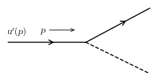
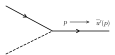
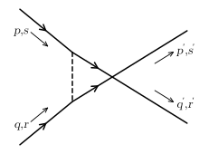
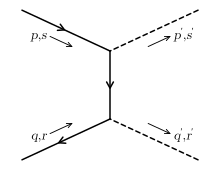
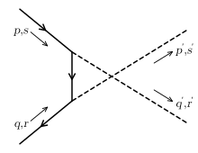
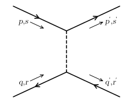
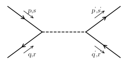
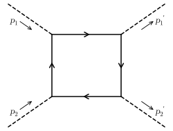

> From <strong>Quantum Field Theory</strong>, lecture notes by <strong>David Tong</strong> (University of Cambridge). Original HTML: <a href="https://davidtong.org/teaching/quantum-field-theory/qfthtml/S5.html">https://davidtong.org/teaching/quantum-field-theory/qfthtml/S5.html</a> · <a href="https://davidtong.org/pdfs/teaching/quantum-field-theory/qft.pdf">PDF version</a> · <a href="https://davidtong.org/teaching/quantum-field-theory">course page</a>. Reformatted for this reader; all content © David Tong.

<a href="4.%20The%20Dirac%20Equation.md">← 4. The Dirac Equation</a> · <a href="README.md">Contents</a> · <a href="6.%20Quantum%20Electrodynamics.md">6. Quantum Electrodynamics →</a>

# 5 Quantizing the Dirac Field

We would now like to quantize the Dirac Lagrangian,

$$
\displaystyle{\cal L}=\bar{\psi}(x)\,\left(i\,\,{\raisebox{0.645pt}{/}\mskip-10.0mu \partial}-m\right)\,\psi(x) \tag{5.439}
$$

We will proceed naively and treat $\psi$ as we did the scalar field. But we’ll see that things go wrong and we will have to reconsider how to quantize this theory.

## 5.1 A Glimpse at the Spin-Statistics Theorem

We start in the usual way and define the momentum,

$$
\displaystyle\pi=\frac{\partial{\cal L} }{\partial{\dot{\psi} } }=i\bar{\psi}\gamma^{0}=i\psi^{\dagger} \tag{5.440}
$$

For the Dirac Lagrangian, the momentum conjugate to $\psi$ is $i\psi^{\dagger}$. It does not involve the time derivative of $\psi$. This is as it should be for an equation of motion that is first order in time, rather than second order. This is because we need only specify $\psi$ and $\psi^{\dagger}$ on an initial time slice to determine the full evolution.

To quantize the theory, we promote the field $\psi$ and its momentum $\psi^{\dagger}$ to operators, satisfying the canonical commutation relations, which read

$$
\displaystyle[\psi_{\alpha}(\vec{x}),\psi_{\beta}(\vec{y})]=[\psi^{\dagger}_{\alpha}(\vec{x}),\psi^{\dagger}_{\beta}(\vec{y})]=0
$$

$$
\displaystyle[\psi_{\alpha}(\vec{x}),\psi^{\dagger}_{\beta}(\vec{y})]=\delta_{\alpha\beta}\,\delta^{(3)}(\vec{x}-\vec{y}) \tag{5.441}
$$

It’s this step that we’ll soon have to reconsider.

Since we’re dealing with a free theory, where any classical solution is a sum of plane waves, we may write the quantum operators as

$$
\displaystyle\psi(\vec{x})=\sum_{s=1}^{2}\int\frac{d^{3}p}{(2\pi)^{3} }\,\frac{1}{\sqrt{2E_{\vec{p} } } }\left[b_{\vec{p} }^{s}\,u^{s}(\vec{p})e^{+i\vec{p}\cdot\vec{x} }+c^{s\,\dagger}_{\vec{p} }\,v^{s}(\vec{p})e^{-i\vec{p}\cdot\vec{x} }\right]
$$

$$
\displaystyle\psi^{\dagger}(\vec{x})=\sum_{s=1}^{2}\int\frac{d^{3}p}{(2\pi)^{3} }\,\frac{1}{\sqrt{2E_{\vec{p} } } }\left[b_{\vec{p} }^{s\,\dagger}\,u^{s}(\vec{p})^{\dagger}e^{-i\vec{p}\cdot\vec{x} }+c^{s}_{\vec{p} }\,v^{s}(\vec{p})^{\dagger}e^{+i\vec{p}\cdot\vec{x} }\right] \tag{5.442}
$$

where the operators $b^{s\,\dagger}_{\vec{p} }$ create particles associated to the spinors $u^{s}(\vec{p})$, while $c^{s\,\dagger}_{\vec{p} }$ create particles associated to $v^{s}(\vec{p})$. As with the scalars, the commutation relations of the fields imply commutation relations for the annihilation and creation operators    <strong>Claim:</strong> The field commutation relations (<a href="#E441">5.441</a>) are equivalent to

$$
\begin{aligned}\displaystyle[b^{r}_{\vec{p} },b_{\vec{q} }^{s\,\dagger}] &\displaystyle= \displaystyle(2\pi)^{3}\delta^{rs}\,\delta^{(3)}(\vec{p}-\vec{q})\end{aligned}
$$

$$
\begin{aligned}\displaystyle{[}c_{\vec{p} }^{r},c_{\vec{q} }^{s\,\dagger}] &\displaystyle= \displaystyle-(2\pi)^{3}\delta^{rs}\,\delta^{(3)}(\vec{p}-\vec{q})\end{aligned} \tag{5.443}
$$

with all other commutators vanishing.

Note the strange minus sign in the $[c,c^{\dagger}]$ term. This means that we can’t define the ground state $\left|0\right\rangle$ as something annihilated by $c^{r}_{\vec{p} }\left|0\right\rangle=0$, because then the excited states $c^{s\,\dagger}_{\vec{p} }\left|0\right\rangle$ would have negative norm. To avoid this, we will have to flip the interpretation of $c$ and $c^{\dagger}$, with the vacuum defined by $c^{s\,\dagger}_{\vec{p} }\left|0\right\rangle=0$ and the excited states by $c^{r}_{\vec{p} }\left|0\right\rangle$. This, as we will see, will be our undoing.    <strong>Proof:</strong> Let’s show that the $[b,b^{\dagger}]$ and $[c,c^{\dagger}]$ commutators reproduce the field commutators (<a href="#E441">5.441</a>),

$$
\begin{aligned}\displaystyle[\psi(\vec{x}),\psi^{\dagger}(\vec{y})] &\displaystyle= \displaystyle\sum_{r,s}\int\frac{d^{3}p\,d^{3}q}{(2\pi)^{6} }\,\frac{1}{\sqrt{4E_{\vec{p} }E_{\vec{q} } } }\,\left([b_{\vec{p} }^{r},b_{\vec{q} }^{s\,\dagger}]u^{r}(\vec{p})u^{s}(\vec{q})^{\dagger}e^{i(\vec{x}\cdot\vec{p}-\vec{y}\cdot\vec{q})}\right. \\ & \displaystyle\ \ \ \ \ \ \ \ \ \ \ \ \ \ \ \ \ \ \ \ \ \ \ \ \ \ \ \ \ \ \ \ \ \ \ \ \ \ \ \ \ \ +\left.[c_{\vec{p} }^{r\,\dagger},c_{\vec{q} }^{s}]v^{r}(\vec{p})v^{s}(\vec{q})^{\dagger}e^{-i(\vec{x}\cdot\vec{p}-\vec{y}\cdot\vec{q})}\right) \\ &\displaystyle= \displaystyle\sum_{s}\int\frac{d^{3}p}{(2\pi)^{3} }\frac{1}{2E_{\vec{p} } }\,\left(u^{s}(\vec{p})\bar{u}^{s}(\vec{p})\gamma^{0}e^{i\vec{p}\cdot(\vec{x}-\vec{y})}+v^{s}(\vec{p})\bar{v}^{s}(\vec{p})\gamma^{0}e^{-i\vec{p}\cdot(\vec{x}-\vec{y})}\right)\end{aligned} \tag{5.444}
$$

At this stage we use the outer product formulae (<a href="4.%20The%20Dirac%20Equation.md#E435">4.435</a>) and (<a href="4.%20The%20Dirac%20Equation.md#E436">4.436</a>) which tell us $\sum_{s}u^{s}(\vec{p})\bar{u}^{s}(\vec{p})=\,\,{\raisebox{0.645pt}{/}\mskip-11.0mu p}+m$ and $\sum_{s}v^{s}(\vec{p})\bar{v}^{s}(\vec{p})=\,\,{\raisebox{0.645pt}{/}\mskip-11.0mu p}-m$, so that

$$
\begin{aligned}\displaystyle[\psi(\vec{x}),\psi^{\dagger}(\vec{y})] &\displaystyle= \displaystyle\int\frac{d^{3}p}{(2\pi)^{3} }\frac{1}{2E_{\vec{p} } }\left((\,\,{\raisebox{0.645pt}{/}\mskip-11.0mu p}+m)\gamma^{0}e^{i\vec{p}\cdot(\vec{x}-\vec{y})}+(\,\,{\raisebox{0.645pt}{/}\mskip-11.0mu p}-m)\gamma^{0}e^{-i\vec{p}\cdot(\vec{x}-\vec{y})}\right) \\ &\displaystyle= \displaystyle\int\frac{d^{3}p}{(2\pi)^{3} }\frac{1}{2E_{\vec{p} } }\left((p_{0}\gamma^{0}+p_{i}\gamma^{i}+m)\gamma^{0}+(p_{0}\gamma^{0}-p_{i}\gamma^{i}-m)\gamma^{0}\right)e^{+i\vec{p}\cdot(\vec{x}-\vec{y})}\end{aligned}
$$

where, in the second term, we’ve changed $\vec{p}\rightarrow-\vec{p}$ under the integration sign. Now, using $p_{0}=E_{\vec{p} }$ we have

$$
\displaystyle[\psi(\vec{x}),\psi^{\dagger}(\vec{y})]=\int\frac{d^{3}p}{(2\pi)^{3} }e^{+i\vec{p}\cdot(\vec{x}-\vec{y})}=\delta^{(3)}(\vec{x}-\vec{y}) \tag{5.445}
$$

as promised. Notice that it’s a little tricky in the middle there, making sure that the $p_{i}\gamma^{i}$ terms cancel. This was the reason we needed the minus sign in the $[c,c^{\dagger}]$ commutator terms in (<a href="#E443">5.443</a>). $\Box$

### 5.1.1 The Hamiltonian

To proceed, let’s construct the Hamiltonian for the theory. Using the momentum $\pi=i\psi^{\dagger}$, we have

$$
\displaystyle{\cal H}=\pi\dot{\psi}-{\cal L}=\bar{\psi}(-i\gamma^{i}\partial_{i}+m)\psi \tag{5.446}
$$

which means that $H=\int d^{3}x\,{\cal H}$ agrees with the conserved energy computed using Noether’s theorem (<a href="4.%20The%20Dirac%20Equation.md#E399">4.399</a>). We now wish to turn the Hamiltonian into an operator. Let’s firstly look at

$$
\displaystyle(-i\gamma^{i}\partial_{i}+m)\psi=\int\frac{d^{3}p}{(2\pi)^{3} }\frac{1}{\sqrt{2E_{\vec{p} } } }\,\left[b_{\vec{p} }^{s}\,(-\gamma^{i}p_{i}+m)u^{s}(\vec{p})\,e^{+i\vec{p}\cdot\vec{x} }+c_{\vec{p} }^{s\,\dagger}(\gamma^{i}p_{i}+m)v^{s}(\vec{p})\,e^{-i\vec{p}\cdot\vec{x} }\right]
$$

where, for once we’ve left the sum over $s=1,2$ implicit. There’s a small subtlety with the minus signs in deriving this equation that arises from the use of the Minkowski metric in contracting indices, so that $\vec{p}\cdot\vec{x}\equiv\sum_{i}x^{i}p^{i}=-x^{i}p_{i}$. Now we use the defining equations for the spinors $u^{s}(\vec{p})$ and $v^{s}(\vec{p})$ given in (<a href="4.%20The%20Dirac%20Equation.md#E412">4.412</a>) and (<a href="4.%20The%20Dirac%20Equation.md#E418">4.418</a>), to replace

$$
\displaystyle(-\gamma^{i}p_{i}+m)u^{s}(\vec{p})=\gamma^{0}p_{0}u^{s}(\vec{p})\ \ \ {\rm and}\ \ \ (\gamma^{i}p_{i}+m)v^{s}(\vec{p})=-\gamma^{0}p_{0}v^{s}(\vec{p}) \tag{5.447}
$$

so we can write

$$
\displaystyle(-i\gamma^{i}\partial_{i}+m)\psi=\int\frac{d^{3}p}{(2\pi)^{3} }\sqrt{\frac{E_{\vec{p} } }{2} }\,\gamma^{0}\,\left[b_{\vec{p} }^{s}\,u^{s}(\vec{p})\,e^{+i\vec{p}\cdot\vec{x} }-c_{\vec{p} }^{s\,\dagger}\,v^{s}(\vec{p})\,e^{-i\vec{p}\cdot\vec{x} }\right] \tag{5.448}
$$

We now use this to write the operator Hamiltonian

$$
\begin{aligned}\displaystyle H &\displaystyle= \displaystyle\int d^{3}x\,\psi^{\dagger}\gamma^{0}(-i\gamma^{i}\partial_{i}+m)\psi \\ &\displaystyle= \displaystyle\int\frac{d^{3}x\,d^{3}p\,d^{3}q}{(2\pi)^{6} }\sqrt{\frac{E_{\vec{p} } }{4E_{\vec{q} } } }\left[b_{\vec{q} }^{r\,\dagger}u^{r}(\vec{q})^{\dagger}e^{-i\vec{q}\cdot\vec{x} }+c^{r}_{\vec{q} }\,v^{r}(\vec{q})^{\dagger}\,e^{+i\vec{q}\cdot\vec{x} }\right]\cdot \\ & \displaystyle\ \ \ \ \ \ \ \ \ \ \ \ \ \ \ \ \ \ \ \ \ \ \ \ \ \ \ \ \ \ \ \ \ \ \ \ \ \ \ \ \ \ \ \ \left[b_{\vec{p} }^{s}\,u^{s}(\vec{p})e^{+i\vec{p}\cdot\vec{x} }-c^{s\,\dagger}_{\vec{p} }\,v^{s}(\vec{p})\,e^{-i\vec{p}\cdot\vec{x} }\right] \\ &\displaystyle= \displaystyle\int\frac{d^{3}p}{(2\pi)^{3} }\frac{1}{2}\left[b_{\vec{p} }^{r\,\dagger}b_{\vec{p} }^{s}[u^{r}(\vec{p})^{\dagger}\cdot u^{s}(\vec{p})]-c_{\vec{p} }^{r}c_{\vec{p} }^{s\,\dagger}[v^{r}(\vec{p})^{\dagger}\cdot v^{s}(\vec{p})]\right. \\ & \displaystyle\ \ \ \ \ \ \ \ \ \ \ \ \ \ \ \ \ \ \ \ \ \ \ \ \ \ \ \left.-b_{\vec{p} }^{r\,\dagger}c_{-\vec{p} }^{s\,\dagger}[u^{r}(\vec{p})^{\dagger}\cdot v^{s}(-\vec{p})]+c_{\vec{p} }^{r}\,b_{-\vec{p} }^{s}[v^{r}(\vec{p})^{\dagger}\cdot u^{s}(-\vec{p})]\right]\end{aligned}
$$

where, in the last two terms we have relabelled $\vec{p}\rightarrow-\vec{p}$. We now use our inner product formulae (<a href="4.%20The%20Dirac%20Equation.md#E429">4.429</a>), (<a href="4.%20The%20Dirac%20Equation.md#E431">4.431</a>) and (<a href="4.%20The%20Dirac%20Equation.md#E434">4.434</a>) which read

$$
\displaystyle u^{r}(\vec{p})^{\dagger}\cdot u^{s}(\vec{p})=v^{r}(\vec{p})^{\dagger}\cdot v^{s}(\vec{p})=2p_{0}\delta^{rs}\ \ \ {\rm and}\ \ \ \ u^{r}(\vec{p})^{\dagger}\cdot v^{s}(-\vec{p})=v^{r}(\vec{p})^{\dagger}\cdot u^{s}(-\vec{p})=0
$$

giving us

$$
\begin{aligned}\displaystyle H &\displaystyle= \displaystyle\int\frac{d^{3}p}{(2\pi)^{3} }E_{\vec{p} }\left(b^{s\,\dagger}_{\vec{p} }b^{s}_{\vec{p} }-c^{s}_{\vec{p} }c^{s\,\dagger}_{\vec{p} }\right)\end{aligned} \tag{5.449}
$$

$$
\begin{aligned}&\displaystyle= \displaystyle\int\frac{d^{3}p}{(2\pi)^{3} }E_{\vec{p} }\left(b^{s\,\dagger}_{\vec{p} }b^{s}_{\vec{p} }-c^{s\,\dagger}_{\vec{p} }c^{s}_{\vec{p} }+(2\pi)^{3}\delta^{(3)}(0)\right)\end{aligned} \tag{5.450}
$$

The $\delta^{(3)}$ term is familiar and easily dealt with by normal ordering. The $b^{\dagger}b$ term is familiar and we can check that $b^{\dagger}$ create positive energy states as expected,

$$
\displaystyle[H,b_{\vec{p} }^{s\,\dagger}]=E_{\vec{p} }\,b_{\vec{p} }^{s\,\dagger}
$$

The minus sign in front of the $c^{\dagger}c$ term should make us nervous. If we think of $c^{\dagger}$ as creation operators then there’s no problem since, using the commutation relation (<a href="#E443">5.443</a>), we still find that $c^{\dagger}$ creates positive energy states,

$$
\displaystyle[H,c_{\vec{p} }^{s\,\dagger}]=E_{\vec{p} }\,c_{\vec{p} }^{s\,\dagger}
$$

However, as we noted after (<a href="#E443">5.443</a>), these states have negative norm. To have a sensible Hilbert space, we need to interpret $c$ as the creation operator. But then the Hamiltonian is not bounded below because

$$
\displaystyle[H,c_{\vec{p} }^{s}]=-E_{\vec{p} }\,c_{\vec{p} }^{s}
$$

This is a disaster. Taken seriously it would tell us that we could tumble to states of lower and lower energy by continually producing $c$ particles. As the English would say, it’s all gone a bit Pete Tong. (No relation).

Since the above calculation was a little tricky, you might think that it’s possible to rescue the theory to get the minus signs to work out right. You can play around with different things, but you’ll always find this minus sign cropping up somewhere. And, in fact, it’s telling us something important that we missed.

## 5.2 Fermionic Quantization

The key piece of physics that we missed is that spin $1/2$ particles are fermions, meaning that they obey Fermi-Dirac statistics with the quantum state picking up a minus sign upon the interchange of any two particles. This fact is embedded into the structure of relativistic quantum field theory: the spin-statistics theorem says that integer spin fields must be quantized as bosons, while half-integer spin fields must be quantized as fermions. Any attempt to do otherwise will lead to an inconsistency, such as the unbounded Hamiltonian we saw in (<a href="#E450">5.450</a>).

So how do we go about quantizing a field as a fermion? Recall that when we quantized the scalar field, the resulting particles obeyed bosonic statistics because the creation and annihilation operators satisfied the commutation relations,

$$
\displaystyle[a^{\dagger}_{\vec{p} },a_{\vec{q} }^{\dagger}]=0\ \ \Rightarrow\ \ a_{\vec{p} }^{\dagger}a_{\vec{q} }^{\dagger}\left|0\right\rangle\equiv\left|\vec{p},\vec{q}\right\rangle=\left|\vec{q},\vec{p}\right\rangle \tag{5.451}
$$

To have states obeying fermionic statistics, we need anti-commutation relations, $\{A,B\}\equiv AB+BA$. Rather than (<a href="#E441">5.441</a>), we will ask that the spinor fields satisfy

$$
\displaystyle\{\psi_{\alpha}(\vec{x}),\psi_{\beta}(\vec{y})\}=\{\psi^{\dagger}_{\alpha}(\vec{x}),\psi^{\dagger}_{\beta}(\vec{y})\}=0
$$

$$
\displaystyle\{\psi_{\alpha}(\vec{x}),\psi^{\dagger}_{\beta}(\vec{y})\}=\delta_{\alpha\beta}\,\delta^{(3)}(\vec{x}-\vec{y}) \tag{5.452}
$$

We still have the expansion (<a href="#E442">5.442</a>) of $\psi$ and $\psi^{\dagger}$ in terms of $b,b^{\dagger},c$ and $c^{\dagger}$. But now the same proof that led us to (<a href="#E443">5.443</a>) tells us that

$$
\begin{aligned}\displaystyle\{b^{r}_{\vec{p} },b_{\vec{q} }^{s\,\dagger}\} &\displaystyle= \displaystyle(2\pi)^{3}\delta^{rs}\,\delta^{(3)}(\vec{p}-\vec{q})\end{aligned}
$$

$$
\begin{aligned}\displaystyle\{c_{\vec{p} }^{r},c_{\vec{q} }^{s\,\dagger}\} &\displaystyle= \displaystyle(2\pi)^{3}\delta^{rs}\,\delta^{(3)}(\vec{p}-\vec{q})\end{aligned} \tag{5.453}
$$

with all other <em>anti-commutators</em> vanishing,

$$
\displaystyle\{b_{\vec{p} }^{r},b_{\vec{q} }^{s}\}=\{c_{\vec{p} }^{r},c_{\vec{q} }^{s}\}=\{b_{\vec{p} }^{r},c_{\vec{q} }^{s\,\dagger}\}=\{b_{\vec{p} }^{r},c_{\vec{q} }^{s}\}=\ldots=0 \tag{5.454}
$$

The calculation of the Hamiltonian proceeds as before, all the way through to the penultimate line (<a href="#E449">5.449</a>). At that stage, we get

$$
\begin{aligned}\displaystyle H &\displaystyle= \displaystyle\int\frac{d^{3}p}{(2\pi)^{3} }\,E_{\vec{p} }\,\left[b_{\vec{p} }^{s\,\dagger}b_{\vec{p} }^{s}-c_{\vec{p} }^{s}c_{\vec{p} }^{s\,\dagger}\right] \\ &\displaystyle= \displaystyle\int\frac{d^{3}p}{(2\pi)^{3} }\,E_{\vec{p} }\left[b_{\vec{p} }^{s\,\dagger}b_{\vec{p} }^{s}+c_{\vec{p} }^{s\,\dagger}c_{\vec{p} }^{s}-(2\pi)^{3}\delta^{(3)}(0)\right]\end{aligned} \tag{5.455}
$$

The anti-commutators have saved us from the indignity of an unbounded Hamiltonian. Note that when normal ordering the Hamiltonian we now throw away a negative contribution $-(2\pi)^{3}\delta^{(3)}(0)$. In principle, this could partially cancel the positive contribution from bosonic fields. Cosmological constant problem anyone?!

### 5.2.1 Fermi-Dirac Statistics

Just as in the bosonic case, we define the vacuum $\left|0\right\rangle$ to satisfy,

$$
\displaystyle b_{\vec{p} }^{s}\left|0\right\rangle=c_{\vec{p} }^{s}\left|0\right\rangle=0 \tag{5.456}
$$

Although $b$ and $c$ obey anti-commutation relations, the Hamiltonian (<a href="#E455">5.455</a>) has nice commutation relations with them. You can check that

$$
\begin{aligned}\displaystyle[H,b_{\vec{p} }^{r}]=-E_{\vec{p} }\,b_{\vec{p} }^{r} &\displaystyle{\rm and} \displaystyle\ \ \ [H,b_{\vec{p} }^{r\,\dagger}]=E_{\vec{p} }\,b_{\vec{p} }^{r\,\dagger}\end{aligned}
$$

$$
\begin{aligned}\displaystyle{[}H,c_{\vec{p} }^{r}{]}=-E_{\vec{p} }\,c_{\vec{p} }^{r} &\displaystyle{\rm and} \displaystyle\ \ \ {[}H,c_{\vec{p} }^{r\,\dagger}{]}=E_{\vec{p} }\,c_{\vec{p} }^{r\,\dagger}\end{aligned} \tag{5.457}
$$

This means that we can again construct a tower of energy eigenstates by acting on the vacuum by $b_{\vec{p} }^{r\,\dagger}$ and $c_{\vec{p} }^{r,\dagger}$ to create particles and antiparticles, just as in the bosonic case. For example, we have the one-particle states

$$
\displaystyle\left|\vec{p},r\right\rangle=b_{\vec{p} }^{r\,\dagger}\left|0\right\rangle \tag{5.458}
$$

The two particle states now satisfy

$$
\displaystyle\left|\vec{p}_{1},r_{1};\vec{p}_{2},r_{2}\right\rangle\equiv b_{\vec{p}_{1} }^{r_{1}\,\dagger}\,b_{\vec{p}_{2} }^{r_{2}\,\dagger}\left|0\right\rangle=-\left|\vec{p}_{2},r_{2};\vec{p}_{1},r_{1}\right\rangle \tag{5.459}
$$

confirming that the particles do indeed obey Fermi-Dirac statistics. In particular, we have the Pauli-Exclusion principle $\left|\vec{p},r;\vec{p},r\right\rangle=0$. Finally, if we wanted to be sure about the spin of the particle, we could act with the angular momentum operator (<a href="4.%20The%20Dirac%20Equation.md#E403">4.403</a>) to confirm that a stationary particle $\left|\vec{p}=0,r\right\rangle$ does indeed carry intrinsic angular momentum 1/2 as expected.

## 5.3 Dirac’s Hole Interpretation

> “In this attempt, the success seems to have been on the side of Dirac rather than logic”

<em>Pauli on Dirac</em>

Let’s pause our discussion to make a small historical detour. Dirac originally viewed his equation as a relativistic version of the Schrödinger equation, with $\psi$ interpreted as the wavefunction for a single particle with spin. To reinforce this interpretation, he wrote $(i\,\,{\raisebox{0.645pt}{/}\mskip-10.0mu \partial}-m)\psi=0$ as

$$
\displaystyle i\frac{\partial{\psi} }{\partial{t} }=-i\vec{\alpha}\cdot\vec{\nabla}\psi+m\beta\psi\equiv\hat{H}\psi \tag{5.460}
$$

where $\vec{\alpha}=-\gamma^{0}\vec{\gamma}$ and $\beta=\gamma^{0}$. Here the operator $\hat{H}$ is interpreted as the one-particle Hamiltonian. This is a very different viewpoint from the one we now have, where $\psi$ is a classical field that should be quantized. In Dirac’s view, the Hamiltonian of the system is $\hat{H}$ defined above, while for us the Hamiltonian is the field operator (<a href="#E455">5.455</a>). Let’s see where Dirac’s viewpoint leads.

With the interpretation of $\psi$ as a single-particle wavefunction, the plane-wave solutions (<a href="4.%20The%20Dirac%20Equation.md#E411">4.411</a>) and (<a href="4.%20The%20Dirac%20Equation.md#E417">4.417</a>) to the Dirac equation are thought of as energy eigenstates, with

$$
\begin{aligned}\displaystyle\psi=u(\vec{p})\,e^{-ip\cdot x} &\displaystyle\ \ \ \Rightarrow \displaystyle i\frac{\partial{\psi} }{\partial{t} }=E_{\vec{p} }\,\psi\end{aligned}
$$

$$
\begin{aligned}\displaystyle\psi=v(\vec{p})\,e^{+ip\cdot x} &\displaystyle\Rightarrow \displaystyle i\frac{\partial{\psi} }{\partial{t} }=-E_{\vec{p} }\,\psi\end{aligned} \tag{5.461}
$$

which look like positive and negative energy solutions. The spectrum is once again unbounded below; there are states $v(\vec{p})$ with arbitrarily low energy $-E_{\vec{p} }$. At first glance this is disastrous, just like the unbounded field theory Hamiltonian (<a href="#E450">5.450</a>). Dirac postulated an ingenious solution to this problem: since the electrons are fermions (a fact which is put in by hand to Dirac’s theory) they obey the Pauli-exclusion principle. So we could simply stipulate that in the true vacuum of the universe, all the negative energy states are filled. Only the positive energy states are accessible. These filled negative energy states are referred to as the <em>Dirac sea</em>. Although you might worry about the infinite negative charge of the vacuum, Dirac argued that only charge differences would be observable (a trick reminiscent of the normal ordering prescription we used for field operators).

Having avoided disaster by floating on an infinite sea comprised of occupied negative energy states, Dirac realized that his theory made a shocking prediction. Suppose that a negative energy state is excited to a positive energy state, leaving behind a hole. The hole would have all the properties of the electron, except it would carry positive charge. After flirting with the idea that it may be the proton, Dirac finally concluded that the hole is a new particle: the positron. Moreover, when a positron comes across an electron, the two can annihilate. Dirac had predicted anti-matter, one of the greatest achievements of theoretical physics. It took only a couple of years before the positron was discovered experimentally in 1932.

Although Dirac’s physical insight led him to the right answer, we now understand that the interpretation of the Dirac spinor as a single-particle wavefunction is not really correct. For example, Dirac’s argument for anti-matter relies crucially on the particles being fermions while, as we have seen already in this course, anti-particles exist for both fermions and bosons. What we really learn from Dirac’s analysis is that there is no consistent way to interpret the Dirac equation as describing a single particle. It is instead to be thought of as a classical field which has only positive energy solutions because the Hamiltonian (<a href="4.%20The%20Dirac%20Equation.md#E399">4.399</a>) is positive definite. Quantization of this field then gives rise to both particle and anti-particle excitations.

This from Julian Schwinger:

> <em>“Until now, everyone thought that the Dirac equation referred directly to physical particles. Now, in field theory, we recognize that the equations refer to a sublevel. Experimentally we are concerned with particles, yet the old equations describe fields…. When you begin with field equations, you operate on a level where the particles are not there from the start. It is when you solve the field equations that you see the emergence of particles.”</em>

## 5.4 Propagators

Let’s now move to the Heisenberg picture. We define the spinors $\psi(\vec{x},t)$ at every point in spacetime such that they satisfy the operator equation

$$
\displaystyle\frac{\partial{\psi} }{\partial{t} }=i[H,\psi] \tag{5.462}
$$

We solve this by the expansion

$$
\begin{aligned}\displaystyle\psi(x) &\displaystyle= \displaystyle\sum_{s=1}^{2}\int\frac{d^{3}p}{(2\pi)^{3} }\frac{1}{\sqrt{2E_{\vec{p} } } }\left[b_{\vec{p} }^{s}u^{s}(\vec{p})e^{-ip\cdot x}+c_{\vec{p} }^{s\,\dagger}v^{s}(\vec{p})e^{+ip\cdot x}\right]\end{aligned}
$$

$$
\begin{aligned}\displaystyle\psi^{\dagger}(x) &\displaystyle= \displaystyle\sum_{s=1}^{2}\int\frac{d^{3}p}{(2\pi)^{3} }\frac{1}{\sqrt{2E_{\vec{p} } } }\left[b_{\vec{p} }^{s\,\dagger}u^{s}(\vec{p})^{\dagger}e^{+ip\cdot x}+c_{\vec{p} }^{s}v^{s}(\vec{p})^{\dagger}e^{-ip\cdot x}\right]\end{aligned} \tag{5.463}
$$

Let’s now look at the anti-commutators of these fields. We define the fermionic propagator to be

$$
\displaystyle iS_{\alpha\beta}=\{\psi_{\alpha}(x),\bar{\psi}_{\beta}(y)\} \tag{5.464}
$$

In what follows we will often drop the indices and simply write $iS(x-y)=\{\psi(x),\bar{\psi}(y)\}$, but you should remember that $S(x-y)$ is a $4\times 4$ matrix. Inserting the expansion (<a href="#E463">5.463</a>), we have

$$
\begin{aligned}\displaystyle iS(x-y) &\displaystyle= \displaystyle\int\frac{d^{3}p\,d^{3}q}{(2\pi)^{6} }\frac{1}{\sqrt{4E_{\vec{p} }E_{\vec{q} } } }\left[\{b_{\vec{p} }^{s},b_{\vec{q} }^{r\,\dagger}\}u^{s}(\vec{p})\bar{u}^{r}(\vec{q})e^{-i(p\cdot x-q\cdot y)}\right. \\ & \displaystyle\ \ \ \ \ \ \ \ \ \ \ \ \ \ \ \ \ \ \ \ \ \ \ \ \ \ \ \ \ \ \ \left.+\{c_{\vec{p} }^{s\,\dagger},c_{\vec{q} }^{r}\}v^{s}(\vec{p})\bar{v}^{r}(\vec{q})e^{+i(p\cdot x-q\cdot y)}\right] \\ &\displaystyle= \displaystyle\int\frac{d^{3}p}{(2\pi)^{3} }\frac{1}{2E_{\vec{p} } }\,\left[u^{s}(\vec{p})\bar{u}^{s}(\vec{p})e^{-ip\cdot(x-y)}+v^{s}(\vec{p})\bar{v}^{s}(\vec{p})e^{+ip\cdot(x-y)}\right] \\ &\displaystyle= \displaystyle\int\frac{d^{3}p}{(2\pi)^{3} }\frac{1}{2E_{\vec{p} } }\,\left[(\!\,\,{\raisebox{0.645pt}{/}\mskip-11.0mu p}+m)e^{-ip\cdot(x-y)}+(\!\,\,{\raisebox{0.645pt}{/}\mskip-11.0mu p}-m)e^{+ip\cdot(x-y)}\right]\end{aligned} \tag{5.465}
$$

where to reach the final line we have used the outer product formulae (<a href="4.%20The%20Dirac%20Equation.md#E435">4.435</a>) and (<a href="4.%20The%20Dirac%20Equation.md#E436">4.436</a>). We can then write

$$
\displaystyle iS(x-y)=(i\!\,\,{\raisebox{0.645pt}{/}\mskip-10.0mu \partial}_{x}+m)(D(x-y)-D(y-x)) \tag{5.466}
$$

in terms of the propagator for a real scalar field $D(x-y)$ which, recall, can be written as (<a href="2.%20Free%20Fields.md#E165">2.165</a>)

$$
\displaystyle D(x-y)=\int\frac{d^{3}p}{(2\pi)^{3} }\frac{1}{2E_{\vec{p} } }\,e^{-ip\cdot(x-y)} \tag{5.467}
$$

Some comments:

&#8226;&nbsp; For spacelike separated points $(x-y)^{2}<0$, we have already seen that $D(x-y)-D(y-x)=0$. In the bosonic theory, we made a big deal of this since it ensured that

$$
\displaystyle[\phi(x),\phi(y)]=0\ \ \ \ \ \ \ (x-y)^{2}<0 \tag{5.468}
$$

outside the lightcone, which we trumpeted as proof that our theory was causal. However, for fermions we now have

$$
\displaystyle\{\psi_{\alpha}(x),\psi_{\beta}(y)\}=0\ \ \ \ \ \ \ \ \ (x-y)^{2}<0 \tag{5.469}
$$

outside the lightcone. What happened to our precious causality? The best that we can say is that all our observables are bilinear in fermions, for example the Hamiltonian (<a href="#E455">5.455</a>). These still commute outside the lightcone. The theory remains causal as long as fermionic operators are not observable. If you think this is a little weak, remember that no one has ever seen a physical measuring apparatus come back to minus itself when you rotate by $360$ degrees!

&#8226;&nbsp; At least away from singularities, the propagator satisfies

$$
\displaystyle(i\!\,\,{\raisebox{0.645pt}{/}\mskip-10.0mu \partial}_{x}-m)S(x-y)=0 \tag{5.470}
$$

which follows from the fact that $(\!\,\,{\raisebox{0.645pt}{/}\mskip-10.0mu \partial}_{x}^{2}+m^{2})D(x-y)=0$ using the mass shell condition $p^{2}=m^{2}$.

## 5.5 The Feynman Propagator

By a similar calculation to that above, we can determine the vacuum expectation value,

$$
\displaystyle\left\langle 0\right|\psi_{\alpha}(x)\bar{\psi}_{\beta}(y)\left|0\right\rangle=\int\frac{d^{3}p}{(2\pi)^{3} }\frac{1}{2E_{\vec{p} } }(\!\,\,{\raisebox{0.645pt}{/}\mskip-11.0mu p}+m)_{\alpha\beta}\,e^{-ip\cdot(x-y)}
$$

$$
\displaystyle\left\langle 0\right|\bar{\psi}_{\beta}(y){\psi}_{\alpha}(x)\left|0\right\rangle=\int\frac{d^{3}p}{(2\pi)^{3} }\frac{1}{2E_{\vec{p} } }(\!\,\,{\raisebox{0.645pt}{/}\mskip-11.0mu p}-m)_{\alpha\beta}\,e^{+ip\cdot(x-y)} \tag{5.471}
$$

We now define the Feynman propagator $S_{F}(x-y)$, which is again a $4\times 4$ matrix, as the time ordered product,

$$
\displaystyle S_{F}(x-y)=\left\langle 0\right|T\psi(x)\bar{\psi}(y)\left|0\right\rangle\equiv\left\{\begin{array}{cr}\left\langle 0\right|\psi(x)\bar{\psi}(y)\left|0\right\rangle&\ \ \ \ \ x^{0}>y^{0}\\ \left\langle 0\right|-\bar{\psi}(y)\psi(x)\left|0\right\rangle&y^{0}>x^{0}\end{array}\right. \tag{5.472}
$$

Notice the minus sign! It is necessary for Lorentz invariance. When $(x-y)^{2}<0$, there is no invariant way to determine whether $x^{0}>y^{0}$ or $y^{0}>x^{0}$. In this case the minus sign is necessary to make the two definitions agree since $\{\psi(x),\bar{\psi}(y)\}=0$ outside the lightcone. We have the 4-momentum integral representation for the Feynman propagator,

$$
\displaystyle S_{F}(x-y)=i\int\frac{d^{4}p}{(2\pi)^{4} }\,e^{-ip\cdot(x-y)}\,\frac{\gamma\cdot p+m}{p^{2}-m^{2}+i\epsilon} \tag{5.473}
$$

which satisfies $(i\!\,\,{\raisebox{0.645pt}{/}\mskip-10.0mu \partial}_{x}-m)S_{F}(x-y)=i\delta^{(4)}(x-y)$, so that $S_{F}$ is a Green’s function for the Dirac operator.

The minus sign that we see in (<a href="#E472">5.472</a>) also occurs for any string of operators inside a time ordered product $T(\ldots)$. While bosonic operators commute inside $T$, fermionic operators anti-commute. We have this same behaviour for normal ordered products as well, with fermionic operators obeying $:\psi_{1}\psi_{2}:=-:\psi_{2}\psi_{1}:$. With the understanding that all fermionic operators anti-commute inside $T$ and $::$, Wick’s theorem proceeds just as in the bosonic case. We define the contraction

$$
\displaystyle\overbrace{\psi(x)\bar{\psi}(y)}=T(\psi(x)\bar{\psi}(y))\,-:\psi(x)\bar{\psi}(y):\ =S_{F}(x-y) \tag{5.474}
$$

## 5.6 Yukawa Theory

The interaction between a Dirac fermion of mass $m$ and a real scalar field of mass $\mu$ is governed by the Yukawa theory,

$$
\displaystyle{\cal L}={\textstyle\frac{1}{2} }\partial_{\mu}\phi\partial^{\mu}\phi-{\textstyle\frac{1}{2} }\mu^{2}\phi^{2}+\bar{\psi}(i\gamma^{\mu}\partial_{\mu}-m)\psi-\lambda\phi\bar{\psi}\psi \tag{5.475}
$$

which is the proper version of the baby scalar Yukawa theory we looked at in Section 3. Couplings of this type appear in the standard model, between fermions and the Higgs boson. In that context, the fermions can be leptons (such as the electron) or quarks.

Yukawa originally proposed an interaction of this type as an effective theory of nuclear forces. With an eye to this, we will again refer to the $\phi$ particles as mesons, and the $\psi$ particles as nucleons. Except, this time, the nucleons have spin. (This is still not a particularly realistic theory of nucleon interactions, not least because we’re omitting isospin. Moreover, in Nature the relevant mesons are pions which are pseudoscalars, so a coupling of the form $\phi\bar{\psi}\gamma^{5}\psi$ would be more appropriate. We’ll turn to this briefly in Section <a href="#SS7.SSS3">5.7.3</a>).

Note the dimensions of the various fields. We still have $[\phi]=1$, but the kinetic terms require that $[\psi]=3/2$. Thus, unlike in the case with only scalars, the coupling is dimensionless: $[\lambda]=0$.

We’ll proceed as we did in Section 3, firstly computing the amplitude of a particular scattering process then, with that calculation as a guide, writing down the Feynman rules for the theory. We start with:

### 5.6.1 An Example: Putting Spin on Nucleon Scattering

Let’s study $\psi\psi\rightarrow\psi\psi$ scattering. This is the same calculation we performed in Section (<a href="3.%20Interacting%20Fields.md#SS3.SSS3">3.3.3</a>) except now the fermions have spin. Our initial and final states are

$$
\begin{aligned}\displaystyle\left|i\right\rangle &\displaystyle= \displaystyle\sqrt{4E_{\vec{p} }E_{\vec{q} } }\,b^{s\,\dagger}_{\vec{p} }\,b^{r\,\dagger}_{\vec{q} }\,\left|0\right\rangle\equiv\left|\vec{p},s;\vec{q},r\right\rangle\end{aligned}
$$

$$
\begin{aligned}\displaystyle\left|f\right\rangle &\displaystyle= \displaystyle\sqrt{4E_{\vec{p}^{\prime} }E_{\vec{q}^{\prime} } }\,b^{s^{\prime}\,\dagger}_{\vec{p}^{\,\prime} }\,b^{r^{\prime}\,\dagger}_{\vec{q}^{\,\prime} }\,\left|0\right\rangle\equiv\left|\vec{p}^{\,\prime},s^{\prime};\vec{q}^{\,\prime},r^{\prime}\right\rangle\end{aligned} \tag{5.476}
$$

We need to be a little cautious about minus signs, because the $b^{\dagger}$’s now anti-commute. In particular, we should be careful when we take the adjoint. We have

$$
\displaystyle\left\langle f\right|=\sqrt{4E_{\vec{p}^{\prime} }E_{\vec{q}^{\prime} } }\ \left\langle 0\right|\,b^{r^{\prime} }_{\vec{q}^{\,\prime} }\,b^{s^{\prime} }_{\vec{p}^{\,\prime} } \tag{5.477}
$$

We want to calculate the order $\lambda^{2}$ terms from the S-matrix element $\left\langle f\right|S-1\left|i\right\rangle$.

$$
\displaystyle\frac{(-i\lambda)^{2} }{2}\int d^{4}x_{1}d^{4}x_{2}\ T\left(\bar{\psi}(x_{1})\psi(x_{1})\phi(x_{1})\,\bar{\psi}(x_{2})\psi(x_{2})\phi(x_{2})\right) \tag{5.478}
$$

where, as usual, all fields are in the interaction picture. Just as in the bosonic calculation, the contribution to nucleon scattering comes from the contraction

$$
\displaystyle:\bar{\psi}(x_{1})\psi(x_{1})\bar{\psi}(x_{2})\psi(x_{2}):\ \overbrace{\phi(x_{1})\phi(x_{2})} \tag{5.479}
$$

We just have to be careful about how the spinor indices are contracted. Let’s start by looking at how the fermionic operators act on $\left|i\right\rangle$. We expand out the $\psi$ fields, leaving the $\bar{\psi}$ fields alone for now. We may ignore the $c^{\dagger}$ pieces in $\psi$ since they give no contribution at order $\lambda^{2}$. We have

$$
\begin{aligned}\displaystyle:\bar{\psi}(x_{1})\psi(x_{1})\,\bar{\psi}(x_{2})\psi(x_{2}):\,b^{s\,\dagger}_{\vec{p} }\,b^{r\,\dagger}_{\vec{q} }\left|0\right\rangle &\displaystyle= \displaystyle-\int\frac{d^{3}k_{1}\,d^{3}k_{2} }{(2\pi)^{6} }\,[\bar{\psi}(x_{1})\cdot u^{m}(\vec{k}_{1})]\,[\bar{\psi}(x_{2})\cdot u^{n}(\vec{k}_{2})] \\ & \displaystyle\ \ \ \ \ \ \ \ \ \ \ \ \frac{e^{-ik_{1}\cdot x_{1}-ik_{2}\cdot x_{2} } }{\sqrt{4E_{\vec{k}_{1} }E_{\vec{k}_{2} } } }\ b_{\vec{k}_{1} }^{m}b_{\vec{k}_{2} }^{n}b_{\vec{p} }^{s\,\dagger}b_{\vec{q} }^{r\,\dagger}\left|0\right\rangle\end{aligned} \tag{5.480}
$$

where we’ve used square brackets $[\cdot]$ to show how the spinor indices are contracted. The minus sign that sits out front came from moving $\psi(x_{1})$ past $\bar{\psi}(x_{2})$. Now anti-commuting the $b$’s past the $b^{\dagger}$’s, we get

$$
\begin{aligned}&\displaystyle= \displaystyle\frac{-1}{2\sqrt{E_{\vec{p} }E_{\vec{q} } } }\,\left([\bar{\psi}(x_{1})\cdot u^{r}(\vec{q})]\,[\bar{\psi}(x_{2})\cdot u^{s}(\vec{p})]e^{-ip\cdot x_{2}-iq\cdot x_{1} }\right. \\ & \displaystyle\left.\ \ \ \ \ \ \ \ \ \ \ \ \ \ \ \ \ \ \ \ \ \ -\ [\bar{\psi}(x_{1})\cdot u^{s}(\vec{p})]\,[\bar{\psi}(x_{2})\cdot u^{r}(\vec{q})]e^{-ip\cdot x_{1}-iq\cdot x_{2} }\right)\left|0\right\rangle\end{aligned} \tag{5.481}
$$

Note, in particular, the relative minus sign that appears between these two terms. Now let’s see what happens when we hit this with $\left\langle f\right|$. We look at

$$
\begin{aligned}\displaystyle\left\langle 0\right|b_{\vec{q}^{\prime} }^{r^{\prime} }\,b_{\vec{p}^{\prime} }^{s^{\prime} }\,[\bar{\psi}(x_{1})\cdot u^{r}(\vec{q})]\,[\bar{\psi}(x_{2})\cdot u^{s}(\vec{p})]\left|0\right\rangle &\displaystyle= \displaystyle\frac{e^{+ip^{\prime}\cdot x_{1}+iq^{\prime}\cdot x_{2} } }{2\sqrt{E_{\vec{p}^{\prime} }E_{\vec{q}^{\prime} } } }[\bar{u}^{s^{\prime} }(\vec{p}^{\,\prime})\cdot u^{r}(\vec{q})]\,[\bar{u}^{r^{\prime} }(\vec{q}^{\,\prime})\cdot u^{s}(\vec{p})] \\ & \displaystyle-\frac{e^{+ip^{\prime}\cdot x_{2}+iq^{\prime}\cdot x_{1} } }{2\sqrt{E_{\vec{p}^{\prime} }E_{\vec{q}^{\prime} } } }[\bar{u}^{r^{\prime} }(\vec{q}^{\,\prime})\cdot u^{r}(\vec{q})]\,[\bar{u}^{s^{\prime} }(\vec{p}^{\,\prime})\cdot u^{s}(\vec{p})]\end{aligned}
$$

The $[\bar{\psi}(x_{1})\cdot u^{s}(\vec{p})]\,[\bar{\psi}(x_{2})\cdot u^{r}(\vec{q})]$ term in (<a href="#E481">5.481</a>) doubles up with this, cancelling the factor of $1/2$ in front of (<a href="#E478">5.478</a>). Meanwhile, the $1/\sqrt{E}$ terms cancel the relativistic state normalization. Putting everything together, we have the following expression for $\left\langle f\right|S-1\left|i\right\rangle$

$$
\begin{aligned}\displaystyle(-i\lambda)^{2}\int\frac{d^{4}x_{1}d^{4}x_{2}d^{4}k}{(2\pi)^{4} }\frac{ie^{ik\cdot(x_{1}-x_{2})} }{k^{2}-\mu^{2}+i\epsilon} & \displaystyle\left([\bar{u}^{s^{\prime} }\!(\vec{p}^{\,\prime})\cdot u^{s}(\vec{p})]\,[\bar{u}^{r^{\prime} }\!(\vec{q}^{\,\prime})\cdot u^{r}(\vec{q})]e^{+ix_{1}\cdot(q^{\prime}-q)+ix_{2}\cdot(p^{\prime}-p)}\right. \\ & \displaystyle\ \left.-\ [\bar{u}^{s^{\prime} }\!(\vec{p}^{\,\prime})\cdot u^{r}(\vec{q})]\,[\bar{u}^{r^{\prime} }(\vec{q}^{\,\prime})\cdot u^{s}(\vec{p})]e^{ix_{1}\cdot(p^{\prime}-q)+ix_{2}\cdot(q^{\prime}-p)}\right)\end{aligned}
$$

where we’ve put the $\phi$ propagator back in. Performing the integrals over $x_{1}$ and $x_{2}$, this becomes,

$$
\begin{aligned}\displaystyle\int d^{4}k\frac{(2\pi)^{4}i(-i\lambda)^{2} }{k^{2}-\mu^{2}+i\epsilon} & \displaystyle\left([\bar{u}^{s^{\prime} }\!(\vec{p}^{\,\prime})\cdot u^{s}(\vec{p})]\,[\bar{u}^{r^{\prime} }(\vec{q}^{\,\prime})\cdot u^{r}(\vec{q})]\delta^{(4)}(q^{\prime}-q+k)\delta^{(4)}(p^{\prime}-p-k)\right. \\ & \displaystyle\left.\ \ \ -\ [\bar{u}^{s^{\prime} }\!(\vec{p}^{\,\prime})\cdot u^{r}(\vec{q})]\,[\bar{u}^{r^{\prime} }(\vec{q}^{\,\prime})\cdot u^{s}(\vec{p})]\delta^{(4)}(p^{\prime}-q+k)\delta^{(4)}(q^{\prime}-p-k)\right)\end{aligned}
$$

And we’re almost there! Finally, writing the S-matrix element in terms of the amplitude in the usual way, $\left\langle f\right|S-1\left|i\right\rangle=i{\cal A}(2\pi)^{4}\delta^{(4)}(p+q-p^{\prime}-q^{\prime})$, we have

$$
\displaystyle{\cal A}=(-i\lambda)^{2}\left(\frac{[\bar{u}^{s^{\prime} }\!(\vec{p}^{\,\prime})\cdot u^{s}(\vec{p})]\,[\bar{u}^{r^{\prime} }(\vec{q}^{\,\prime})\cdot u^{r}(\vec{q})]}{(p^{\prime}-p)^{2}-\mu^{2}+i\epsilon}-\frac{[\bar{u}^{s^{\prime} }\!(\vec{p}^{\,\prime})\cdot u^{r}(\vec{q})]\,[\bar{u}^{r^{\prime} }(\vec{q}^{\,\prime})\cdot u^{s}(\vec{p})]}{(q^{\prime}-p)^{2}-\mu^{2}+i\epsilon}\right)
$$

which is our final answer for the amplitude.

## 5.7 Feynman Rules for Fermions

It’s important to bear in mind that the calculation we just did kind of blows. Thankfully the Feynman rules will once again encapsulate the combinatoric complexities and make life easier for us. The rules to compute amplitudes are the following

&#8226;&nbsp; To each incoming fermion with momentum $p$ and spin $r$, we associate a spinor $u^{r}(\vec{p})$. For outgoing fermions we associate $\bar{u}^{r}(\vec{p})$.

<figure id="F21" style="margin:0;text-align:center"><figcaption style="font-size:0.9em;margin-top:0.4em"><strong>Figure 21.</strong> An incoming fermion</figcaption></figure><figure id="F22" style="margin:0;text-align:center"><figcaption style="font-size:0.9em;margin-top:0.4em"><strong>Figure 22.</strong> An outgoing fermion</figcaption></figure>

&#8226;&nbsp; To each incoming anti-fermion with momentum $p$ and spin $r$, we associate a spinor $\bar{v}^{r}(\vec{p})$. For outgoing anti-fermions we associate ${v}^{r}(\vec{p})$.

<figure id="F23" style="margin:0;text-align:center"><figcaption style="font-size:0.9em;margin-top:0.4em"><strong>Figure 23.</strong> An incoming anti-fermion</figcaption></figure><figure id="F24" style="margin:0;text-align:center"><figcaption style="font-size:0.9em;margin-top:0.4em"><strong>Figure 24.</strong> An outgoing anti-fermion</figcaption></figure>

&#8226;&nbsp; Each vertex gets a factor of $-i\lambda$.

&#8226;&nbsp; Each internal line gets a factor of the relevant propagator.

$$
\begin{aligned}& \displaystyle\ \ \ \ \ \frac{i}{p^{2}-\mu^{2}+i\epsilon}\ \ \ \ \text{for scalars}\end{aligned}
$$

$$
\begin{aligned}& \displaystyle\ \ \ \ \ \frac{i(\,\,{\raisebox{0.645pt}{/}\mskip-11.0mu p}+m)}{p^{2}-m^{2}+i\epsilon}\ \ \ \ \text{for fermions}\end{aligned} \tag{5.482}
$$

The arrows on the fermion lines must flow consistently through the diagram (this ensures fermion number conservation). Note that the fermionic propagator is a $4\times 4$ matrix. The matrix indices are contracted at each vertex, either with further propagators, or with external spinors $u$, $\bar{u}$, $v$ or $\bar{v}$.

&#8226;&nbsp; Impose momentum conservation at each vertex, and integrate over undetermined loop momenta.

&#8226;&nbsp; Add extra minus signs for statistics. Some examples will be given below.

### 5.7.1 Examples

Let’s run through the same examples we did for the scalar Yukawa theory. Firstly, we have

### Nucleon Scattering

For the example we worked out previously, the two lowest order Feynman diagrams are shown in Figure 25.

<figure id="F25" style="margin:1.5em auto;text-align:center">
+
<figcaption style="font-size:0.9em;margin-top:0.4em"><strong>Figure 25.</strong> The two Feynman diagrams for nucleon scattering</figcaption></figure>

We’ve drawn the second Feynman diagram with the legs crossed to emphasize the fact that it picks up a minus sign due to statistics. (Note that the way the legs point in the Feynman diagram doesn’t tell us the direction in which the particles leave the scattering event: the momentum label does that. The two diagrams above are different because the incoming legs are attached to different outgoing legs). Using the Feynman rules we can read off the amplitude.

$$
\displaystyle{\cal A}=(-i\lambda)^{2}\left(\frac{[\bar{u}^{s^{\prime} }\!(\vec{p}^{\,\prime})\cdot u^{s}(\vec{p})]\,[\bar{u}^{r^{\prime} }(\vec{q}^{\,\prime})\cdot u^{r}(\vec{q})]}{(p-p^{\prime})^{2}-\mu^{2} }-\frac{[\bar{u}^{s^{\prime} }\!(\vec{p}^{\,\prime})\cdot u^{r}(\vec{q})]\,[\bar{u}^{r^{\prime} }(\vec{q}^{\,\prime})\cdot u^{s}(\vec{p})]}{(p-q^{\prime})^{2}-\mu^{2} }\right) \tag{5.483}
$$

The denominators in each term are due to the meson propagator, with the momentum determined by conservation at each vertex. This agrees with the amplitude we computed earlier using Wick’s theorem.

### Nucleon to Meson Scattering

<figure id="F26" style="margin:1.5em auto;text-align:center">
+
<figcaption style="font-size:0.9em;margin-top:0.4em"><strong>Figure 26.</strong> The two Feynman diagrams for nucleon to meson scattering</figcaption></figure>

Let’s now look at $\psi\bar{\psi}\rightarrow\phi\phi$. The two lowest order Feynman diagrams are shown in Figure 26. Applying the Feynman rules, we have

$$
\displaystyle{\cal A}=(-i\lambda)^{2}\left(\frac{\bar{v}^{r}\!(\vec{q})[\gamma^{\mu}(p_{\mu}-p^{\prime}_{\mu})+m]u^{s}(\vec{p})}{(p-p^{\prime})^{2}-m^{2} }+\frac{\bar{v}^{r}\!(\vec{q})[\gamma^{\mu}(p_{\mu}-q^{\prime}_{\mu})+m]u^{s}(\vec{p})}{(p-q^{\prime})^{2}-m^{2} }\right)
$$

Since the internal line is now a fermion, the propagator contains $\gamma_{\mu}(p_{\mu}-p^{\prime}_{\mu})+m$ factors. This is a $4\times 4$ matrix which sits on the top, sandwiched between the two external spinors. Now the exchange statistics applies to the final meson states. These are bosons and, correspondingly, there is no relative minus sign between the two diagrams.

### Nucleon-Anti-Nucleon Scattering

For $\psi\bar{\psi}\rightarrow\psi\bar{\psi}$, the two lowest order Feynman diagrams are of two distinct types, just like in the bosonic case. They are shown in Figure <a href="#F27">27</a>.

The corresponding amplitude is given by,

$$
\displaystyle{\cal A}=(-i\lambda)^{2}\left(-\frac{[\bar{u}^{s^{\prime} }\!(\vec{p}^{\,\prime})\cdot u^{s}(\vec{p})]\,[\bar{v}^{r}(\vec{q})\cdot v^{r^{\prime} }(\vec{q}^{\,\prime})]}{(p-p^{\prime})^{2}-\mu^{2} }+\frac{[\bar{v}^{r}\!(\vec{q})\cdot u^{s}(\vec{p})]\,[\bar{u}^{s^{\prime} }(\vec{p}^{\,\prime})\cdot v^{r^{\prime} }(\vec{q}^{\,\prime})]}{(p+q)^{2}-\mu^{2}+i\epsilon}\right) \tag{5.484}
$$

As in the bosonic diagrams, there is again the difference in the momentum dependence in the denominator. But now the difference in the diagrams is also reflected in the spinor contractions in the numerator.

More subtle are the minus signs. The fermionic statistics mean that the first diagram has an extra minus sign relative to the $\psi\psi$ scattering of Figure <a href="#F25">25</a>. Since this minus sign will be important when we come to figure out whether the Yukawa force is attractive or repulsive, let’s go back to basics and see where it comes from. The initial and final states for this scattering process are

$$
\begin{aligned}\displaystyle\left|i\right\rangle &\displaystyle= \displaystyle\sqrt{4E_{\vec{p} }E_{\vec{q} } }\,b^{s\,\dagger}_{\vec{p} }\,c^{r\,\dagger}_{\vec{q} }\,\left|0\right\rangle\equiv\left|\vec{p},s;\vec{q},r\right\rangle\end{aligned}
$$

$$
\begin{aligned}\displaystyle\left|f\right\rangle &\displaystyle= \displaystyle\sqrt{4E_{\vec{p}^{\prime} }E_{\vec{q}^{\prime} } }\,b^{s^{\prime}\,\dagger}_{\vec{p}^{\,\prime} }\,c^{r^{\prime}\,\dagger}_{\vec{q}^{\,\prime} }\,\left|0\right\rangle\equiv\left|\vec{p}^{\,\prime},s^{\prime};\vec{q}^{\,\prime},r^{\prime}\right\rangle\end{aligned} \tag{5.485}
$$

The ordering of $b^{\dagger}$ and $c^{\dagger}$ in these states is crucial and reflects the scattering $\psi\bar{\psi}\rightarrow\psi\bar{\psi}$, as opposed to $\psi\bar{\psi}\rightarrow\bar{\psi}\psi$ which would differ by a minus sign. The first diagram in Figure <a href="#F27">27</a> comes from the term in the perturbative expansion,

$$
\begin{aligned}\displaystyle\left\langle f\right|:\bar{\psi}(x_{1})\psi(x_{1})\,\bar{\psi}(x_{2})\psi(x_{2}):\,b^{s\,\dagger}_{\vec{p} }\,c^{r\,\dagger}_{\vec{q} }\left|0\right\rangle &\displaystyle\sim \displaystyle\left\langle f\right|[\bar{v}^{m}(\vec{k}_{1})\cdot\psi(x_{1})]\,[\bar{\psi}(x_{2})\cdot u^{n}(\vec{k}_{2})]c_{\vec{k}_{1} }^{m}b_{\vec{k}_{2} }^{n}b_{\vec{p} }^{s\,\dagger}c_{\vec{q} }^{r\,\dagger}\left|0\right\rangle\end{aligned}
$$

<figure id="F27" style="margin:1.5em auto;text-align:center">
+
<figcaption style="font-size:0.9em;margin-top:0.4em"><strong>Figure 27.</strong> The two Feynman diagrams for nucleon-anti-nucleon scattering</figcaption></figure>

where we’ve neglected a bunch of objects in this equation like $\int d^{4}k_{i}$ and exponential factors because we only want to keep track of the minus signs. Moving the annihilation operators past the creation operators, we have

$$
\displaystyle+\left\langle f\right|[\bar{v}^{r}(\vec{q})\cdot\psi(x_{1})]\,[\bar{\psi}(x_{2})\cdot u^{s}(\vec{p})]\left|0\right\rangle \tag{5.486}
$$

Repeating the process by expanding out the $\psi(x_{1})$ and $\bar{\psi}(x_{2})$ fields and moving them to the left to annihilate $\left\langle f\right|$, we have

$$
\displaystyle\left\langle 0\right|c_{\vec{q}^{\,\prime} }^{r^{\prime} }b_{\vec{p}^{\,\prime} }^{s^{\prime} }c_{\vec{l}_{1} }^{m\,\dagger}b_{\vec{l}_{2} }^{n\,\dagger}\,[\bar{v}^{r}(\vec{q})\cdot v^{m}(\vec{l}_{1})]\,[\bar{u}^{n}(\vec{l}_{2})\cdot u^{s}(\vec{p})]\left|0\right\rangle\sim-[\bar{v}^{r}(\vec{q})\cdot v^{r^{\prime} }(\vec{q}^{\,\prime})]\,[\bar{u}^{s^{\prime} }(\vec{p}^{\,\prime})\cdot u^{s}(\vec{p})]
$$

where the minus sign has appeared from anti-commuting $c_{\vec{l}_{1} }^{m\,\dagger}$ past $b_{\vec{p}^{\,\prime} }^{s^{\prime} }$. This is the overall minus sign found in (<a href="#E484">5.484</a>). One can also follow similar contractions to compute the second diagram in Figure <a href="#F27">27</a>.

### Meson Scattering

<figure id="F28" style="margin:1.5em auto;text-align:center"><figcaption style="font-size:0.9em;margin-top:0.4em"><strong>Figure 28.</strong> </figcaption></figure>

Finally, we can also compute the scattering of $\phi\phi\rightarrow\phi\phi$ which, as in the bosonic case, picks up its leading contribution at one-loop. The amplitude for the diagram shown in the figure is

$$
\begin{aligned}\displaystyle i{\cal A}=-(-i\lambda)^{4}\int\frac{d^{4}k}{(2\pi)^{4} } & \displaystyle{\rm Tr}\,\frac{\,\,{\raisebox{0.645pt}{/}\mskip-11.0mu k}+m}{(k^{2}-m^{2}+i\epsilon)}\frac{\,\,{\raisebox{0.645pt}{/}\mskip-11.0mu k}+\,\,{\raisebox{0.645pt}{/}\mskip-11.0mu p}{}^{\,\prime}_{1}+m}{((k+p_{1}^{\prime})^{2}-m^{2}+i\epsilon)} \\ & \displaystyle\ \ \ \ \ \ \ \times\frac{\,\,{\raisebox{0.645pt}{/}\mskip-11.0mu k}+\,\,{\raisebox{0.645pt}{/}\mskip-11.0mu p}{}^{\,\prime}_{1}-\,\,{\raisebox{0.645pt}{/}\mskip-11.0mu p}_{1}+m}{((k+p_{1}^{\,\prime}-p_{1})^{2}-m^{2}+i\epsilon)}\frac{\,\,{\raisebox{0.645pt}{/}\mskip-11.0mu k}-\,\,{\raisebox{0.645pt}{/}\mskip-11.0mu p}{}^{\,\prime}_{2}+m}{((k-p_{2}^{\,\prime})^{2}-m^{2}+i\epsilon)}\end{aligned}
$$

Notice that the high momentum limit of the integral is $\int d^{4}k/k^{4}$, which is no longer finite, but diverges logarithmically. You will have to wait until next term to make sense of this integral.

There’s an overall minus sign sitting in front of this amplitude. This is a generic feature of diagrams with fermions running in loops: each fermionic loop in a diagram gives rise to an extra minus sign. We can see this rather simply in the diagram

which involves the expression

$$
\begin{aligned}\displaystyle\overbrace{\bar{\psi}_{\alpha}(x)\overbrace{\psi_{\alpha}(x)\bar{\psi}_{\beta}(y)}\psi_{\beta}(y)} &\displaystyle= \displaystyle-\overbrace{\psi_{\beta}(y)\bar{\psi}_{\alpha}(x)}\,\overbrace{\psi_{\alpha}(x)\bar{\psi}_{\beta}(y)} \\ &\displaystyle= \displaystyle-{\rm Tr}\,\left(S_{F}(y-x)S_{F}(x-y)\right)\end{aligned}
$$

After passing the fermion fields through each other, a minus sign appears, sitting in front of the two propagators.

### 5.7.2 The Yukawa Potential Revisited

We saw in Section <a href="3.%20Interacting%20Fields.md#SS5.SSS2">3.5.2</a>, that the exchange of a real scalar particle gives rise to a universally attractive Yukawa potential between two spin zero particles. Does the same hold for the spin $1/2$ particles?

Recall that the strategy to compute the potential is to take the non-relativistic limit of the scattering amplitude, and compare with the analogous result from quantum mechanics. Our new amplitude now also includes the spinor degrees of freedom $u(\vec{p})$ and $v(\vec{p})$. In the non-relativistic limit, $p\rightarrow(m,\vec{p})$, and

$$
\begin{aligned}\displaystyle u(\vec{p})=\left(\begin{array}{c}\sqrt{p\cdot\sigma}\xi\\ \sqrt{p\cdot\bar{\sigma} }\xi\end{array}\right) &\displaystyle\rightarrow \displaystyle\sqrt{m}\left(\begin{array}{c}\xi\\ \xi\end{array}\right)\end{aligned}
$$

$$
\begin{aligned}\displaystyle v(\vec{p})=\left(\begin{array}{c}\sqrt{p\cdot\sigma}\xi\\ -\sqrt{p\cdot\bar{\sigma} }\xi\end{array}\right) &\displaystyle\rightarrow \displaystyle\sqrt{m}\left(\begin{array}{c}\xi\\ -\xi\end{array}\right)\end{aligned} \tag{5.487}
$$

In this limit, the spinor contractions in the amplitude for $\psi\psi\rightarrow\psi\psi$ scattering (<a href="#E483">5.483</a>) become $\bar{u}^{s^{\prime} }\cdot u^{s}=2m\delta^{ss^{\prime} }$ and the amplitude is

$$
\displaystyle\includegraphics[height=4.437em,totalheight=8.374em,width=10.837em,alt=Fermion scattering by scalar exchange]{.pics/svg/f25a.svg}=-i(-i\lambda)^{2}\,(2m)\,\left(\frac{\delta^{s^{\prime}s}\delta^{r^{\prime}r} }{(\vec{p}-\vec{p}^{\prime})+\mu^{2} }-\frac{\delta^{s^{\prime}r}\delta^{r^{\prime}s} }{(\vec{p}-\vec{q}^{\prime})+\mu^{2} }\right) \tag{5.488}
$$

The $\delta$ symbols tell us that spin is conserved in the non-relativistic limit, while the momentum dependence is the same as in the bosonic case, telling us that once again the particles feel an attractive Yukawa potential,

$$
\displaystyle U(\vec{r})=-\frac{\lambda^{2}e^{-\mu r} }{4\pi r} \tag{5.489}
$$

Repeating the calculation for $\psi\bar{\psi}\rightarrow\psi\bar{\psi}$, there are two minus signs which cancel each other. The first is the extra overall minus sign in the scattering amplitude (<a href="#E484">5.484</a>), due to the fermionic nature of the particles. The second minus sign comes from the non-relativistic limit of the spinor contraction for anti-particles in (<a href="#E484">5.484</a>), which is $\bar{v}^{s^{\prime} }\cdot v^{s}=-2m\delta^{ss^{\prime} }$. These two signs cancel, giving us once again an attractive Yukawa potential (<a href="#E489">5.489</a>).

### 5.7.3 Pseudo-Scalar Coupling

Rather than the standard Yukawa coupling, we could instead consider

$$
\displaystyle{\cal L}_{\rm Yuk}=-\lambda\phi\bar{\psi}\gamma^{5}\psi \tag{5.490}
$$

This still preserves parity if $\phi$ is a pseudoscalar, i.e.

$$
\displaystyle P:\phi(\vec{x},t)\rightarrow-\phi(-\vec{x},t) \tag{5.491}
$$

We can compute in this theory very simply: the Feynman rule for the interaction vertex is now changed to a factor of $-i\lambda\gamma^{5}$. For example, the Feynman diagrams for $\psi\psi\rightarrow\psi\psi$ scattering are again given by Figure <a href="#F25">25</a>, with the amplitude now

$$
\displaystyle{\cal A}=(-i\lambda)^{2}\left(\frac{[\bar{u}^{s^{\prime} }\!(\vec{p}^{\,\prime})\gamma^{5}u^{s}(\vec{p})]\,[\bar{u}^{r^{\prime} }(\vec{q}^{\,\prime})\gamma^{5}u^{r}(\vec{q})]}{(p-p^{\prime})^{2}-\mu^{2} }-\frac{[\bar{u}^{s^{\prime} }\!(\vec{p}^{\,\prime})\gamma^{5}u^{r}(\vec{q})]\,[\bar{u}^{r^{\prime} }(\vec{q}^{\,\prime})\gamma^{5}u^{s}(\vec{p})]}{(p-q^{\prime})^{2}-\mu^{2} }\right)
$$

We could again try to take the non-relativistic limit for this amplitude. But this time, things work a little differently. Using the expressions for the spinors (<a href="#E487">5.487</a>), we have $\bar{u}^{s^{\prime} }\gamma^{5}u^{s}\rightarrow 0$ in the non-relativistic limit. To find the non-relativistic amplitude, we must go to next to leading order. One can easily check that $\bar{u}^{s^{\prime} }(\vec{p}^{\,\prime})\gamma^{5}u^{s}(\vec{p})\rightarrow m\,\xi^{s^{\prime}\,T}(\vec{p}-\vec{p}^{\,\prime})\cdot\vec{\sigma}\xi^{s}$. So, in the non-relativistic limit, the leading order amplitude arising from pseudoscalar exchange is given by a spin-spin coupling,

$$
\displaystyle\includegraphics[height=4.437em,totalheight=8.374em,width=10.837em,alt=Fermion scattering by scalar exchange]{.pics/svg/f25a.svg}\rightarrow+im(-i\lambda)^{2}\,\frac{[\xi^{s^{\prime}\,T}(\vec{p}-\vec{p}^{\,\prime})\cdot\vec{\sigma}\xi^{s}]\,[\xi^{r^{\prime}\,T}(\vec{p}-\vec{p}^{\,\prime})\cdot\vec{\sigma}\xi^{r}]}{(\vec{p}-\vec{p}^{\,\prime})^{2}+\mu^{2} } \tag{5.492}
$$

---

<a href="4.%20The%20Dirac%20Equation.md">← 4. The Dirac Equation</a> · <a href="README.md">Contents</a> · <a href="6.%20Quantum%20Electrodynamics.md">6. Quantum Electrodynamics →</a>
