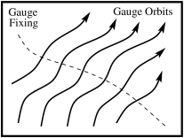
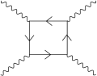

> From <strong>Quantum Field Theory</strong>, lecture notes by <strong>David Tong</strong> (University of Cambridge). Original HTML: <a href="https://davidtong.org/teaching/quantum-field-theory/qfthtml/S6.html">https://davidtong.org/teaching/quantum-field-theory/qfthtml/S6.html</a> · <a href="https://davidtong.org/pdfs/teaching/quantum-field-theory/qft.pdf">PDF version</a> · <a href="https://davidtong.org/teaching/quantum-field-theory">course page</a>. Reformatted for this reader; all content © David Tong.

<a href="5.%20Quantizing%20the%20Dirac%20Field.md">← 5. Quantizing the Dirac Field</a> · <a href="README.md">Contents</a>

# 6 Quantum Electrodynamics

In this section we finally get to quantum electrodynamics (QED), the theory of light interacting with charged matter. Our path to quantization will be as before: we start with the free theory of the electromagnetic field and see how the quantum theory gives rise to a photon with two polarization states. We then describe how to couple the photon to fermions and to bosons.

## 6.1 Maxwell’s Equations

The Lagrangian for Maxwell’s equations in the absence of any sources is simply

$$
\displaystyle{\cal L}=-\frac{1}{4}\,F_{\mu\nu}F^{\mu\nu} \tag{6.493}
$$

where the field strength is defined by

$$
\displaystyle F_{\mu\nu}=\partial_{\mu}A_{\nu}-\partial_{\nu}A_{\mu} \tag{6.494}
$$

The equations of motion which follow from this Lagrangian are

$$
\displaystyle\partial_{\mu}\left(\frac{\partial{\cal L} }{\partial{(\partial_{\mu}A_{\nu})} }\right)=-\partial_{\mu}F^{\mu\nu}=0 \tag{6.495}
$$

Meanwhile, from the definition of $F_{\mu\nu}$, the field strength also satisfies the Bianchi identity

$$
\displaystyle\partial_{\lambda}F_{\mu\nu}+\partial_{\mu}F_{\nu\lambda}+\partial_{\nu}F_{\lambda\mu}=0 \tag{6.496}
$$

To make contact with the form of Maxwell’s equations you learn about in high school, we need some 3-vector notation. If we define $A^{\mu}=(\phi,\vec{A})$, then the electric field $\vec{E}$ and magnetic field $\vec{B}$ are defined by

$$
\displaystyle\vec{E}=-\nabla\phi-\frac{\partial{\vec{A} } }{\partial{t} }\ \ \ {\rm and}\ \ \ \vec{B}=\nabla\times\vec{A} \tag{6.497}
$$

which, in terms of $F_{\mu\nu}$, becomes

$$
\displaystyle F_{\mu\nu}=\tiny{\left(\begin{array}{cccc}0&E_{x}&E_{y}&E_{z}\\ -E_{x}&0&-B_{z}&B_{y}\\ -E_{y}&B_{z}&0&-B_{x}\\ -E_{z}&-B_{y}&B_{x}&0\end{array}\right)} \tag{6.498}
$$

The Bianchi identity (<a href="#E496">6.496</a>) then gives two of Maxwell’s equations,

$$
\displaystyle\nabla\cdot\vec{B}=0\ \ \ \ {\rm and}\ \ \ \ \frac{\partial{\vec{B} } }{\partial{t} }=-\nabla\times\vec{E} \tag{6.499}
$$

These remain true even in the presence of electric sources. Meanwhile, the equations of motion give the remaining two Maxwell equations,

$$
\displaystyle\nabla\cdot\vec{E}=0\ \ \ \ {\rm and}\ \ \ \ \frac{\partial{\vec{E} } }{\partial{t} }=\nabla\times\vec{B} \tag{6.500}
$$

As we will see shortly, in the presence of charged matter these equations pick up extra terms on the right-hand side.

### 6.1.1 Gauge Symmetry

The massless vector field $A_{\mu}$ has 4 components, which would naively seem to tell us that the gauge field has 4 degrees of freedom. Yet we know that the photon has only two degrees of freedom which we call its polarization states. How are we going to resolve this discrepancy? There are two related comments which will ensure that quantizing the gauge field $A_{\mu}$ gives rise to 2 degrees of freedom, rather than 4.

&#8226;&nbsp; The field $A_{0}$ has no kinetic term $\dot{A}_{0}$ in the Lagrangian: it is not dynamical. This means that if we are given some initial data $A_{i}$ and $\dot{A}_{i}$ at a time $t_{0}$, then the field $A_{0}$ is fully determined by the equation of motion $\nabla\cdot\vec{E}=0$ which, expanding out, reads

$$
\displaystyle\nabla^{2}A_{0}+\nabla\cdot\frac{\partial{\vec{A} } }{\partial{t} }=0 \tag{6.501}
$$

This has the solution

$$
\displaystyle A_{0}(\vec{x})=\int d^{3}x^{\prime}\ \frac{(\nabla\cdot\partial\vec{A}/\partial t)(\vec{x}^{\,\prime})}{4\pi|\vec{x}-\vec{x}^{\,\prime}|} \tag{6.502}
$$

So $A_{0}$ is not independent: we don’t get to specify $A_{0}$ on the initial time slice. It looks like we have only 3 degrees of freedom in $A_{\mu}$ rather than 4. But this is still one too many.

&#8226;&nbsp; The Lagrangian (<a href="#E495">6.495</a>) has a <em>very</em> large symmetry group, acting on the vector potential as

$$
\displaystyle A_{\mu}(x)\rightarrow A_{\mu}(x)+\partial_{\mu}\lambda(x) \tag{6.503}
$$

for any function $\lambda(x)$. We’ll ask only that $\lambda(x)$ dies off suitably quickly at spatial $\vec{x}\rightarrow\infty$. We call this a <em>gauge symmetry</em>. The field strength is invariant under the gauge symmetry:

$$
\displaystyle F_{\mu\nu}\rightarrow\partial_{\mu}(A_{\nu}+\partial_{\nu}\lambda)-\partial_{\nu}(A_{\mu}+\partial_{\mu}\lambda)=F_{\mu\nu} \tag{6.504}
$$

So what are we to make of this? We have a theory with an infinite number of symmetries, one for each function $\lambda(x)$. Previously we only encountered symmetries which act the same at all points in spacetime, for example $\psi\rightarrow e^{i\alpha}\psi$ for a complex scalar field. Noether’s theorem told us that these symmetries give rise to conservation laws. Do we now have an infinite number of conservation laws?

The answer is no! Gauge symmetries have a very different interpretation than the global symmetries that we make use of in Noether’s theorem. While the latter take a physical state to another physical state with the same properties, the gauge symmetry is to be viewed as a redundancy in our description. That is, two states related by a gauge symmetry are to be identified: they are the same physical state. (There is a small caveat to this statement which is explained in Section 6.3.1). One way to see that this interpretation is necessary is to notice that Maxwell’s equations are not sufficient to specify the evolution of $A_{\mu}$. The equations read,

$$
\displaystyle\left[\eta_{\mu\nu}(\partial^{\rho}\partial_{\rho})-\partial_{\mu}\partial_{\nu}\right]A^{\nu}=0 \tag{6.505}
$$

But the operator $[\eta_{\mu\nu}(\partial^{\rho}\partial_{\rho})-\partial_{\mu}\partial_{\nu}]$ is not invertible: it annihilates any function of the form $\partial_{\mu}\lambda$. This means that given any initial data, we have no way to uniquely determine $A_{\mu}$ at a later time since we can’t distinguish between $A_{\mu}$ and $A_{\mu}+\partial_{\mu}\lambda$. This would be problematic if we thought that $A_{\mu}$ is a physical object. However, if we’re happy to identify $A_{\mu}$ and $A_{\mu}+\partial_{\mu}\lambda$ as corresponding to the same physical state, then our problems disappear.

<figure id="F29" style="margin:1.5em auto;text-align:center"><figcaption style="font-size:0.9em;margin-top:0.4em"><strong>Figure 29.</strong> </figcaption></figure>

Since gauge invariance is a redundancy of the system, we might try to formulate the theory purely in terms of the local, physical, gauge invariant objects $\vec{E}$ and $\vec{B}$. This is fine for the free classical theory: Maxwell’s equations were, after all, first written in terms of $\vec{E}$ and $\vec{B}$. But it is not possible to describe certain quantum phenomena, such as the Aharonov-Bohm effect, without using the gauge potential $A_{\mu}$. We will see shortly that we also require the gauge potential to describe classically charged fields. To describe Nature, it appears that we have to introduce quantities $A_{\mu}$ that we can never measure.

The picture that emerges for the theory of electromagnetism is of an enlarged phase space, foliated by gauge orbits as shown in the figure. All states that lie along a given line can be reached by a gauge transformation and are identified. To make progress, we pick a representative from each gauge orbit. It doesn’t matter which representative we pick — after all, they’re all physically equivalent. But we should make sure that we pick a “good” gauge, in which we cut the orbits.

Different representative configurations of a physical state are called different <em>gauges</em>. There are many possibilities, some of which will be more useful in different situations. Picking a gauge is rather like picking coordinates that are adapted to a particular problem. Moreover, different gauges often reveal slightly different aspects of a problem. Here we’ll look at two different gauges:

&#8226;&nbsp; <strong>Lorentz Gauge:</strong> $\partial_{\mu}A^{\mu}=0$

To see that we can always pick a representative configuration satisfying $\partial_{\mu}A^{\mu}=0$, suppose that we’re handed a gauge field $A^{\prime}_{\mu}$ satisfying $\partial_{\mu}(A^{\prime})^{\mu}=f(x)$. Then we choose $A_{\mu}=A^{\prime}_{\mu}+\partial_{\mu}\lambda$, where

$$
\displaystyle\partial_{\mu}\partial^{\mu}\lambda=-f \tag{6.506}
$$

This equation always has a solution. In fact this condition doesn’t pick a unique representative from the gauge orbit. We’re always free to make further gauge transformations with $\partial_{\mu}\partial^{\mu}\lambda=0$, which also has non-trivial solutions. As the name suggests, the Lorentz gauge<a href="#footnote3">1</a> has the advantage that it is Lorentz invariant.

&#8226;&nbsp; <strong>Coulomb Gauge:</strong> $\nabla\cdot\vec{A}=0$

We can make use of the residual gauge transformations in Lorentz gauge to pick $\nabla\cdot\vec{A}=0$. (The argument is the same as before). Since $A_{0}$ is fixed by (<a href="#E502">6.502</a>), we have as a consequence

$$
\displaystyle A_{0}=0 \tag{6.507}
$$

(This equation will no longer hold in Coulomb gauge in the presence of charged matter). Coulomb gauge breaks Lorentz invariance, so may not be ideal for some purposes. However, it is very useful to exhibit the physical degrees of freedom: the 3 components of $\vec{A}$ satisfy a single constraint: $\nabla\cdot\vec{A}=0$, leaving behind just 2 degrees of freedom. These will be identified with the two polarization states of the photon. Coulomb gauge is sometimes called radiation gauge.

## 6.2 The Quantization of the Electromagnetic Field

In the following we shall quantize free Maxwell theory twice: once in Coulomb gauge, and again in Lorentz gauge. We’ll ultimately get the same answers and, along the way, see that each method comes with its own subtleties.

The first of these subtleties is common to both methods and comes when computing the momentum $\pi^{\mu}$ conjugate to $A_{\mu}$,

$$
\begin{aligned}\displaystyle\pi^{0} &\displaystyle= \displaystyle\frac{\partial{\cal L} }{\partial{\dot{A}_{0} } }=0\end{aligned}
$$

$$
\begin{aligned}\displaystyle\pi^{i} &\displaystyle= \displaystyle\frac{\partial{\cal L} }{\partial{\dot{A}_{i} } }=-F^{0i}\equiv E^{i}\end{aligned} \tag{6.508}
$$

so the momentum $\pi^{0}$ conjugate to $A_{0}$ vanishes. This is the mathematical consequence of the statement we made above: $A_{0}$ is not a dynamical field. Meanwhile, the momentum conjugate to $A_{i}$ is our old friend, the electric field. We can compute the Hamiltonian,

$$
\begin{aligned}\displaystyle H &\displaystyle= \displaystyle\int d^{3}x\ \pi^{i}\dot{A}_{i}-{\cal L} \\ &\displaystyle= \displaystyle\int d^{3}x\ {\textstyle\frac{1}{2} }\vec{E}\cdot\vec{E}+{\textstyle\frac{1}{2} }\vec{B}\cdot\vec{B}-A_{0}(\nabla\cdot\vec{E})\end{aligned} \tag{6.509}
$$

So $A_{0}$ acts as a Lagrange multiplier which imposes Gauss’ law

$$
\displaystyle\nabla\cdot\vec{E}=0 \tag{6.510}
$$

which is now a constraint on the system in which $\vec{A}$ are the physical degrees of freedom. Let’s now see how to treat this system using different gauge fixing conditions.

### 6.2.1 Coulomb Gauge

In Coulomb gauge, the equation of motion for $\vec{A}$ is

$$
\displaystyle\partial_{\mu}\partial^{\mu}\vec{A}=0 \tag{6.511}
$$

which we can solve in the usual way,

$$
\displaystyle\vec{A}=\int\frac{d^{3}p}{(2\pi)^{3} }\,\vec{\xi}(\vec{p})\,e^{ip\cdot x} \tag{6.512}
$$

with $p_{0}^{2}=|\vec{p}|^{2}$. The constraint $\nabla\cdot\vec{A}=0$ tells us that $\vec{\xi}$ must satisfy

$$
\displaystyle\vec{\xi}\cdot\vec{p}=0 \tag{6.513}
$$

which means that $\vec{\xi}$ is perpendicular to the direction of motion $\vec{p}$. We can pick $\vec{\xi}(\vec{p})$ to be a linear combination of two orthonormal vectors $\vec{\epsilon}_{r}$, $r=1,2$, each of which satisfies $\vec{\epsilon}_{r}(\vec{p})\cdot\vec{p}=0$ and

$$
\displaystyle\vec{\epsilon}_{r}(\vec{p})\cdot\vec{\epsilon}_{s}(\vec{p})=\delta_{rs}\ \ \ \ \ r,s=1,2 \tag{6.514}
$$

These two vectors correspond to the two polarization states of the photon. It’s worth pointing out that you can’t consistently pick a continuous basis of polarization vectors for every value of $\vec{p}$ because you can’t comb the hair on a sphere. But this topological fact doesn’t cause any complications in computing QED scattering processes.

To quantize we turn the Poisson brackets into commutators. Naively we would write

$$
\displaystyle[A_{i}(\vec{x}),\,A_{j}(\vec{y})]=[E^{i}(\vec{x}),E^{j}(\vec{y})]=0
$$

$$
\displaystyle[A_{i}(\vec{x}),E^{j}(\vec{y})]=i\delta^{j}_{i}\,\delta^{(3)}(\vec{x}-\vec{y}) \tag{6.515}
$$

But this can’t quite be right, because it’s not consistent with the constraints. We still want to have $\nabla\cdot\vec{A}=\nabla\cdot\vec{E}=0$, now imposed on the operators. But from the commutator relations above, we see

$$
\displaystyle[\nabla\cdot\vec{A}(\vec{x}),\nabla\cdot\vec{E}(\vec{y})]=i\nabla^{2}\,\delta^{(3)}(\vec{x}-\vec{y})\neq 0 \tag{6.516}
$$

What’s going on? In imposing the commutator relations (<a href="#E515">6.515</a>) we haven’t correctly taken into account the constraints. In fact, this is a problem already in the classical theory, where the Poisson bracket structure is already altered<a href="#footnote4">2</a>. The correct Poisson bracket structure leads to an alteration of the last commutation relation,

$$
\displaystyle[A_{i}(\vec{x}),E_{j}(\vec{y})]=i\left(\delta_{ij}-\frac{\partial_{i}\partial_{j} }{\nabla^{2} }\right)\,\delta^{(3)}(\vec{x}-\vec{y}) \tag{6.517}
$$

To see that this is now consistent with the constraints, we can rewrite the right-hand side of the commutator in momentum space,

$$
\displaystyle[A_{i}(\vec{x}),E_{j}(\vec{y})]=i\int\frac{d^{3}p}{(2\pi)^{3} }\left(\delta_{ij}-\frac{p_{i}p_{j} }{|\vec{p}|^{\,2} }\right)e^{i\vec{p}\cdot(\vec{x}-\vec{y})} \tag{6.518}
$$

which is now consistent with the constraints, for example

$$
\displaystyle[\partial_{i}A_{i}(\vec{x}),E_{j}(\vec{y})]=i\int\frac{d^{3}p}{(2\pi)^{3} }\left(\delta_{ij}-\frac{p_{i}p_{j} }{|\vec{p}|^{\,2} }\right)ip_{i}\,e^{i\vec{p}\cdot(\vec{x}-\vec{y})}=0 \tag{6.519}
$$

We now write $\vec{A}$ in the usual mode expansion,

$$
\begin{aligned}\displaystyle\vec{A}(\vec{x}) &\displaystyle= \displaystyle\int\frac{d^{3}p}{(2\pi)^{3} }\frac{1}{\sqrt{2|\vec{p}|} }\,\sum_{r=1}^{2}\vec{\epsilon}_{r}(\vec{p})\,\left[a^{r}_{\vec{p} }\,e^{i\vec{p}\cdot\vec{x} }+a_{\vec{p} }^{r\,\dagger}e^{-i\vec{p}\cdot\vec{x} }\right]\end{aligned}
$$

$$
\begin{aligned}\displaystyle\vec{E}(\vec{x}) &\displaystyle= \displaystyle\int\frac{d^{3}p}{(2\pi)^{3} }(-i)\sqrt{\frac{|\vec{p}|}{2} }\,\sum_{r=1}^{2}\vec{\epsilon}_{r}(\vec{p})\,\left[a^{r}_{\vec{p} }\,e^{i\vec{p}\cdot\vec{x} }-a^{r\,\dagger}_{\vec{p} }e^{-i\vec{p}\cdot\vec{x} }\right]\end{aligned} \tag{6.520}
$$

where, as before, the polarization vectors satisfy

$$
\displaystyle\vec{\epsilon}_{r}(\vec{p})\cdot\vec{p}=0\ \ \ {\rm and}\ \ \ \vec{\epsilon}_{r}(\vec{p})\cdot\vec{\epsilon}_{s}(\vec{p})=\delta_{rs} \tag{6.521}
$$

It is not hard to show that the commutation relations (<a href="#E517">6.517</a>) are equivalent to the usual commutation relations for the creation and annihilation operators,

$$
\displaystyle[a^{r}_{\vec{p} },a^{s}_{\vec{q} }]=[a^{r\,\dagger}_{\vec{p} },a^{s\,\dagger}_{\vec{q} }]=0
$$

$$
\displaystyle[a^{r}_{\vec{p} },a^{s\,\dagger}_{\vec{q} }{]}=(2\pi)^{3}\delta^{rs}\,\delta^{(3)}(\vec{p}-\vec{q}) \tag{6.522}
$$

where, in deriving this, we need the completeness relation for the polarization vectors,

$$
\displaystyle\sum_{r=1}^{2}{\epsilon}_{r}^{i}(\vec{p})\epsilon_{r}^{j}(\vec{p})=\delta^{ij}-\frac{p^{i}p^{j} }{|\vec{p}|^{\,2} } \tag{6.523}
$$

You can easily check that this equation is true by acting on both sides with a basis of vectors $(\vec{\epsilon}_{1}(\vec{p}),\vec{\epsilon}_{2}(\vec{p}),\vec{p})$.

We derive the Hamiltonian by substituting (<a href="#E520">6.520</a>) into (<a href="#E509">6.509</a>). The last term vanishes in Coulomb gauge. After normal ordering, and playing around with $\vec{\epsilon}_{r}$ polarization vectors, we get the simple expression

$$
\displaystyle H=\int\frac{d^{3}p}{(2\pi)^{3} }\,|\vec{p}|\,\sum_{r=1}^{2}a_{\vec{p} }^{r\,\dagger}a_{\vec{p} }^{r} \tag{6.524}
$$

The Coulomb gauge has the advantage that the physical degrees of freedom are manifest. However, we’ve lost all semblance of Lorentz invariance. One place where this manifests itself is in the propagator for the fields $A_{i}(x)$ (in the Heisenberg picture). In Coulomb gauge the propagator reads

$$
\displaystyle D^{\rm tr}_{ij}(x-y)\equiv\left\langle 0\right|TA_{i}(x)A_{j}(y)\left|0\right\rangle=\int\frac{d^{4}p}{(2\pi)^{4} }\,\frac{i}{p^{2}+i\epsilon}\,\left(\delta_{ij}-\frac{p_{i}p_{j} }{|\vec{p}|^{2} }\right)\,e^{-ip\cdot(x-y)} \tag{6.525}
$$

The $tr$ superscript on the propagator refers to the “transverse” part of the photon. When we turn to the interacting theory, we will have to fight to massage this propagator into something a little nicer.

### 6.2.2 Lorentz Gauge

We could try to work in a Lorentz invariant fashion by imposing the Lorentz gauge condition $\partial_{\mu}A^{\mu}=0$. The equations of motion that follow from the action are then

$$
\displaystyle\partial_{\mu}\partial^{\mu}A^{\nu}=0 \tag{6.526}
$$

Our approach to implementing Lorentz gauge will be a little different from the method we used in Coulomb gauge. We choose to change the theory so that (<a href="#E526">6.526</a>) arises directly through the equations of motion. We can achieve this by taking the Lagrangian

$$
\displaystyle{\cal L}=-\frac{1}{4}F_{\mu\nu}F^{\mu\nu}-\frac{1}{2}(\partial_{\mu}A^{\mu})^{2} \tag{6.527}
$$

The equations of motion coming from this action are

$$
\displaystyle\partial_{\mu}F^{\mu\nu}+\partial^{\nu}(\partial_{\mu}A^{\mu})=\partial_{\mu}\partial^{\mu}A^{\nu}=0 \tag{6.528}
$$

(In fact, we could be a little more general than this, and consider the Lagrangian

$$
\displaystyle{\cal L}=-{\textstyle\frac{1}{4} }F_{\mu\nu}F^{\mu\nu}-\frac{1}{2\alpha}(\partial_{\mu}A^{\mu})^{2} \tag{6.529}
$$

with arbitrary $\alpha$ and reach similar conclusions. The quantization of the theory is independent of $\alpha$ and, rather confusingly, different choices of $\alpha$ are sometimes also referred to as different “gauges”. We will use $\alpha=1$, which is called “Feynman gauge”. The other common choice, $\alpha=0$, is called “Landau gauge”.)

Our plan will be to quantize the theory (<a href="#E528">6.528</a>), and only later impose the constraint $\partial_{\mu}A^{\mu}=0$ in a suitable manner on the Hilbert space of the theory. As we’ll see, we will also have to deal with the residual gauge symmetry of this theory which will prove a little tricky. At first, we can proceed very easily, because both $\pi^{0}$ and $\pi^{i}$ are dynamical:

$$
\begin{aligned}\displaystyle\pi^{0} &\displaystyle= \displaystyle\frac{\partial{\cal L} }{\partial{\dot{A}_{0} } }=-\partial_{\mu}A^{\mu}\end{aligned}
$$

$$
\begin{aligned}\displaystyle\pi^{i} &\displaystyle= \displaystyle\frac{\partial{\cal L} }{\partial{\dot{A}_{i} } }=\partial^{i}A^{0}-\dot{A}^{i}\end{aligned} \tag{6.530}
$$

Turning these classical fields into operators, we can simply impose the usual commutation relations,

$$
\displaystyle[A_{\mu}(\vec{x}),A_{\nu}(\vec{y})]=[\pi^{\mu}(\vec{x}),\pi^{\nu}(\vec{y})]=0
$$

$$
\displaystyle[A_{\mu}(\vec{x}),\pi_{\nu}(\vec{y})]=i\eta_{\mu\nu}\,\delta^{(3)}(\vec{x}-\vec{y}) \tag{6.531}
$$

and we can make the usual expansion in terms of creation and annihilation operators and 4 polarization vectors $(\epsilon_{\mu})^{\lambda}$, with $\lambda=0,1,2,3$.

$$
\begin{aligned}\displaystyle A_{\mu}(\vec{x}) &\displaystyle= \displaystyle\int\frac{d^{3}p}{(2\pi)^{3} }\,\frac{1}{\sqrt{2|\vec{p}|} }\,\sum_{\lambda=0}^{3}\epsilon_{\mu}^{\lambda}(\vec{p})\,\left[a^{\lambda}_{\vec{p} }\,e^{i\vec{p}\cdot\vec{x} }+a^{\lambda\,\dagger}_{\vec{p} }e^{-i\vec{p}\cdot\vec{x} }\right]\end{aligned}
$$

$$
\begin{aligned}\displaystyle\pi^{\mu}(\vec{x}) &\displaystyle= \displaystyle\int\frac{d^{3}p}{(2\pi)^{3} }\,\sqrt{\frac{|\vec{p}|}{2} }\,(+i)\,\sum_{\lambda=0}^{3}(\epsilon^{\mu})^{\lambda}(\vec{p})\,\left[a^{\lambda}_{\vec{p} }\,e^{i\vec{p}\cdot\vec{x} }-a^{\lambda\,\dagger}_{\vec{p} }e^{-i\vec{p}\cdot\vec{x} }\right]\end{aligned} \tag{6.532}
$$

Note that the momentum $\pi^{\mu}$ comes with a factor of $(+i)$, rather than the familiar $(-i)$ that we’ve seen so far. This can be traced to the fact that the momentum (<a href="#E530">6.530</a>) for the classical fields takes the form $\pi^{\mu}=-\dot{A}^{\mu}+\ldots$. In the Heisenberg picture, it becomes clear that this descends to $(+i)$ in the definition of momentum.

There are now four polarization 4-vectors $\epsilon^{\lambda}(\vec{p})$, instead of the two polarization 3-vectors that we met in the Coulomb gauge. Of these four 4-vectors, we pick $\epsilon^{0}$ to be timelike, while $\epsilon^{1,2,3}$ are spacelike. We pick the normalization

$$
\displaystyle\epsilon^{\lambda}\cdot\epsilon^{\lambda^{\prime} }=\eta^{\lambda\lambda^{\prime} } \tag{6.533}
$$

which also means that

$$
\displaystyle(\epsilon_{\mu})^{\lambda}\,(\epsilon_{\nu})^{\lambda^{\prime} }\,\eta_{\lambda\lambda^{\prime} }=\eta_{\mu\nu} \tag{6.534}
$$

The polarization vectors depend on the photon 4-momentum $p=(|\vec{p}|,\vec{p})$. Of the two spacelike polarizations, we will choose $\epsilon^{1}$ and $\epsilon^{2}$ to lie transverse to the momentum:

$$
\displaystyle\epsilon^{1}\cdot p=\epsilon^{2}\cdot p=0 \tag{6.535}
$$

The third vector $\epsilon^{3}$ is the longitudinal polarization. For example, if the momentum lies along the $x^{3}$ direction, so $p\sim(1,0,0,1)$, then

$$
\displaystyle\epsilon^{0}=\tiny{\left(\begin{array}{c}1\\ 0\\ 0\\ 0\end{array}\right)}\ \ \ ,\ \ \ \epsilon^{1}=\tiny{\left(\begin{array}{c}0\\ 1\\ 0\\ 0\end{array}\right)}\ \ \ ,\ \ \ \epsilon^{2}=\tiny{\left(\begin{array}{c}0\\ 0\\ 1\\ 0\end{array}\right)}\ \ \ ,\ \ \ \epsilon^{3}=\tiny{\left(\begin{array}{c}0\\ 0\\ 0\\ 1\end{array}\right)} \tag{6.536}
$$

For other 4-momenta, the polarization vectors are the appropriate Lorentz transformations of these vectors, since (<a href="#E535">6.535</a>) are Lorentz invariant.

We do our usual trick, and translate the field commutation relations (<a href="#E531">6.531</a>) into those for creation and annihilation operators. We find $[a^{\lambda}_{\vec{p} },a^{\lambda^{\prime} }_{\vec{q} }]=[a_{\vec{p} }^{\lambda\,\dagger},a_{\vec{q} }^{\lambda^{\prime}\,\dagger}]=0$ and

$$
\displaystyle[a^{\lambda}_{\vec{p} },a^{\lambda^{\prime}\,\dagger}_{\vec{q} }]=-\eta^{\lambda\lambda^{\prime} }\,(2\pi)^{3}\,\delta^{(3)}(\vec{p}-\vec{q}) \tag{6.537}
$$

The minus signs here are odd to say the least! For spacelike $\lambda=1,2,3$, everything looks fine,

$$
\displaystyle[a^{\lambda}_{\vec{p} },a^{\lambda^{\prime}\,\dagger}_{\vec{q} }]=\delta^{\lambda\lambda^{\prime} }\,(2\pi)^{3}\,\delta^{(3)}(\vec{p}-\vec{q})\ \ \ \ \ \lambda,\lambda^{\prime}=1,2,3 \tag{6.538}
$$

But for the timelike annihilation and creation operators, we have

$$
\displaystyle[a^{0}_{\vec{p} },a^{0\,\dagger}_{\vec{q} }]=-(2\pi)^{3}\,\delta^{(3)}(\vec{p}-\vec{q}) \tag{6.539}
$$

This is very odd! To see just how strange this is, we take the Lorentz invariant vacuum $\left|0\right\rangle$ defined by

$$
\displaystyle a_{\vec{p} }^{\lambda}\,\left|0\right\rangle=0 \tag{6.540}
$$

Then we can create one-particle states in the usual way,

$$
\displaystyle\left|\vec{p},\lambda\right\rangle=a_{\vec{p} }^{\lambda\,\dagger}\left|0\right\rangle \tag{6.541}
$$

For spacelike polarization states, $\lambda=1,2,3$, all seems well. But for the timelike polarization $\lambda=0$, the state $\left|\vec{p},0\right\rangle$ has negative norm,

$$
\displaystyle\left\langle\vec{p},0\right|\vec{q},0\rangle=\left\langle 0\right|a_{\vec{p} }^{0}\ a_{\vec{q} }^{0\,\dagger}\left|0\right\rangle=-(2\pi)^{3}\,\delta^{(3)}(\vec{p}-\vec{q}) \tag{6.542}
$$

Wtf? That’s very very strange. A Hilbert space with negative norm means negative probabilities which makes no sense at all. We can trace this negative norm back to the wrong sign of the kinetic term for $A_{0}$ in our original Lagrangian: ${\cal L}=+{\textstyle\frac{1}{2} }\dot{\vec{A} }{}^{2}-{\textstyle\frac{1}{2} }\dot{A}^{2}_{0}+\ldots$.

At this point we should remember our constraint equation, $\partial_{\mu}A^{\mu}=0$, which, until now, we’ve not imposed on our theory. This is going to come to our rescue. We will see that it will remove the timelike, negative norm states, and cut the physical polarizations down to two. We work in the Heisenberg picture, so that

$$
\displaystyle\partial_{\mu}A^{\mu}=0 \tag{6.543}
$$

makes sense as an operator equation. Then we could try implementing the constraint in the quantum theory in a number of different ways. Let’s look at a number of increasingly weak ways to do this

&#8226;&nbsp; We could ask that $\partial_{\mu}A^{\mu}=0$ is imposed as an equation on operators. But this can’t possibly work because the commutation relations (<a href="#E531">6.531</a>) won’t be obeyed for $\pi^{0}=-\partial_{\mu}A^{\mu}$. We need some weaker condition.

&#8226;&nbsp; We could try to impose the condition on the Hilbert space instead of directly on the operators. After all, that’s where the trouble lies! We could imagine that there’s some way to split the Hilbert space up into good states $\left|\Psi\right\rangle$ and bad states that somehow decouple from the system. With luck, our bad states will include the weird negative norm states that we’re so disgusted by. But how can we define the good states? One idea is to impose

$$
\displaystyle\partial_{\mu}A^{\mu}\left|\Psi\right\rangle=0 \tag{6.544}
$$

on all good, physical states $\left|\Psi\right\rangle$. But this can’t work either! Again, the condition is too strong. For example, suppose we decompose $A_{\mu}(x)=A_{\mu}^{+}(x)+A_{\mu}^{-}(x)$ with

$$
\displaystyle A_{\mu}^{+}(x)=\int\frac{d^{3}p}{(2\pi)^{3} }\,\frac{1}{\sqrt{2|\vec{p}|} }\,\sum_{\lambda=0}^{3}\epsilon_{\mu}^{\lambda}a^{\lambda}_{\vec{p} }\,e^{-ip\cdot x}
$$

$$
\displaystyle A_{\mu}^{-}(x)=\int\frac{d^{3}p}{(2\pi)^{3} }\,\frac{1}{\sqrt{2|\vec{p}|} }\,\sum_{\lambda=0}^{3}\epsilon_{\mu}^{\lambda}a^{\lambda\,\dagger}_{\vec{p} }e^{+ip\cdot x} \tag{6.545}
$$

Then, on the vacuum $A_{\mu}^{+}\left|0\right\rangle=0$ automatically, but $\partial^{\mu}A^{-}_{\mu}\left|0\right\rangle\neq 0$. So not even the vacuum is a physical state if we use (<a href="#E544">6.544</a>) as our constraint

&#8226;&nbsp; Our final attempt will be the correct one. In order to keep the vacuum as a good physical state, we can ask that physical states $\left|\Psi\right\rangle$ are defined by

$$
\displaystyle\partial^{\mu}A^{+}_{\mu}\left|\Psi\right\rangle=0 \tag{6.546}
$$

This ensures that

$$
\displaystyle\left\langle\Psi^{\prime}\right|\partial_{\mu}A^{\mu}\left|\Psi\right\rangle=0 \tag{6.547}
$$

so that the operator $\partial_{\mu}A^{\mu}$ has vanishing matrix elements between physical states. Equation (<a href="#E546">6.546</a>) is known as the <em>Gupta-Bleuler</em> condition. The linearity of the constraint means that the physical states $\left|\Psi\right\rangle$ span a physical Hilbert space ${\cal H}_{\rm phys}$.

So what does the physical Hilbert space ${\cal H}_{\rm phys}$ look like? And, in particular, have we rid ourselves of those nasty negative norm states so that ${\cal H}_{\rm phys}$ has a positive definite inner product defined on it? The answer is actually no, but almost!

Let’s consider a basis of states for the Fock space. We can decompose any element of this basis as $\left|\Psi\right\rangle=\left|\psi_{T}\right\rangle\left|\phi\right\rangle$, where $\left|\psi_{T}\right\rangle$ contains only transverse photons, created by $a_{\vec{p} }^{1,2\,\dagger}$, while $\left|\phi\right\rangle$ contains the timelike photons created by $a_{\vec{p} }^{0\,\dagger}$ and longitudinal photons created by $a_{\vec{p} }^{3\,\dagger}$. The Gupta-Bleuler condition (<a href="#E546">6.546</a>) requires

$$
\displaystyle(a_{\vec{p} }^{3}-a_{\vec{p} }^{0})\left|\phi\right\rangle=0 \tag{6.548}
$$

This means that the physical states must contain combinations of timelike and longitudinal photons. Whenever the state contains a timelike photon of momentum $\vec{p}$, it must also contain a longitudinal photon with the same momentum. In general $\left|\phi\right\rangle$ will be a linear combination of states $\left|\phi_{n}\right\rangle$ containing $n$ pairs of timelike and longitudinal photons, which we can write as

$$
\displaystyle|\phi\rangle=\sum_{n=0}^{\infty}C_{n}\left|\phi_{n}\right\rangle \tag{6.549}
$$

where $\left|\phi_{0}\right\rangle=\left|0\right\rangle$ is simply the vacuum. It’s not hard to show that although the condition (<a href="#E548">6.548</a>) does indeed decouple the negative norm states, all the remaining states involving timelike and longitudinal photons have zero norm

$$
\displaystyle\left\langle\phi_{m}\right|\phi_{n}\rangle=\delta_{n0}\delta_{m0} \tag{6.550}
$$

This means that the inner product on ${\cal H}_{\rm phys}$ is positive semi-definite. Which is an improvement. But we still need to deal with all these zero norm states.

The way we cope with the zero norm states is to treat them as gauge equivalent to the vacuum. Two states that differ only in their timelike and longitudinal photon content, $\left|\phi_{n}\right\rangle$ with $n\geq 1$ are said to be physically equivalent. We can think of the gauge symmetry of the classical theory as descending to the Hilbert space of the quantum theory. Of course, we can’t just stipulate that two states are physically identical unless they give the same expectation value for all physical observables. We can check that this is true for the Hamiltonian, which can be easily computed to be

$$
\displaystyle H=\int\frac{d^{3}p}{(2\pi)^{3} }\,|\vec{p}|\left(\sum_{i=1}^{3}a_{\vec{p} }^{i\,\dagger}a_{\vec{p} }^{i}-a_{\vec{p} }^{0\,\dagger}a_{\vec{p} }^{0}\right) \tag{6.551}
$$

But the condition (<a href="#E548">6.548</a>) ensures that $\left\langle\Psi\right|a_{\vec{p} }^{3\,\dagger}a^{3}_{\vec{p} }\,\left|\Psi\right\rangle=\left\langle\Psi\right|a_{\vec{p} }^{0\,\dagger}a^{0}_{\vec{p} }\,\left|\Psi\right\rangle$ so that the contributions from the timelike and longitudinal photons cancel amongst themselves in the Hamiltonian. This also renders the Hamiltonian positive definite, leaving us just with the contribution from the transverse photons as we would expect.

In general, one can show that the expectation values of all gauge invariant operators evaluated on physical states are independent of the coefficients $C_{n}$ in (<a href="#E549">6.549</a>).

### Propagators

Finally, it’s a simple matter to compute the propagator in Lorentz gauge. It is given by

$$
\displaystyle\left\langle 0\right|T\,A_{\mu}(x)A_{\nu}(y)\left|0\right\rangle=\int\frac{d^{4}p}{(2\pi)^{4} }\,\frac{-i\eta_{\mu\nu} }{p^{2}+i\epsilon}\,e^{-ip\cdot(x-y)} \tag{6.552}
$$

This is a lot nicer than the propagator we found in Coulomb gauge: in particular, it’s Lorentz invariant. We could also return to the Lagrangian (<a href="#E529">6.529</a>). Had we pushed through the calculation with arbitrary coefficient $\alpha$, we would find the propagator,

$$
\displaystyle\left\langle 0\right|T\,A_{\mu}(x)A_{\nu}(y)\left|0\right\rangle=\int\frac{d^{4}p}{(2\pi)^{4} }\,\frac{-i}{p^{2}+i\epsilon}\left(\eta_{\mu\nu}+(\alpha-1)\frac{p_{\mu}p_{\nu} }{p^{2} }\right)\,e^{-ip\cdot(x-y)} \tag{6.553}
$$

## 6.3 Coupling to Matter

Let’s now build an interacting theory of light and matter. We want to write down a Lagrangian which couples $A_{\mu}$ to some matter fields, either scalars or spinors. For example, we could write something like

$$
\displaystyle{\cal L}=-{\textstyle\frac{1}{4} }F_{\mu\nu}F^{\mu\nu}-j^{\mu}A_{\mu} \tag{6.554}
$$

where $j^{\mu}$ is some function of the matter fields. The equations of motion read

$$
\displaystyle\partial_{\mu}F^{\mu\nu}=j^{\nu} \tag{6.555}
$$

so, for consistency, we require

$$
\displaystyle\partial_{\mu}j^{\mu}=0 \tag{6.556}
$$

In other words, $j^{\mu}$ must be a conserved current. But we’ve got lots of those! Let’s look at how we can couple two of them to electromagnetism.

### 6.3.1 Coupling to Fermions

The Dirac Lagrangian

$$
\displaystyle{\cal L}=\bar{\psi}(i\,\,{\raisebox{0.645pt}{/}\mskip-10.0mu \partial}-m)\psi \tag{6.557}
$$

has an internal symmetry $\psi\rightarrow e^{-i\alpha}\psi$ and $\bar{\psi}\rightarrow e^{+i\alpha}\bar{\psi}$, with $\alpha\in{\bf R}$. This gives rise to the conserved current $j^{\mu}_{V}=\bar{\psi}\gamma^{\mu}\psi$. So we could look at the theory of electromagnetism coupled to fermions, with the Lagrangian,

$$
\displaystyle{\cal L}=-{\textstyle\frac{1}{4} }F_{\mu\nu}F^{\mu\nu}+\bar{\psi}(i\!\,\,{\raisebox{0.645pt}{/}\mskip-10.0mu \partial}-m)\psi-e\bar{\psi}\gamma^{\mu}A_{\mu}\psi \tag{6.558}
$$

where we’ve introduced a coupling constant $e$. For the free Maxwell theory, we have seen that the existence of a gauge symmetry was crucial in order to cut down the physical degrees of freedom to the requisite 2. Does our interacting theory above still have a gauge symmetry? The answer is yes. To see this, let’s rewrite the Lagrangian as

$$
\displaystyle{\cal L}=-{\textstyle\frac{1}{4} }F_{\mu\nu}F^{\mu\nu}+\bar{\psi}(i\,\,{\raisebox{0.645pt}{/}\mskip-13.0mu D}-m)\psi \tag{6.559}
$$

where $D_{\mu}\psi=\partial_{\mu}\psi+ieA_{\mu}\psi$ is called the <em>covariant derivative</em>. This Lagrangian is invariant under gauge transformations which act as

$$
\displaystyle A_{\mu}\rightarrow A_{\mu}+\partial_{\mu}\lambda\ \ \ {\rm and}\ \ \ \psi\rightarrow e^{-ie\lambda}\psi \tag{6.560}
$$

for an arbitrary function $\lambda(x)$. The tricky term is the derivative acting on $\psi$, since this will also hit the $e^{-ie\lambda}$ piece after the transformation. To see that all is well, let’s look at how the covariant derivative transforms. We have

$$
\begin{aligned}\displaystyle D_{\mu}\psi &\displaystyle= \displaystyle\partial_{\mu}\psi+ieA_{\mu}\psi \\ &\displaystyle\rightarrow \displaystyle\partial_{\mu}(e^{-ie\lambda}\psi)+ie(A_{\mu}+\partial_{\mu}\lambda)(e^{-ie\lambda}\psi) \\ &\displaystyle= \displaystyle e^{-ie\lambda}D_{\mu}\psi\end{aligned} \tag{6.561}
$$

so the covariant derivative has the nice property that it merely picks up a phase under the gauge transformation, with the derivative of $e^{-ie\lambda}$ cancelling the transformation of the gauge field. This ensures that the whole Lagrangian is invariant, since $\bar{\psi}\rightarrow e^{+ie\lambda(x)}\bar{\psi}$.

### Electric Charge

The coupling $e$ has the interpretation of the electric charge of the $\psi$ particle. This follows from the equations of motion of classical electromagnetism $\partial_{\mu}F^{\mu\nu}=j^{\nu}$: we know that the $j^{0}$ component is the charge density. We therefore have the total charge $Q$ given by

$$
\displaystyle Q=e\int d^{3}x\,\bar{\psi}(\vec{x})\gamma^{0}\psi(\vec{x}) \tag{6.562}
$$

After treating this as a quantum equation, we have

$$
\displaystyle Q=e\int\frac{d^{3}p}{(2\pi)^{3} }\sum_{s=1}^{2}(b^{s\,\dagger}_{\vec{p} }b_{\vec{p} }^{s}-c^{s\,\dagger}_{\vec{p} }c_{\vec{p} }^{s}) \tag{6.563}
$$

which is the number of particles, minus the number of antiparticles. Note that the particle and the anti-particle are required by the formalism to have opposite electric charge. For QED, the theory of light interacting with electrons, the electric charge is usually written in terms of the dimensionless ratio $\alpha$, known as the fine structure constant

$$
\displaystyle\alpha=\frac{e^{2} }{4\pi\hbar c}\approx\frac{1}{137} \tag{6.564}
$$

Setting $\hbar=c=1$, we have $e=\sqrt{4\pi\alpha}\approx 0.3$.

There’s a small subtlety here that’s worth elaborating on. I stressed that there’s a radical difference between the interpretation of a global symmetry and a gauge symmetry. The former takes you from one physical state to another with the same properties and results in a conserved current through Noether’s theorem. The latter is a redundancy in our description of the system. Yet in electromagnetism, the gauge symmetry $\psi\rightarrow e^{+ie\lambda(x)}\psi$ seems to lead to a conservation law, namely the conservation of electric charge. This is because among the infinite number of gauge symmetries parameterized by a function $\lambda(x)$, there is also a single global symmetry: that with $\lambda(x)={\rm constant}$. This is a true symmetry of the system, meaning that it takes us to another physical state. More generally, the subset of global symmetries from among the gauge symmetries are those for which $\lambda(x)\rightarrow\alpha={\rm constant}$ as $x\rightarrow\infty$. These take us from one physical state to another.

Finally, let’s check that the $4\times 4$ matrix $C$ that we introduced in Section <a href="4.%20The%20Dirac%20Equation.md#SS5">4.5</a> really deserves the name “charge conjugation matrix”. If we take the complex conjugation of the Dirac equation, we have

$$
\displaystyle(i\gamma^{\mu}\partial_{\mu}-e\gamma^{\mu}A_{\mu}-m)\psi=0\ \ \ \Rightarrow\ \ \ (-i(\gamma^{\mu})^{\star}\partial_{\mu}-e(\gamma^{\mu})^{\star}A_{\mu}-m)\psi^{\star}=0
$$

Now using the defining equation $C^{\dagger}\gamma^{\mu}C=-(\gamma^{\mu})^{\star}$, and the definition $\psi^{(c)}=C\psi^{\star}$, we see that the charge conjugate spinor $\psi^{(c)}$ satisfies

$$
\displaystyle(i\gamma^{\mu}\partial_{\mu}+e\gamma^{\mu}A_{\mu}-m)\psi^{(c)}=0 \tag{6.565}
$$

So we see that the charge conjugate spinor $\psi^{(c)}$ satisfies the Dirac equation, but with charge $-e$ instead of $+e$.

### 6.3.2 Coupling to Scalars

For a real scalar field, we have no suitable conserved current. This means that we can’t couple a real scalar field to a gauge field.

Let’s now consider a complex scalar field $\varphi$. (For this section, I’ll depart from our previous notation and call the scalar field $\varphi$ to avoid confusing it with the spinor). We have a symmetry $\varphi\rightarrow e^{-i\alpha}\varphi$. We could try to couple the associated current to the gauge field,

$$
\displaystyle{\cal L}_{\rm int}=-i((\partial_{\mu}\varphi^{\star})\varphi-\varphi^{\star}\partial_{\mu}\varphi)A^{\mu} \tag{6.566}
$$

But this doesn’t work because

- The theory is no longer gauge invariant

- The current $j^{\mu}$ that we coupled to $A_{\mu}$ depends on $\partial_{\mu}\varphi$. This means that if we try to compute the current associated to the symmetry, it will now pick up a contribution from the $j^{\mu}A_{\mu}$ term. So the whole procedure wasn’t consistent.

We solve both of these problems simultaneously by remembering the covariant derivative. In this scalar theory, the combination

$$
\displaystyle{\cal D}_{\mu}\varphi=\partial_{\mu}\varphi+ieA_{\mu}\varphi \tag{6.567}
$$

again transforms as ${\cal D}_{\mu}\varphi\rightarrow e^{-ie\lambda}{\cal D}_{\mu}\varphi$ under a gauge transformation $A_{\mu}\rightarrow A_{\mu}+\partial_{\mu}\lambda$ and $\varphi\rightarrow e^{-ie\lambda}\varphi$. This means that we can construct a gauge invariant action for a charged scalar field coupled to a photon simply by promoting all derivatives to covariant derivatives

$$
\displaystyle{\cal L}=-\frac{1}{4}F_{\mu\nu}F^{\mu\nu}+{\cal D}_{\mu}\varphi^{\star}{\cal D}^{\mu}\varphi-m^{2}|\varphi|^{2} \tag{6.568}
$$

In general, this trick works for any theory. If we have a $U(1)$ symmetry that we wish to couple to a gauge field, we may do so by replacing all derivatives by suitable covariant derivatives. This procedure is known as <em>minimal coupling</em>.

## 6.4 QED

Let’s now work out the Feynman rules for the full theory of quantum electrodynamics (QED) – the theory of electrons interacting with light. The Lagrangian is

$$
\displaystyle{\cal L}=-\frac{1}{4}F_{\mu\nu}F^{\mu\nu}+\bar{\psi}(i\,\,{\raisebox{0.645pt}{/}\mskip-13.0mu D}-m)\psi \tag{6.569}
$$

where $D_{\mu}=\partial_{\mu}+ieA_{\mu}$.

The route we take now depends on the gauge choice. If we worked in Lorentz gauge previously, then we can jump straight to Section <a href="#SS5">6.5</a> where the Feynman rules for QED are written down. If, however, we worked in Coulomb gauge, then we still have a bit of work in front of us in order to massage the photon propagator into something Lorentz invariant. We will now do that.

In Coulomb gauge $\nabla\cdot\vec{A}=0$, the equation of motion arising from varying $A_{0}$ is now

$$
\displaystyle-\nabla^{2}A_{0}=e\psi^{\dagger}\psi\equiv ej^{0} \tag{6.570}
$$

which has the solution

$$
\displaystyle A_{0}(\vec{x},t)=e\int d^{3}x^{\prime}\,\frac{j^{0}(\vec{x}^{\,\prime},t)}{4\pi|\vec{x}-\vec{x}^{\,\prime}|} \tag{6.571}
$$

In Coulomb gauge we can rewrite the Maxwell part of the Lagrangian as

$$
\begin{aligned}\displaystyle L_{\rm Maxwell} &\displaystyle= \displaystyle\int d^{3}x\ {\textstyle\frac{1}{2} }\vec{E}^{2}-{\textstyle\frac{1}{2} }\vec{B}^{2} \\ &\displaystyle= \displaystyle\int d^{3}x\ {\textstyle\frac{1}{2} }(\dot{\vec{A} }+\nabla A_{0})^{2}-{\textstyle\frac{1}{2} }\vec{B}^{2} \\ &\displaystyle= \displaystyle\int d^{3}x\ {\textstyle\frac{1}{2} }\dot{\vec{A} }{}^{\,2}+{\textstyle\frac{1}{2} }(\nabla A_{0})^{2}-{\textstyle\frac{1}{2} }\vec{B}^{2}\end{aligned} \tag{6.572}
$$

where the cross-term has vanished using $\nabla\cdot\vec{A}=0$. After integrating the second term by parts and inserting the equation for $A_{0}$, we have

$$
\begin{aligned}\displaystyle L_{\rm Maxwell} &\displaystyle= \displaystyle\int d^{3}x\ \left[{\textstyle\frac{1}{2} }\dot{\vec{A} }{}^{\,2}-{\textstyle\frac{1}{2} }\vec{B}^{\,2}+\frac{e^{2} }{2}\int d^{3}x^{\prime}\ \frac{j_{0}(\vec{x})j_{0}(\vec{x}^{\,\prime})}{4\pi|\vec{x}-\vec{x}^{\,\prime}|}\right]\end{aligned} \tag{6.573}
$$

We find ourselves with a nonlocal term in the action. This is exactly the type of interaction that we boasted in Section <a href="1.%20Classical%20Field%20Theory.md#SS1.SSS4">1.1.4</a> never arises in Nature! It appears here as an artifact of working in Coulomb gauge: it does not mean that the theory of QED is nonlocal. For example, it wouldn’t appear if we worked in Lorentz gauge.

We now compute the Hamiltonian. Changing notation slightly from previous chapters, we have the conjugate momenta,

$$
\begin{aligned}\displaystyle\vec{\Pi} &\displaystyle= \displaystyle\frac{\partial{\cal L} }{\partial{\dot{\vec{A} } } }=\dot{\vec{A} }\end{aligned}
$$

$$
\begin{aligned}\displaystyle\pi_{\psi} &\displaystyle= \displaystyle\frac{\partial{\cal L} }{\partial{\dot{\psi} } }=i\psi^{\dagger}\end{aligned} \tag{6.574}
$$

which gives us the Hamiltonian

$$
\displaystyle H=\int d^{3}x\ \left[{\textstyle\frac{1}{2} }\dot{\vec{A} }{}^{\,2}+{\textstyle\frac{1}{2} }\vec{B}^{2}+\bar{\psi}(-i\gamma^{i}\partial_{i}+m)\psi-e\vec{j}\cdot\vec{A}+\frac{e^{2} }{2}\int d^{3}x^{\prime}\,\frac{j^{0}(\vec{x})j^{0}(\vec{x}^{\,\prime})}{4\pi|\vec{x}-\vec{x}^{\,\prime}|}\right]
$$

where $\vec{j}=\bar{\psi}\vec{\gamma}\psi$ and $j^{0}=\bar{\psi}\gamma^{0}\psi$.

### 6.4.1 Naive Feynman Rules

We want to determine the Feynman rules for this theory. For fermions, the rules are the same as those given in Section 5. The new pieces are:

- We denote the photon by a wavy line. Each end of the line comes with an $i,j=1,2,3$ index telling us the component of $\vec{A}$. We calculated the transverse photon propagator in (<a href="#E525">6.525</a>): it is and contributes $\displaystyle{D_{ij}^{\rm tr}=\frac{i}{p^{2}+i\epsilon}\left(\delta_{ij}-\frac{p_{i}p_{j} }{|\vec{p}|^{2} }\right)}$

- The vertex contributes $-ie\gamma^{i}$. The index on $\gamma^{i}$ contracts with the index on the photon line.

- The non-local interaction which, in position space, is given by contributes a factor of $\displaystyle{\frac{i(e\gamma^{0})^{2}\delta(x^{0}-y^{0})}{4\pi|\vec{x}-\vec{y}|} }$

These Feynman rules are rather messy. This is the price we’ve paid for working in Coulomb gauge. We’ll now show that we can massage these expressions into something much more simple and Lorentz invariant. Let’s start with the offending instantaneous interaction. Since it comes from the $A_{0}$ component of the gauge field, we could try to redefine the propagator to include a $D_{00}$ piece which will capture this term. In fact, it fits quite nicely in this form: if we look in momentum space, we have

$$
\displaystyle\frac{\delta(x^{0}-y^{0})}{4\pi|\vec{x}-\vec{y}|}=\int\frac{d^{4}p}{(2\pi)^{4} }\,\frac{e^{ip\cdot(x-y)} }{|\vec{p}|^{2} } \tag{6.575}
$$

so we can combine the non-local interaction with the transverse photon propagator by defining a new photon propagator

$$
\displaystyle D_{\mu\nu}(p)=\left\{\begin{array}{cr}\displaystyle{+\frac{i}{|\vec{p}|^{2} } }&\mu,\nu=0\\ \displaystyle{\frac{i}{p^{2}+i\epsilon}\left(\delta_{ij}-\frac{p_{i}p_{j} }{|\vec{p}|^{2} }\right)}&\ \ \ \mu=i\neq 0,\nu=j\neq 0\\ 0&{\rm otherwise}\end{array}\right. \tag{6.576}
$$

With this propagator, the wavy photon line now carries a $\mu,\nu=0,1,2,3$ index, with the extra $\mu=0$ component taking care of the instantaneous interaction. We now need to change our vertex slightly: the $-ie\gamma^{i}$ above gets replaced by $-ie\gamma^{\mu}$ which correctly accounts for the $(e\gamma^{0})^{2}$ piece in the instantaneous interaction.

The $D_{00}$ piece of the propagator doesn’t look a whole lot different from the transverse photon propagator. But wouldn’t it be nice if they were both part of something more symmetric! In fact, they are. We have the following:    <strong>Claim:</strong> We can replace the propagator $D_{\mu\nu}(p)$ with the simpler, Lorentz invariant propagator

$$
\displaystyle D_{\mu\nu}(p)=-i\frac{\eta_{\mu\nu} }{p^{2} } \tag{6.577}
$$

<strong>Proof:</strong> There is a general proof using current conservation. Here we’ll be more pedestrian and show that we can do this for certain Feynman diagrams. In particular, we focus on a particular tree-level diagram that contributes to $e^{-}e^{-}\rightarrow e^{-}e^{-}$ scattering,

$$
\displaystyle\boxed{\small\text{diagram} }\sim\ e^{2}[\bar{u}(p^{\prime})\gamma^{\mu}u(p)]\,D_{\mu\nu}(k)\,[\bar{u}(q^{\prime})\gamma^{\nu}u(q)] \tag{6.578}
$$

where $k=p-p^{\prime}=q^{\prime}-q$. Recall that $u(\vec{p})$ satisfies the equation

$$
\displaystyle(\,\,{\raisebox{0.645pt}{/}\mskip-11.0mu p}-m)u(\vec{p})=0 \tag{6.579}
$$

Let’s define the spinor contractions $\alpha^{\mu}=\bar{u}(\vec{p}^{\,\prime})\gamma^{\mu}u(\vec{p})$ and $\beta^{\nu}=\bar{u}(\vec{q}^{\,\prime})\gamma^{\nu}u(\vec{q})$. Then since $k=p-p^{\prime}=q^{\prime}-q$, we have

$$
\displaystyle k_{\mu}\alpha^{\mu}=\bar{u}(\vec{p}^{\,\prime})(\,\,{\raisebox{0.645pt}{/}\mskip-11.0mu p}-\,\,{\raisebox{0.645pt}{/}\mskip-11.0mu p}^{\,\prime})u(\vec{p})=\bar{u}(\vec{p}^{\,\prime})(m-m)u(\vec{p})=0 \tag{6.580}
$$

and, similarly, $k_{\nu}\beta^{\nu}=0$. Using this fact, the diagram can be written as

$$
\begin{aligned}\displaystyle\alpha^{\mu}D_{\mu\nu}\beta^{\nu} &\displaystyle= \displaystyle i\left(\frac{\vec{\alpha}\cdot\vec{\beta} }{k^{2} }-\frac{(\vec{\alpha}\cdot\vec{k})(\vec{\beta}\cdot\vec{k})}{k^{2}|\vec{k}|^{2} }+\frac{\alpha^{0}\beta^{0} }{|\vec{k}|^{2} }\right) \\ &\displaystyle= \displaystyle i\left(\frac{\vec{\alpha}\cdot\vec{\beta} }{k^{2} }-\frac{k_{0}^{2}\alpha_{0}\beta_{0} }{k^{2}|\vec{k}|^{2} }+\frac{\alpha_{0}\beta_{0} }{|\vec{k}|^{2} }\right) \\ &\displaystyle= \displaystyle i\left(\frac{\vec{\alpha}\cdot\vec{\beta} }{k^{2} }-\frac{1}{k^{2}|\vec{k}|^{2} }\,(k_{0}^{2}-k^{2})\,\alpha_{0}\beta_{0}\right) \\ &\displaystyle= \displaystyle-\frac{i}{k^{2} }\alpha\cdot\beta=\alpha^{\mu}\left(-\frac{i\eta_{\mu\nu} }{k^{2} }\right)\beta^{\nu}\end{aligned} \tag{6.581}
$$

which is the claimed result. You can similarly check that the same substitution is legal in the diagram

$$
\displaystyle\boxed{\small\text{diagram} }\sim\ e^{2}[\bar{v}(\vec{q})\gamma^{\mu}u(\vec{p})]D_{\mu\nu}(k)[\bar{u}(\vec{p}^{\,\prime})\gamma^{\nu}v(\vec{q}^{\,\prime})] \tag{6.582}
$$

In fact, although we won’t show it here, it’s a general fact that in every Feynman diagram we may use the very nice, Lorentz invariant propagator $D_{\mu\nu}=-i\eta_{\mu\nu}/p^{2}$. $\Box$    <strong>Note:</strong> This is the propagator we found when quantizing in Lorentz gauge (using the Feynman gauge parameter). In general, quantizing the Lagrangian (<a href="#E529">6.529</a>) in Lorentz gauge, we have the propagator

$$
\displaystyle D_{\mu\nu}=-\frac{i}{p^{2} }\left(\eta_{\mu\nu}+(\alpha-1)\frac{p_{\mu}p_{\nu} }{p^{2} }\right) \tag{6.583}
$$

Using similar arguments to those given above, you can show that the $p_{\mu}p_{\nu}/p^{2}$ term cancels in all diagrams. For example, in the following diagrams the $p_{\mu}p_{\nu}$ piece of the propagator contributes as

$$
\begin{aligned}& \displaystyle\sim\bar{u}(p^{\prime})\gamma^{\mu}u(p)\,k_{\mu}=\bar{u}(p^{\prime})(\!\,\,{\raisebox{0.645pt}{/}\mskip-11.0mu p}-\,\,{\raisebox{0.645pt}{/}\mskip-11.0mu p}{}^{\,\prime})u(p)=0 \\ & \displaystyle\sim\bar{v}(p)\gamma^{\mu}u(q)\,k_{\mu}=\bar{u}(p)(\!\,\,{\raisebox{0.645pt}{/}\mskip-11.0mu p}+\,\,{\raisebox{0.645pt}{/}\mskip-9.0mu q}{}^{\,\prime})u(q)=0\end{aligned} \tag{6.584}
$$

## 6.5 Feynman Rules

Finally, we have the Feynman rules for QED. For vertices and internal lines, we write

- Vertex: $-ie\gamma^{\mu}$

- Photon Propagator: $-\displaystyle{\frac{i\eta_{\mu\nu} }{p^{2}+i\epsilon} }$

- Fermion Propagator: $\displaystyle{\frac{i(\,\,{\raisebox{0.645pt}{/}\mskip-11.0mu p}+m)}{p^{2}-m^{2}+i\epsilon} }$

For external lines in the diagram, we attach

- Photons: We add a polarization vector $\epsilon_{\rm in}^{\mu}$/$\epsilon_{\rm out}^{\mu}$ for incoming/outgoing photons. In Coulomb gauge, $\epsilon^{0}=0$ and $\vec{\epsilon}\cdot{\vec{p} }=0$.

- Fermions: We add a spinor $u^{r}(\vec{p})$/$\bar{u}^{r}(\vec{p})$ for incoming/outgoing fermions. We add a spinor $\bar{v}^{r}(\vec{p})$/${v}^{r}(\vec{p})$ for incoming/outgoing anti-fermions.

### 6.5.1 Charged Scalars

> “Pauli asked me to calculate the cross section for pair creation of scalar particles by photons. It was only a short time after Bethe and Heitler had solved the same problem for electrons and positrons. I met Bethe in Copenhagen at a conference and asked him to tell me how he did the calculations. I also inquired how long it would take to perform this task; he answered, “It would take me three days, but you will need about three weeks.” He was right, as usual; furthermore, the published cross sections were wrong by a factor of four.”

<em>Viki Weisskopf</em>

The interaction terms in the Lagrangian for charged scalars come from the covariant derivative terms,

$$
\displaystyle{\cal L}={\cal D}_{\mu}\psi^{\dagger}\,{\cal D}^{\mu}\psi=\partial_{\mu}\psi^{\dagger}\partial^{\mu}\psi-ieA_{\mu}(\psi^{\dagger}\partial^{\mu}\psi-\psi\partial^{\mu}\psi^{\dagger})+e^{2}A_{\mu}A^{\mu}\psi^{\dagger}\psi \tag{6.585}
$$

This gives rise to two interaction vertices. But the cubic vertex is something we haven’t seen before: it contains kinetic terms. How do these appear in the Feynman rules? After a Fourier transform, the derivative term means that the interaction is stronger for fermions with higher momentum, so we include a momentum factor in the Feynman rule. There is also a second, “seagull” graph. The two Feynman rules are

$$
\displaystyle\boxed{\small\text{diagram} }\ -ie(p+q)_{\mu}\ \ \ \ \ \ \ \ {\rm and}\ \ \ \ \ \ \ \boxed{\small\text{diagram} }\ +2ie^{2}\eta_{\mu\nu}
$$

The factor of two in the seagull diagram arises because of the two identical particles appearing in the vertex. (It’s the same reason that the $1/4!$ didn’t appear in the Feynman rules for $\phi^{4}$ theory).

## 6.6 Scattering in QED

Let’s now calculate some amplitudes for various processes in quantum electrodynamics, with a photon coupled to a single fermion. We will consider the analogous set of processes that we saw in Section 3 and Section 5. We have

### Electron Scattering

Electron scattering $e^{-}e^{-}\rightarrow e^{-}e^{-}$ is described by the two leading order Feynman diagrams, given by

$$
\displaystyle\boxed{\small\text{diagram} }\ \ +\ \ \boxed{\small\text{diagram} }\begin{array}{c}\displaystyle{=\ -i(-ie)^{2}\left(\frac{[\bar{u}^{s^{\prime} }\!(\vec{p}^{\,\prime})\gamma^{\mu}u^{s}(\vec{p})]\,[\bar{u}^{r^{\prime} }(\vec{q}^{\,\prime})\gamma_{\mu}u^{r}(\vec{q})]}{(p^{\prime}-p)^{2} }\right._{\raisebox{-6.45pt}{\ } } }\\ \ \ \ \ \ \ \ \ \ \ \ \ \ \ \displaystyle{\left.-\ \frac{[\bar{u}^{s^{\prime} }\!(\vec{p}^{\,\prime})\gamma^{\mu}u^{r}(\vec{q})]\,[\bar{u}^{r^{\prime} }(\vec{q}^{\,\prime})\gamma_{\mu}u^{s}(\vec{p})]}{(p-q^{\prime})^{2} }\right)}\end{array}
$$

The overall $-i$ comes from the $-i\eta_{\mu\nu}$ in the propagator, which contract the indices on the $\gamma$-matrices (remember that it’s really positive for $\mu,\nu=1,2,3$).

### Electron Positron Annihilation

Let’s now look at $e^{-}e^{+}\rightarrow 2\gamma$, two gamma rays. The two lowest order Feynman diagrams are,

$$
\displaystyle\boxed{\small\text{diagram} }\ \ +\ \ \boxed{\small\text{diagram} }\!\!\!\!\!\!\!\!\!\!\!\!\!\!\!\!\!\!\!\!\!\!\!\!\begin{array}{c}\displaystyle{=\ i(-ie)^{2}\,\bar{v}^{r}\!(\vec{q})\left(\frac{\gamma_{\mu}(\,\,{\raisebox{0.645pt}{/}\mskip-11.0mu p}-\,\,{\raisebox{0.645pt}{/}\mskip-11.0mu p}{}^{\,\prime}+m)\gamma_{\nu} }{(p-p^{\prime})^{2}-m^{2} }\right._{\raisebox{-6.45pt}{\ } } }\\ \ \ \ \ \ \ \ \ \ \ \ \ \ \ \ \ \ \ \ \ \ \displaystyle{\left.+\ \frac{\gamma_{\nu}(\,\,{\raisebox{0.645pt}{/}\mskip-11.0mu p}-\,\,{\raisebox{0.645pt}{/}\mskip-9.0mu q}{}^{\,\prime}+m)\gamma_{\mu} }{(p-q^{\prime})^{2}-m^{2} }\right)u^{s}(\vec{p})\epsilon_{1}^{\nu}(\vec{p}{}^{\,\prime})\epsilon_{2}^{\mu}(\vec{q}{}^{\,\prime})}\end{array}
$$

### Electron Positron Scattering

For $e^{-}e^{+}\rightarrow e^{-}e^{+}$ scattering (sometimes known as Bhabha scattering) the two lowest order Feynman diagrams are

$$
\displaystyle\boxed{\small\text{diagram} }\ \ +\ \ \boxed{\small\text{diagram} }\!\!\!\!\!\!\!\!\!\!\!\!\begin{array}{c}\displaystyle{=\ -i(-ie)^{2}\left(-\frac{[\bar{u}^{s^{\prime} }\!(\vec{p}^{\,\prime})\gamma^{\mu}u^{s}(\vec{p})]\,[\bar{v}^{r}(\vec{q})\gamma_{\mu}v^{r^{\prime} }(\vec{q}^{\,\prime})]}{(p-p^{\prime})^{2} }\right._{\raisebox{-6.45pt}{\ } } }\\ \ \ \ \ \ \ \ \ \ \ \ \ \ \ \ \ \ \displaystyle{\left.+\ \frac{[\bar{v}^{r}\!(\vec{q})\gamma^{\mu}u^{s}(\vec{p})]\,[\bar{u}^{s^{\prime} }(\vec{p}^{\,\prime})\gamma_{\mu}v^{r^{\prime} }(\vec{q}^{\,\prime})]}{(p+q)^{2} }\right)}\end{array}
$$

### Compton Scattering

The scattering of photons (in particular x-rays) off electrons $e^{-}\gamma\rightarrow e^{-}\gamma$ is known as Compton scattering. Historically, the change in wavelength of the photon in the scattering process was one of the conclusive pieces of evidence that light could behave as a particle. The amplitude is given by,

$$
\begin{aligned}&\displaystyle\left.\boxed{\small\text{diagram} }\ \ +\ \ \boxed{\small\text{diagram} }\right._{\raisebox{-6.45pt}{\ } }\end{aligned}
$$

$$
\begin{aligned}\displaystyle= &\displaystyle i(-ie)^{2}\bar{u}^{r^{\prime} }\!(\vec{p}{}^{\,\prime})\left(\displaystyle{\frac{\gamma_{\mu}(\,\,{\raisebox{0.645pt}{/}\mskip-11.0mu p}+\!\,\,{\raisebox{0.645pt}{/}\mskip-9.0mu q}+m)\gamma_{\nu} }{(p+q)^{2}-m^{2} } }+\displaystyle{\frac{\gamma_{\nu}(\,\,{\raisebox{0.645pt}{/}\mskip-11.0mu p}-\!\,\,{\raisebox{0.645pt}{/}\mskip-9.0mu q}{}^{\,\prime}+m)\gamma_{\mu} }{(p-q^{\prime})^{2}-m^{2} } }\right)u^{s}(\vec{p})\,\epsilon_{\rm in}^{\nu}\,\epsilon_{\rm out}^{\mu}\end{aligned}
$$

This amplitude vanishes for longitudinal photons. For example, suppose $\epsilon_{\rm in}\sim q$. Then, using momentum conservation $p+q=p^{\prime}+q^{\prime}$, we may write the amplitude as

$$
\begin{aligned}\displaystyle i{\cal A} &\displaystyle= \displaystyle i(-ie)^{2}\bar{u}^{r^{\prime} }\!(\vec{p}{}^{\,\prime})\left(\frac{\,\,{\raisebox{0.645pt}{/}\mskip-9.0mu \epsilon}_{\rm out}(\,\,{\raisebox{0.645pt}{/}\mskip-11.0mu p}+\,\,{\raisebox{0.645pt}{/}\mskip-9.0mu q}+m)\,\,{\raisebox{0.645pt}{/}\mskip-9.0mu q} }{(p+q)^{2}-m^{2} }+\frac{\,\,{\raisebox{0.645pt}{/}\mskip-9.0mu q}(\,\,{\raisebox{0.645pt}{/}\mskip-11.0mu p}^{\,\prime}-\!\,\,{\raisebox{0.645pt}{/}\mskip-9.0mu q}+m)\,\,{\raisebox{0.645pt}{/}\mskip-9.0mu \epsilon}_{\rm out} }{(p^{\prime}-q)^{2}-m^{2} }\right)u^{s}(\vec{p}) \\ &\displaystyle= \displaystyle i(-ie)^{2}\bar{u}^{r^{\prime} }\!(\vec{p}{}^{\,\prime})\,\,{\raisebox{0.645pt}{/}\mskip-9.0mu \epsilon}_{\rm out}u^{s}(\vec{p})\,\left(\frac{2p\cdot q}{(p+q)^{2}-m^{2} }+\frac{2p^{\prime}\cdot q}{(p^{\prime}-q)^{2}-m^{2} }\right)\end{aligned} \tag{6.586}
$$

where, in going to the second line, we’ve performed some $\gamma$-matrix manipulations, and invoked the fact that $q$ is null, so $\,\,{\raisebox{0.645pt}{/}\mskip-9.0mu q}\,\,{\raisebox{0.645pt}{/}\mskip-9.0mu q}=0$, together with the spinor equations $(\!\,\,{\raisebox{0.645pt}{/}\mskip-11.0mu p}-m)u(\vec{p})$ and $\bar{u}(\vec{p}^{\,\prime})(\!\,\,{\raisebox{0.645pt}{/}\mskip-11.0mu p}{}^{\,\prime}-m)=0$. We now recall the fact that $q$ is a null vector, while $p^{2}=(p^{\prime})^{2}=m^{2}$ since the external legs are on mass-shell. This means that the two denominators in the amplitude read $(p+q)^{2}-m^{2}=2p\cdot q\,$ and $(p^{\prime}-q)^{2}-m^{2}=-2p^{\prime}\cdot q$. This ensures that the combined amplitude vanishes for longitudinal photons as promised. A similar result holds when $\,\,{\raisebox{0.645pt}{/}\mskip-9.0mu \epsilon}_{\rm out}\sim q^{\prime}$.

### Photon Scattering

<figure id="F30" style="margin:1.5em auto;text-align:center"><figcaption style="font-size:0.9em;margin-top:0.4em"><strong>Figure 30.</strong> </figcaption></figure>

In QED, photons no longer pass through each other unimpeded. At one-loop, there is a diagram which leads to photon scattering. Although naively logarithmically divergent, the diagram is actually rendered finite by gauge invariance.

### Adding Muons

Adding a second fermion into the mix, which we could identify as a muon, new processes become possible. For example, we can now have processes such as $e^{-}\mu^{-}\rightarrow e^{-}\mu^{-}$ scattering, and $e^{+}e^{-}$ annihilation into a muon anti-muon pair. Using our standard notation of $p$ and $q$ for incoming momenta, and $p^{\prime}$ and $q^{\prime}$ for outgoing momenta, we have the amplitudes given by

$$
\displaystyle\boxed{\small\text{diagram} }\ \sim\frac{1}{(p-p^{\prime})^{2} }\ \ \ \ \ \ \ {\rm and}\ \ \ \ \ \ \boxed{\small\text{diagram} }\ \sim\frac{1}{(p+q)^{2} } \tag{6.587}
$$

### 6.6.1 The Coulomb Potential

We’ve come a long way. We’ve understood how to compute quantum amplitudes in a large array of field theories. To end this course, we use our newfound knowledge to rederive a result you learnt in kindergarten: Coulomb’s law.

To do this, we repeat our calculation that led us to the Yukawa force in Sections <a href="3.%20Interacting%20Fields.md#SS5.SSS2">3.5.2</a> and <a href="5.%20Quantizing%20the%20Dirac%20Field.md#SS7.SSS2">5.7.2</a>. We start by looking at $e^{-}e^{-}\rightarrow e^{-}e^{-}$ scattering. We have

$$
\displaystyle\boxed{\small\text{diagram} }\ =-i(-ie)^{2}\,\frac{[\bar{u}(\vec{p}{}^{\,\prime})\gamma^{\mu}u(\vec{p})]\,[\bar{u}(\vec{q}{}^{\,\prime})\gamma_{\mu}u(\vec{q})]}{(p^{\prime}-p)^{2} } \tag{6.588}
$$

Following (<a href="5.%20Quantizing%20the%20Dirac%20Field.md#E487">5.487</a>), the non-relativistic limit of the spinor is $u(p)\rightarrow\sqrt{m}\left(\begin{array}{c}\xi\\ \xi\end{array}\right)$. This means that the $\gamma^{0}$ piece of the interaction gives a term $\bar{u}^{s}(\vec{p})\gamma^{0}u^{r}(\vec{q})\rightarrow 2m\delta^{rs}$, while the spatial $\gamma^{i}$, $i=1,2,3$ pieces vanish in the non-relativistic limit: $\bar{u}^{s}(\vec{p})\gamma^{i}u^{r}(\vec{q})\rightarrow 0$. Comparing the scattering amplitude in this limit to that of non-relativistic quantum mechanics, we have the effective potential between two electrons given by,

$$
\displaystyle U(\vec{r})=+e^{2}\int\frac{d^{3}p}{(2\pi)^{3} }\,\frac{e^{i\vec{p}\cdot\vec{r} } }{|\vec{p}|^{2} }=+\frac{e^{2} }{4\pi r} \tag{6.589}
$$

We find the familiar repulsive Coulomb potential. We can trace the minus sign that gives a repulsive potential to the fact that only the $A_{0}$ component of the intermediate propagator $\sim-i\eta_{\mu\nu}$ contributes in the non-relativistic limit.

For $e^{-}e^{+}\rightarrow e^{-}e^{+}$ scattering, the amplitude is

$$
\displaystyle\boxed{\small\text{diagram} }=+i(-ie)^{2}\,\frac{[\bar{u}(\vec{p}{}^{\,\prime})\gamma^{\mu}u(\vec{p})]\,[\bar{v}(\vec{q})\gamma_{\mu}v(\vec{q}{}^{\,\prime})]}{(p^{\prime}-p)^{2} } \tag{6.590}
$$

The overall $+$ sign comes from treating the fermions correctly: we saw the same minus sign when studying scattering in Yukawa theory. The difference now comes from looking at the non-relativistic limit. We have $\bar{v}\gamma^{0}v\rightarrow 2m$, giving us the potential between opposite charges,

$$
\displaystyle U(\vec{r})=-e^{2}\int\frac{d^{3}p}{(2\pi)^{3} }\,\frac{e^{i\vec{p}\cdot\vec{r} } }{|\vec{p}|^{2} }=-\frac{e^{2} }{4\pi r} \tag{6.591}
$$

Reassuringly, we find an attractive force between an electron and positron. The difference from the calculation of the Yukawa force comes again from the zeroth component of the gauge field, this time in the guise of the $\gamma^{0}$ sandwiched between $\bar{v}\gamma^{0}v\rightarrow 2m$, rather than the $\bar{v}v\rightarrow-2m$ that we saw in the Yukawa case.

### The Coulomb Potential for Scalars

There are many minus signs in the above calculation which somewhat obscure the crucial one which gives rise to the repulsive force. A careful study reveals the offending sign to be that which sits in front of the $A_{0}$ piece of the photon propagator $-i\eta_{\mu\nu}/p^{2}$. Note that with our signature $(+---)$, the propagating $A_{i}$ have the correct sign, while $A_{0}$ comes with the wrong sign. This is simpler to see in the case of scalar QED, where we don’t have to worry about the gamma matrices. From the Feynman rules of Section 6.5.1, we have the non-relativistic limit of scalar $e^{-}e^{-}$ scattering,

$$
\displaystyle\boxed{\small\text{diagram} }\ =-i\eta_{\mu\nu}(-ie)^{2}\,\frac{(p+p^{\prime})^{\mu}(q+q^{\prime})_{\nu} }{(p^{\prime}-p)^{2} }\ \rightarrow\ -i(-ie)^{2}\,\frac{(2m)^{2} }{-(\vec{p}-\vec{p}^{\,\prime})^{2} }
$$

where the non-relativistic limit in the numerator involves $(p+p^{\prime})\cdot(q+q^{\prime})\approx(p+p^{\prime})^{0}(q+q^{\prime})_{0}\approx(2m)^{2}$ and is responsible for selecting the $A_{0}$ part of the photon propagator rather than the $A_{i}$ piece. This shows that the Coulomb potential for spin 0 particles of the same charge is again repulsive, just as it is for fermions. For $e^{-}e^{+}$ scattering, the amplitude picks up an extra minus sign because the arrows on the legs of the Feynman rules in Section 6.5.1 are correlated with the momentum arrows. Flipping the arrows on one pair of legs in the amplitude introduces the relevant minus sign to ensure that the non-relativistic potential between $e^{-}e^{+}$ is attractive as expected.

## 6.7 Afterword

In this course, we have laid the foundational framework for quantum field theory. Most of the developments that we’ve seen were already in place by the middle of the 1930s, pioneered by people such as Jordan, Dirac, Heisenberg, Pauli and Weisskopf <a href="#footnote5">3</a>.

Yet by the end of the 1930s, physicists were ready to give up on quantum field theory. The difficulty lies in the next terms in perturbation theory. These are the terms that correspond to Feynamn diagrams with loops in them, which we have scrupulously avoided computing in this course. The reason we’ve avoided them is because they typically give infinity! And, after ten years of trying, and failing, to make sense of this, the general feeling was that one should do something else. This from Dirac in 1937,

> <em>Because of its extreme complexity, most physicists will be glad to see the end of QED</em>

But the leading figures of the day gave up too soon. It took a new generation of postwar physicists — people like Schwinger, Feynman, Tomonaga and Dyson — to return to quantum field theory and tame the infinities. The story of how they did that will be told in next term’s course.

---

<strong>Footnotes</strong>

1 Named after Lorenz who had the misfortune to be one letter away from greatness. <a href="#footnote3-ref">↩</a>

2 For a nice discussion of the classical and quantum dynamics of constrained systems, see the small book by Paul Dirac, “<em>Lectures on Quantum Mechanics</em>” <a href="#footnote4-ref">↩</a>

3 For more details on the history of quantum field theory, see the excellent book “QED and the Men who Made it” by Sam Schweber. <a href="#footnote5-ref">↩</a>

---

<a href="5.%20Quantizing%20the%20Dirac%20Field.md">← 5. Quantizing the Dirac Field</a> · <a href="README.md">Contents</a>
